# Development and release process

This document defines how repository work moves from ordinary development to a
published release. The current state is declared in
[`.github/release-channels.toml`](../.github/release-channels.toml) and verified
against Git, GitHub, and local deployment evidence by
`tools/release-report.py`.

Generate and read the report before choosing a target branch:

```bash
git fetch origin --prune
uv run --script tools/release-report.py
```

The generated `.reports/release-report.md` names the current state, the evidence
that supports it, and the next transition. Conversation alone does not change
release state. Decisions that APIs cannot infer must be recorded in the channel
manifest.

## State machine

```mermaid
stateDiagram-v2
    [*] --> Released
    Released --> Baking: configure bake branch
    Baking --> Baking: fix, merge, deploy, validate
    Baking --> PromotionApproved: developer approves exact bake commit
    PromotionApproved --> Baking: bake commit changes or approval withdrawn
    PromotionApproved --> PromotionProposed: open bake-to-main PR
    PromotionProposed --> Baking: PR closed or bake changes
    PromotionProposed --> ReadyForCandidate: checks pass and PR merges to main
    ReadyForCandidate --> Candidate: prepare numbered RC
    Candidate --> Baking: RC rejected; retain evidence and advance RC number
    Candidate --> StablePreparation: exact RC accepted
    StablePreparation --> StableAcceptance: build final stable bytes
    StableAcceptance --> Baking: source fix needed; retain attempt and advance RC
    StableAcceptance --> Released: final bytes accepted, approved, tagged, and published
```



## State ownership

| State | Durable evidence | Work target | Next transition |
|---|---|---|---|
| `released` | Latest stable GitHub release and tag | New configured bake branch | Start a bake cycle |
| `baking` | Configured bake branch plus `decision = "continue-bake"` | Direct administrative commits or focused PRs to bake | Developer approves an exact tested commit |
| `promotion approved` | `decision = "approved"`, full bake commit, and decision date | No new code without invalidating approval | Open the bake-to-`main` PR |
| `promotion proposed` | Open bake-to-`main` PR for the approved commit | Promotion PR only | Merge after required checks pass |
| `ready for candidate` | Bake commit is in synchronized `main` | Release preparation from `main` | Prepare the candidate |
| `candidate` | Numbered RC identity, preparation receipt, tag, and immutable artifacts | RC acceptance only | Prepare final stable bytes or reject back to bake |
| `stable preparation` | Accepted RC and approved source commit | Release-metadata changes only | Build final stable artifacts |
| `stable acceptance` | Attempt-specific stable preparation and artifact hashes | Independent final artifact and installed gates | Tag and publish accepted bytes, or retain a rejected attempt |
| `released` | Stable tag, GitHub release, and verified PyPI publication | Close the cycle | Start later work in a new bake |

## Bake development

During `baking`, small administrative fixes may be committed directly to the
configured bake branch. Substantive fixes use focused branches and pull
requests targeting bake. After each change reaches bake, deploy the exact
synchronized commit:

```bash
git pull --ff-only origin <configured-bake-branch>
uv run --script tools/local-deploy.py --repo <live-repository>
```

Run these commands from a clean checkout of the configured bake branch. Use the
primary checkout only when it is already clean and on that branch; otherwise,
use a dedicated worktree and remove it after deployment.

Each deployment receives a commit-qualified version such as
`<target>.dev0+g<commit>`. Keep fixing and redeploying until the newest bake
satisfies the report recommendations.

If an active bake exists but requested work names `main`, confirm whether the
developer intends a bake fix, release promotion, or independent post-release
work. Do not bypass the active bake by assumption.

## Validation evidence

Run each gate once for its tested inputs, and carry its passing evidence into
the next phase. Do not rerun unchanged tests at an agent handoff or immediately
before a command that already owns those gates. Record the command, revision
or artifact digest, environment, and result; a failed, missing, or invalidated
record requires a new check. CI platform checks still prove their own platform.

Bake deployment builds and validates its commit-stamped artifact only when no
matching preparation receipt exists. Receipts and wheels are shared across
worktrees in the common Git directory and survive worktree cleanup. Release
preparation owns candidate gates; publication verifies their receipts without
rerunning them. Installing an artifact changes live state, so post-install
identity, watcher restoration, and dashboard readiness remain required.

## Promotion approval

Developer approval must be recorded for the exact validated bake commit:

```toml
[bake.promotion]
decision = "approved"
commit = "<full-current-bake-commit>"
decided_on = "YYYY-MM-DD"
```

A later commit makes approval stale. Return to `baking`, validate the new tip,
and record a new decision. Once approved, open one pull request from bake to
`main`. Do not add unrelated changes to that promotion pull request.

## Candidate and release

The adopted lifecycle uses a stable target and separate PEP 440 candidate
versions, for example `6.9.2rc1`, `6.9.2rc2`, then `6.9.2`. Rejection consumes
an RC number, not a stable patch number. Retain immutable commits, tags,
artifacts, decisions, and receipts for each attempt; resume only identical
inputs. Fixes return to bake and invalidate prior exact-commit approval.

After required Windows/Linux checks and source approval, prepare and accept an
RC through the installed operational flow. Full package versions support
side-by-side installation with stable. Staging is distinct from activation;
select the tested version deliberately and verify rollback, ownership, and
watcher restoration. Multiple installations must not create duplicate
schedulers or watchers against a live repository.

An accepted RC permits final stable preparation, not publication. Build final
stable artifacts from the approved source with only reviewed release-metadata
changes, then independently accept those exact bytes. Do not reuse RC receipts
as stable acceptance. Create the stable tag only after acceptance and publish
the accepted files without rebuilding them. Retain failed final builds by
attempt identity; source changes return to the next RC, while infrastructure
failures may resume identical bytes. Recovery must not overwrite a sealed
installation sharing the stable version name.

Optional RC distribution uses explicit GitHub prereleases, never latest.
Normal upgrades and PyPI publication remain stable-only, including manual
dispatch. Final publication requires developer approval and independent
GitHub and PyPI verification.

### Current migration and implementation boundary

The developer selected this model for the current `6.9.2` cycle on 2026-09-13.
`bake/v6.9.2-rc` replaces the earlier 6.9.2 and 6.9.3 routing without rewriting
shared history. The manifest reserves `6.9.2rc1` for the legacy rejected
candidate, whose actual package version was `6.9.2`. Original artifacts and
receipts are unavailable here. This records the documented rejection, not a
recovered or rebuilt RC package, and carries no reusable acceptance claim.
The next newly built candidate is `6.9.2rc2`.

The migration record, policy, reporting, legacy-command safety guard, and
local numbered RC deployment are implemented. Use `local-deploy.py --rc` for
authorized side-by-side evaluation without a GitHub release. Candidate source
and wheel identity are retained per RC, including failed-readiness retries.
Final stable preparation and recovery remain work in
[#511](https://github.com/johnshew/agents-live/issues/511). The report
must say `blocked`, and release commands must refuse legacy candidate creation,
acceptance, or publication until that workflow is implemented and validated.
Do not remove the guard or use old checkout instructions to bypass it.

## Keeping guidance aligned

`AGENTS.md`, `.agents/release-report.md`, `.agents/testing.md`,
`.agents/release.md`, this document, and `tools/release-report.py` describe one
process. A change to state names, branch routing, decision fields, deployment,
or transition gates must update every affected source in the same change.
