# Development and release process

This document defines how repository work moves from ordinary development to a
published release. The current state is declared in
[`.github/release-channels.toml`](../.github/release-channels.toml) and verified
against Git, GitHub, and local deployment evidence by
`tools/release-report.py`.

Generate and read the report before choosing a target branch:

```bash
git fetch origin --prune
uv run --script tools/release-report.py
```

The generated `.reports/release-report.md` names the current state, the evidence
that supports it, and the next transition. Conversation alone does not change
release state. Decisions that APIs cannot infer must be recorded in the channel
manifest.

## State machine

```mermaid
stateDiagram-v2
    [*] --> Released
    Released --> Baking: configure bake branch
    Baking --> Baking: fix, merge, deploy, validate
    Baking --> PromotionApproved: developer approves exact bake commit
    PromotionApproved --> Baking: bake commit changes or approval withdrawn
    PromotionApproved --> PromotionProposed: open bake-to-main PR
    PromotionProposed --> Baking: PR closed or bake changes
    PromotionProposed --> ReadyForCandidate: checks pass and PR merges to main
    ReadyForCandidate --> Candidate: prepare exact release candidate
    Candidate --> Baking: candidate rejected; reopen bake
    Candidate --> Released: candidate accepted and published
```



## State ownership

| State | Durable evidence | Work target | Next transition |
|---|---|---|---|
| `released` | Latest stable GitHub release and tag | New configured bake branch | Start a bake cycle |
| `baking` | Configured bake branch plus `decision = "continue-bake"` | Direct administrative commits or focused PRs to bake | Developer approves an exact tested commit |
| `promotion approved` | `decision = "approved"`, full bake commit, and decision date | No new code without invalidating approval | Open the bake-to-`main` PR |
| `promotion proposed` | Open bake-to-`main` PR for the approved commit | Promotion PR only | Merge after required checks pass |
| `ready for candidate` | Bake commit is in synchronized `main` | Release preparation from `main` | Prepare the candidate |
| `candidate` | Preparation receipt, candidate branch, tag, and immutable artifacts | Candidate acceptance only | Publish or reject back to bake |
| `released` | Stable tag, GitHub release, and verified PyPI publication | Close the cycle | Start later work in a new bake |

## Bake development

During `baking`, small administrative fixes may be committed directly to the
configured bake branch. Substantive fixes use focused branches and pull
requests targeting bake. After each change reaches bake, deploy the exact
synchronized commit:

```bash
git pull --ff-only origin <configured-bake-branch>
uv run --script tools/local-deploy.py --repo <live-repository>
```

Run these commands from a clean checkout of the configured bake branch. Use the
primary checkout only when it is already clean and on that branch; otherwise,
use a dedicated worktree and remove it after deployment.

Each deployment receives a commit-qualified version such as
`<target>.dev0+g<commit>`. Keep fixing and redeploying until the newest bake
satisfies the report recommendations.

If an active bake exists but requested work names `main`, confirm whether the
developer intends a bake fix, release promotion, or independent post-release
work. Do not bypass the active bake by assumption.

## Promotion approval

Developer approval must be recorded for the exact validated bake commit:

```toml
[bake.promotion]
decision = "approved"
commit = "<full-current-bake-commit>"
decided_on = "YYYY-MM-DD"
```

A later commit makes approval stale. Return to `baking`, validate the new tip,
and record a new decision. Once approved, open one pull request from bake to
`main`. Do not add unrelated changes to that promotion pull request.

## Candidate and release

After the promotion pull request passes Ubuntu and Windows checks and merges,
synchronize clean `main` and use `tools/release.py` to prepare a new candidate.
The release tool creates `release/v<version>-candidate`; that temporary branch
is not a development channel.

Install and accept the exact candidate through the required operational flow.
If it fails, reject it and reopen bake from current `origin/main`. If it passes,
publish the receipt-bound candidate to GitHub and PyPI, then regenerate the
release report.

## Keeping guidance aligned

`AGENTS.md`, `.agents/release-report.md`, `.agents/testing.md`,
`.agents/release.md`, this document, and `tools/release-report.py` describe one
process. A change to state names, branch routing, decision fields, deployment,
or transition gates must update every affected source in the same change.
