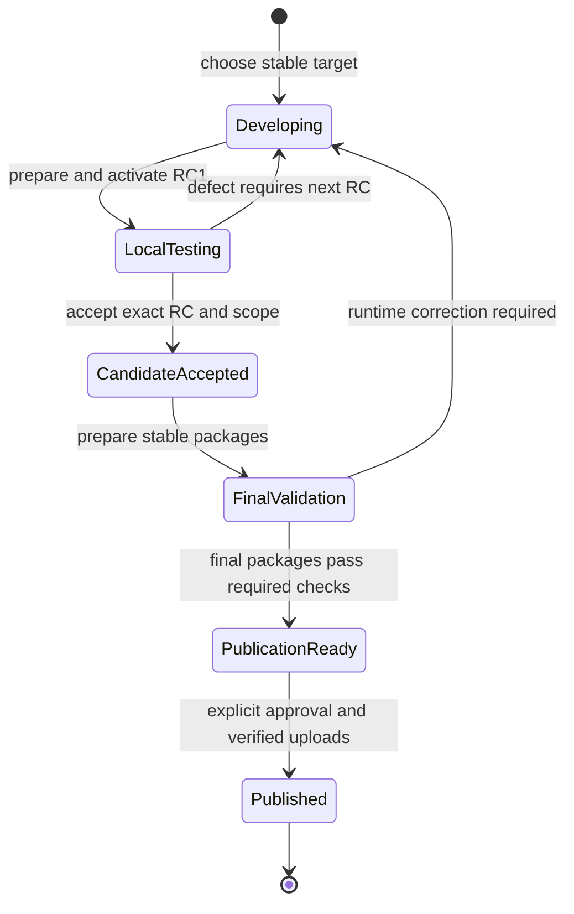

# Development and release process

## Decision

Use one release cycle per intended stable version:

**Choose a target -> build and activate numbered RCs -> accept one -> validate
the final package -> approve and publish.**

For example: `6.9.3rc1`, `6.9.3rc2`, `6.9.3rc3`, then `6.9.3`.
Release candidates are ordinary PEP 440 prerelease packages, not a separate
product line. Local installation and activation are official parts of this
process. They do not require public distribution.

There is no bake channel, bake package version, bake deployment stage, or
bake-to-release promotion approval. Running an RC in real use supplies the
operational confidence that the former bake stage was intended to provide.
Historical commits, packages and receipts remain intact; their existence does
not route new work through the retired process.

This is the approved process design, adopted on 2026-09-19. Tooling and collateral
are being migrated to it. This document does not assert that migration,
candidate acceptance, or publication has already completed. The generated report
and validated attempt records establish actual state.

## Business requirements

| ID | Requirement | Observable acceptance |
|---|---|---|
| BR1 | Choose the next official version deliberately. | One stable target owns its scope, candidates, decisions and final packages. Rejected RCs do not consume another stable patch version. |
| BR2 | Make and deploy local RCs rapidly. | The normal RC operation builds or reuses the exact prepared package, installs it side by side, activates it, verifies health and returns a concise result. No separate bake stage or public release is required. |
| BR3 | Make activation official and recoverable. | Record the previous selection and live state; preserve started intent and ownership; restore existing dashboards and watchers; verify readiness; restore the previous runtime on failure. |
| BR4 | Decide when a candidate is ready to publish. | The developer approves an exact candidate source and known-issue decisions. A successful build, installation, test, or period of real use is evidence, not implicit permission to publish. |
| BR5 | Ship the selected code, not whatever is newest. | Final runtime code matches the accepted RC. Later fixes remain assigned to the next cycle unless explicitly included and tested in another RC. |
| BR6 | Keep all in-flight work visible. | One report shows concurrent release cycles, every retained attempt, selected local runtime, open PRs, assigned and unassigned issues, outstanding checks, approvals and next actions. |
| BR7 | Permit overlap between cycles. | Finalizing one version does not stop development of the next. A newer RC or branch does not invalidate an older intentionally selected candidate. |
| BR8 | Retain trustworthy evidence without repetitive work. | Reuse passing results for identical tested inputs and environment. Record changed inputs and rerun affected checks. Never rebuild a consumed RC identity with different bytes. |
| BR9 | Publish safely to both distribution destinations. | GitHub and PyPI receive the validated final packages, with authenticated publication and independently checked availability. A mirror delay never triggers republication. |
| BR10 | Keep the process understandable. | Reports and commands speak in release targets, RCs, activation, acceptance and publication. Branch names are implementation details, not additional release channels. |

Speed is a requirement, but no fixed time threshold has been measured or agreed.
Record elapsed build, test, installation and restoration time so bottlenecks can
be improved with evidence. Do not invent a performance claim or remove an
effective safety check solely to make the workflow appear fast.

## Industry evidence

The following sources were reviewed on 2026-09-19. They establish standards and
documented practices, not a statistical survey proving a single universal
"state of the art" process. The selection below is engineering judgment for a
Python CLI that manages persistent local automation.

| Source | Evidence | Application here |
|---|---|---|
| [PyPA version specification](https://packaging.python.org/en/latest/specifications/version-specifiers/#pre-releases) | Defines `X.YrcN` prereleases and final releases, with ordered numeric candidate suffixes. Prereleases are normally excluded from dependency resolution unless requested or otherwise eligible. | Use `6.9.3rcN` and `6.9.3`; advance the RC counter on changed candidate packages. No custom bake version is needed. |
| [Trunk-Based Development: branch for release](https://trunkbaseddevelopment.com/branch-for-release/) | Describes release tags without mandatory branches, late stabilization branches when needed, and selecting an earlier known-good commit rather than necessarily the latest commit. | Develop on `main`; create a release branch only to separate stabilization from continuing development. An accepted older RC can be the release baseline. |
| [CPython development cycle](https://devguide.python.org/developer-workflow/development-cycle/#release-candidate-rc) | Restricts changes during RC stabilization and aims for no code changes between the accepted RC and final release. Branches allow next-version development to continue. | Freeze runtime scope at acceptance. A runtime correction requires a new candidate; do not add untested fixes during final packaging. CPython's scale and review organization are not copied wholesale. |
| [PyPA GitHub Actions publishing guide](https://packaging.python.org/en/latest/guides/publishing-package-distribution-releases-using-github-actions-ci-cd-workflows/) | Separates build jobs from publish jobs; publishing downloads already-built distributions. Recommends manual approval for the PyPI environment and describes automatic PEP 740 attestations. | Build final packages once, validate them, approve publication and upload the same files. Keep publication credentials out of build/test jobs. |
| [PyPI Trusted Publishing](https://docs.pypi.org/trusted-publishers/) | Uses OIDC to exchange CI identity for short-lived project-scoped publishing credentials instead of stored long-lived tokens. | Prefer Trusted Publishing from a protected CI publishing job. Retain package hashes and attestations. |
| [PyPA TestPyPI guide](https://packaging.python.org/en/latest/guides/using-testpypi/) | Describes TestPyPI as a separate index for testing distribution tools and processes; its database may be pruned. | TestPyPI is optional publishing-pipeline testing, not a required release stage or durable home for RC evidence. Local wheels and optional GitHub prereleases meet local testing needs. |

### Standards versus project decisions

PEP 440 governs version identity and ordering, not Git branching or approval
workflow. PyPI supports prereleases; keeping RCs local or optionally distributing
them through GitHub while restricting normal publication to stable versions is
our policy, not a PyPI limitation.

Build-once publishing applies to each package version. An RC wheel contains its
RC version in filenames and internal metadata. It cannot become a final package
by renaming the file or changing a GitHub release flag. Prepare the stable
packages from the accepted source with reviewed release-metadata changes,
validate them, then publish those exact files without another rebuild.

Independent installed checks, scheduler ownership verification, dashboard
restoration and safe rollback are project-specific requirements justified by
the incidents in [testing-methodology.md](testing-methodology.md). Removing bake
does not remove those requirements. It removes overlapping lifecycle stages.

## Source and version model

Use the primary checkout only when clean and already on the intended branch;
otherwise use an isolated worktree. Verify ancestry before committing or pushing.
Remove task worktrees after delivery, but retain candidate worktrees and evidence
needed for immutable attempt operations. Never discard another writer's changes.

- `main` is the default integration branch. Merging a PR does not publish a
  package and does not make every commit part of an already selected release.
- Use a short-lived branch such as `release/6.9.3` only when a candidate needs
  stabilization while `main` advances. Fix on `main` and backport where practical;
  ensure branch-only corrections reach future development too.
- Each RC binds its target, exact source commit, package version, package hashes,
  build inputs, checks and local activation evidence. Tags or retained attempt
  refs identify immutable snapshots; there is no branch per channel requirement.
- Stable publication selects the accepted RC source, which need not be the
  newest source commit or the highest existing RC number. Later work remains
  visible and cannot be silently pulled into the final package.
- Review release tooling and documentation changes separately from runtime
  changes. A process migration must not smuggle a newer runtime into a final
  release selected from an older RC. Final-package gates still apply.
- Retain rejected and superseded packages and decisions. Increment candidate
  numbers for changed RC bytes. Retry infrastructure failures with unchanged
  bytes and matching receipts; never overwrite an immutable installation.

## Lifecycle

Activation failure restores the previous runtime and retains failure evidence.
It does not advance the candidate to accepted. A final packaging or infrastructure
failure may retry an unchanged attempt or allocate a distinct final attempt
without consuming another stable version; runtime changes require another RC.

A dashboard-validator correction can requalify an already recorded immutable
build through the [release recovery commands](../.agents/release.md#retry-and-rejection).
The receipt binds the committed validator snapshot and actual gate commands to
the unchanged package hashes. All gates still execute; neither the correction nor
requalification implies installed acceptance. Broader staged evidence reuse and
fast activation remain tracked in [#535](https://github.com/johnshew/agents-live/issues/535).

### Local RC loop

1. Select a target and scope in the release-cycle manifest. Confirm source,
   clean checkout and required review/CI evidence.
2. Reserve the next unused RC number, build its package and run its applicable
   source and packaged checks. Reuse valid evidence instead of repeating it
   simply because another agent or phase takes over.
3. Record the previous local version, started-agent state, owned watchers and
   running dashboards including their repository, port and modes.
4. Install the exact RC side by side and activate it. Restore only previously
   running dashboards and required owned watchers; never create duplicate
   schedulers or change started intent.
5. Verify selected version and package hash, health, state preservation,
   watcher liveness and dashboard API readiness. Restore the previous version
   and services if activation or these checks fail; report restoration failures.
6. Run representative real workflows. Record the version, environment, observed
   behavior and known limitations. Do not confuse elapsed time with coverage.
7. Accept this RC for final preparation, or fix the source and repeat with the
   next number. Public upload is not required for this loop.

Use the executable commands in [.agents/release.md](../.agents/release.md) and
[.agents/testing.md](../.agents/testing.md). Local deployment is a first-class
operation, not an exceptional workaround. Cross-repository operations still
require the applicable confirmation; activation authority does not authorize
editing consumer repositories or publishing unrelated work.

### Stable publication

1. Record the developer's selected RC and exact runtime source, release scope,
   accepted risks and publication decision. Fix or explicitly defer relevant
   known issues; unrelated backlog does not automatically block publication.
2. Prepare the final version from that source, permitting reviewed metadata
   changes such as version and release notes. Independently validate the final
   package, including required Windows/Linux and installed checks.
3. Finalize the stable tag only after acceptance. Preserve any earlier rejected
   unpublished tag through the explicit recovery procedure; never rewrite a
   published tag or replace uploaded packages.
4. Publish retained final files through the protected publishing job. Use
   Trusted Publishing and attestations where configured. Publication must not
   rebuild packages that were already accepted.
5. Verify GitHub and PyPI independently, including the expected version and
   hashes. Report package-proxy visibility separately from upstream availability.
6. Close the released cycle while keeping all later cycles and unresolved work
   visible. Publication retries must not allocate a new version merely because
   an index or mirror is slow.

## Release report contract

[.github/release-cycles.toml](../.github/release-cycles.toml) owns explicit target,
scope and approval decisions. Git, GitHub, package metadata, attempt receipts and
public CLI observations provide evidence. Neither a manifest label nor an issue
closure proves installation, acceptance or publication.

The report must answer "what is in flight?" across all cycles, not just the
current branch. Markdown and JSON must describe the same snapshot and include:

- Every configured stable target, source branch and full source commit, selected
  RC, next unused RC identity, approval and outstanding release decisions.
- Every retained candidate and final attempt: reserved, prepared, activated
  where observed, accepted, rejected, finalized, published or invalid evidence.
  Historical observations must be distinguished from verified current state.
- The currently selected local version and its environment scope, separately
  from the last recorded deployment and any candidate prepared but not selected.
- All open PRs regardless of target branch, their review/check state, and merged
  unreleased work assigned to each cycle. A passing PR is not a release.
- Planned, delivered, partial, deferred and decision-needed issues, plus open
  work outside configured cycles. Preserve the difference between GitHub issue
  state and delivery in a selected candidate.
- Candidate-to-final differences, included and excluded fixes, incomplete
  validation and approval, actual blockers, and one concrete next action per
  active cycle. Do not label ordinary planned work as accepted or published.
- Latest stable GitHub release, per-cycle publication state and separately
  verified or explicitly unverified PyPI and proxy availability.
- Generation time, source identities and missing, stale or truncated data. A
  partial query must not be presented as a complete inventory.

Commands refresh the local report; generated snapshots are gitignored and are
not a substitute for retained acceptance evidence. Guide:
[.agents/release-report.md](../.agents/release-report.md).

## Transition from the previous process

The developer approved these decisions on 2026-09-19:

| Target | Selected work | Decision |
|---|---|---|
| `6.9.2` | Runtime source of installed `6.9.2rc5` | Publish to GitHub and PyPI after final-package validation. Successful local operation is recorded evidence, not a fabricated formal acceptance receipt. |
| `6.9.3rc1` | Scheduled-launch correction [#528](https://github.com/johnshew/agents-live/issues/528), plus [#530](https://github.com/johnshew/agents-live/issues/530), [#531](https://github.com/johnshew/agents-live/issues/531), [#532](https://github.com/johnshew/agents-live/issues/532) | Implement, validate, prepare and activate locally. These are explicitly deferred from `6.9.2`. |
| Outside initial fix scope | [#533](https://github.com/johnshew/agents-live/issues/533) | Keep open and visible; its known limitation is accepted for `6.9.2` publication. |

Prepared RC6 and the post-RC5 source remain retained. They do not supersede the
developer's selection of RC5 for `6.9.2`. The migration must update the manifest,
report, preparation/deployment/publication support, tests, agent guidance and
user-facing version terminology together. Do not declare migration complete
while an active path still requires the retired channel.

## History and learning

The prior revision at `ca9f81829543f21b73b8f23d7de7cb9a026a50ff` described a
bake-to-main promotion lifecycle. Its immutable history and candidate receipts
remain evidence of past operations, not the current workflow. This revision
consolidates the approved simplification and the primary-source review into the
canonical process; it does not certify implementation or release completion.

<!-- glp-update:v1 id=8c95bd10-e8af-47d7-80c5-f9979c91a13d -->

### GLP Update: One numbered release-candidate lifecycle

- Update-ID: 8c95bd10-e8af-47d7-80c5-f9979c91a13d
- Recorded-UTC: 2026-09-19
- Kind: supersession
- Topics: release-process, local-activation, release-reporting
- Workstream: Simplified release-cycle migration
- Target: This document, replacing the process at `ca9f81829543f21b73b8f23d7de7cb9a026a50ff`
- Source-Session: Developer release-process decisions and public documentation review, 2026-09-19
- Evidence-Basis: mixed
- Application: applied
- Consolidation: integrated on 2026-09-19; bounded closure below

#### Change
The developer requires rapid local numbered RCs with activation, followed by
an explicit final release decision. Remove the independent bake channel;
retain immutable package evidence and final validation.

#### Evidence
Business requirements and transition approvals were explicitly supplied in the
2026-09-19 conversation. The six primary/practitioner sources in Industry
Evidence were retrieved that day. They support standard RC numbering,
optional stabilization branches and separated build/publish jobs; the workflow
recommendation is a project-specific synthesis, not an industry prevalence claim.

#### Previous Knowledge
The previous state machine in this file required an additional integration and
deployment channel before candidate/final acceptance. Numbered local RCs already
serve that operational-testing purpose.

#### Verification and Limits
The canonical narrative and requirements incorporate this delta. Documentation
readback and collateral alignment must be independently checked. Passing focused
report/lifecycle tests does not establish a completed migration, live activation
or publication. No release-performance benchmark is claimed.

#### Follow-up
Complete tooling and collateral alignment, then validate the two approved
release workstreams. Record consolidation closure only after cross-document
links and controlling guidance agree.
<!-- /glp-update:v1 id=8c95bd10-e8af-47d7-80c5-f9979c91a13d -->

### Consolidation Ledger: 2026-09-19

Frozen input: the process supersession record above, followed by runtime record
[`dcce029f-e251-4b88-bb1b-4ad450889f6f`](../src/agents_live/skill/docs/key-learnings.md#glp-dcce029f-e251-4b88-bb1b-4ad450889f6f).
The compared baseline is `ca9f81829543f21b73b8f23d7de7cb9a026a50ff`.
This is a topic-scoped endpoint, not a claim about all repository knowledge.

| Input | Canonical destinations | Disposition and checks |
|---|---|---|
| Release-process supersession | This document, docs index, AGENTS, release/testing/report guides, cycle manifest and report | Integrated; six source links and project-specific limits retained. Numbered CLI flags checked against `release.py --help`; report inventory checked by executing tests and actual generated readback. |
| Foreground ownership correction | Runtime learnings, definition contract and diagnostics reference | Integrated; original failed orphan-pipe regression retained, followed by passing owned-child checks. In-progress, missing and pruned states remain distinct. |

Independent readback covered both source records and the controlling guidance.
Documentation-link/export checks and focused report/runtime checks passed.
The active bake manifest and executable bake publication instructions were
retired; historical packages, commits and evidence were not changed. This ledger
closes only these knowledge deltas. CI, packaged readiness, live acceptance,
RC activation and stable publication still require their own evidence. Consumer
repository authorization remains an operational prerequisite, not a waiver.

<!-- glp-update:v1 id=64604e5e-870b-4ce2-965c-4567855aaf73 -->

### GLP Update: Rapid RC evidence and readiness budgets

- Update-ID: 64604e5e-870b-4ce2-965c-4567855aaf73
- Recorded-UTC: 2026-09-19
- Kind: addition
- Topics: release-process, validation-reuse, dashboard-readiness
- Workstream: Rapid local RC delivery
- Target: Business requirements BR2 and BR8 in this document
- Source-Session: Developer fast-RC request and retained RC1 validation, 2026-09-19
- Evidence-Basis: mixed
- Application: applied
- Consolidation: broader lifecycle integration pending under #535

#### Change
Separate build, activation and qualification evidence in the planned fast-RC
workflow. Detailed work and acceptance criteria live in
[#535](https://github.com/johnshew/agents-live/issues/535), discoverable from
[the backlog](backlog.md#rapid-local-release-candidates). Current release gates
remain authoritative until that policy and tooling change is validated.

#### Evidence
An unchanged preparation retry spent 82.175 seconds on seam tests and 163.991
seconds on behavior tests. Full dashboard qualification with the corrected
harness took 207 seconds. The original two-second API request timed out while
a five-second request returned the expected fixture row in 2.55 seconds.
Failure diagnostics also waited indefinitely for a live dashboard's stdout EOF.
The corrected harness allows ten seconds per API request and bounds failure
output collection. Real HTTP and child-process regressions fail against the
original harness and pass with the correction; all packaged dashboard journeys
passed against the unchanged RC1 wheel.

#### Previous Knowledge
BR2 requires rapid activation and BR8 requires evidence reuse, but preparation
still repeats complete source gates on retry and couples activation to complete
qualification. A healthy endpoint can exceed a fixed short request budget.

#### Verification and Limits
These are individual timings, not a performance guarantee. The proposed warm
build-and-activation objective of under two minutes needs measurement before
adoption. Passing the corrected harness does not manufacture a preparation
receipt, establish installed acceptance, or authorize publication. Retained
candidate bytes and original failed evidence remain unchanged.

#### Follow-up
Implement #535 in bounded steps with evidence-invalidation and rollback tests.
The bounded knowledge pass records this delta and routes it through the backlog;
it does not supersede the current lifecycle. Broader lifecycle consolidation is
pending implementation under #535, not implicitly completed by this addendum.
<!-- /glp-update:v1 id=64604e5e-870b-4ce2-965c-4567855aaf73 -->