# Development and release process

## Publication Routing Correction: 2026-09-19

For numbered final attempts, both the publication guard and atomic commit/tag
push use the configured cycle branch. For this cycle that is `release/6.9.2`,
not `main`, which already contains later runtime changes. The remote branch
must still equal the prepared source or the finalized commit; a moved branch
is refused. This changes no accepted package bytes or acceptance requirements.

The developer explicitly approved deferring #538 and #539 on 2026-09-19 and
temporarily selecting RC5 and final stable bytes for independent acceptance,
with RC1 restored afterward. These approvals do not waive validation gates.

<!-- glp-update:v1 id=cc4d9a28-2218-4b5b-8c28-3999a56adff1 -->
<a id="glp-cc4d9a28-2218-4b5b-8c28-3999a56adff1"></a>
### GLP Update: Final Push Follows the Cycle Branch

- Update-ID: cc4d9a28-2218-4b5b-8c28-3999a56adff1
- Recorded-UTC: 2026-09-19T18:00:00Z
- Kind: correction
- Topics: stable publication, isolated release branches
- Workstream: 6.9.2 publication, #511
- Target: stable branch correction at 030ad04
- Source-Session: authorized release execution on 2026-09-19
- Evidence-Basis: mixed
- Application: applied
- Consolidation: pending

#### Change
Final preparation branch routing alone is insufficient: the finalization guard
and atomic publication push must use that same configured branch.

#### Evidence
The guard and push still named main after the preparation routing correction.
Executing temporary-Git coverage now permits an isolated stable source while
main contains newer code, rejects a moved release branch, and checks the exact
atomic push target. The RC rejection/final acceptance lifecycle test also passes.

#### Previous Knowledge
The earlier stable-branch correction described preparation but did not establish
that publication preserved the independent development branch.

#### Verification and Limits
The focused tests pass; exact package acceptance and public availability remain
independent gates. No runtime source or retained artifact changed.

#### Follow-up
Publish only accepted final bytes and consolidate release policy under #511/#535.
<!-- /glp-update:v1 id=cc4d9a28-2218-4b5b-8c28-3999a56adff1 -->

## Stable Branch Correction: 2026-09-19

This retained RC5-source branch uses
[release-cycles.toml](../.github/release-cycles.toml), not the historical bake
instructions below. Prepare `6.9.2` from accepted `6.9.2rc5` on the synchronized
`release/6.9.2` branch. The approved runtime source is
`a68ba1bd2da60070df42b1a378c4fcc4b92d68d6`. Only release routing, the dashboard
validator, tests and this correction differ. Runtime code, installers and package
metadata remain at that source until normal final-version stamping.

Run `tools/release.py --prepare-final --from-rc 6.9.2rc5 --yes` only after exact
RC5 operational acceptance. Independently validate and accept the new stable
bytes, then finalize and publish that attempt. Preserve and verify the rejected
legacy tag through `--migrate-legacy-tag v6.9.2 --yes` before finalization.
Do not include subsequent fixes assigned to `6.9.3`. Current process direction
and broader consolidation are tracked in
[#511](https://github.com/johnshew/agents-live/issues/511) and
[#535](https://github.com/johnshew/agents-live/issues/535).

<!-- glp-update:v1 id=ea4901f1-75af-43f2-8ee3-3cdbb3c17655 -->
<a id="glp-ea4901f1-75af-43f2-8ee3-3cdbb3c17655"></a>
### GLP Update: Selected RC5 Final Routing

- Update-ID: ea4901f1-75af-43f2-8ee3-3cdbb3c17655
- Recorded-UTC: 2026-09-19T16:35:00Z
- Kind: correction
- Topics: exact-source finalization, numbered release cycles
- Workstream: 6.9.2 stable publication
- Target: this document, historical state machine at a68ba1b
- Source-Session: release delivery investigation on 2026-09-19
- Evidence-Basis: mixed
- Application: applied
- Consolidation: pending

#### Change
The approved older runtime can be finalized on its own release branch without
bringing newer runtime changes from main. Numbered-cycle publication approval
replaces the bake promotion requirement for this branch.

#### Evidence
The developer selected RC5 source for stable publication. The isolated branch's
source gates passed, including 311 behavior tests, after migrating allocation,
approval and legacy-command refusal fixtures. The immutable RC5 preparation
already exists; it does not prove installed acceptance.

#### Previous Knowledge
The historical state machine below required bake promotion to main. The correction
above governs this deliberately isolated stable branch.

#### Verification and Limits
Exact-source and immutable-attempt tests pass. No runtime, installer or package
metadata change is included in the tooling backport. Installed acceptance and
final-package validation remain separate requirements; no publication is claimed.

#### Follow-up
Finish exact acceptance and publication; consolidate broader process documentation
under #535 without importing newer runtime source into this stable package.
<!-- /glp-update:v1 id=ea4901f1-75af-43f2-8ee3-3cdbb3c17655 -->

This document defines how repository work moves from ordinary development to a
published release. The current state is declared in
[`.github/release-channels.toml`](../.github/release-channels.toml) and verified
against Git, GitHub, and local deployment evidence by
`tools/release-report.py`.

Generate and read the report before choosing a target branch:

```bash
git fetch origin --prune
uv run --script tools/release-report.py
```

The generated `.reports/release-report.md` names the current state, the evidence
that supports it, and the next transition. Conversation alone does not change
release state. Decisions that APIs cannot infer must be recorded in the channel
manifest.

## State machine

```mermaid
stateDiagram-v2
    [*] --> Released
    Released --> Baking: configure bake branch
    Baking --> Baking: fix, merge, deploy, validate
    Baking --> Candidate: prepare numbered RC from synchronized bake
    Candidate --> Baking: RC rejected; retain evidence and advance RC number
    Candidate --> PromotionApproved: exact RC accepted and developer approves source
    PromotionApproved --> Baking: bake commit changes or approval withdrawn
    PromotionApproved --> PromotionProposed: open bake-to-main PR
    PromotionProposed --> Baking: PR closed or bake changes
    PromotionProposed --> StablePreparation: checks pass and PR merges to main
    StablePreparation --> StableAcceptance: build final stable bytes
    StableAcceptance --> Baking: source fix needed; retain attempt and advance RC
    StableAcceptance --> Released: final bytes accepted, approved, tagged, and published
```



## State ownership

| State | Durable evidence | Work target | Next transition |
|---|---|---|---|
| `released` | Latest stable GitHub release and tag | New configured bake branch | Start a bake cycle |
| `baking` | Configured bake branch plus `decision = "continue-bake"` | Direct administrative commits or focused PRs to bake | Developer approves an exact tested commit |
| `promotion approved` | `decision = "approved"`, full bake commit, and decision date | No new code without invalidating approval | Open the bake-to-`main` PR |
| `promotion proposed` | Open bake-to-`main` PR for the approved commit | Promotion PR only | Merge after required checks pass |
| `candidate` | Numbered RC identity, preparation receipt, and immutable artifacts; no stable tag | RC acceptance only | Approve and promote the source or reject back to bake |
| `stable preparation` | Accepted RC and approved source commit | Release-metadata changes only | Build final stable artifacts |
| `stable acceptance` | Attempt-specific stable preparation and artifact hashes | Independent final artifact and installed gates | Tag and publish accepted bytes, or retain a rejected attempt |
| `released` | Stable tag, GitHub release, and verified PyPI publication | Close the cycle | Start later work in a new bake |

## Bake development

During `baking`, small administrative fixes may be committed directly to the
configured bake branch. Substantive fixes use focused branches and pull
requests targeting bake. After each change reaches bake, deploy the exact
synchronized commit:

```bash
git pull --ff-only origin <configured-bake-branch>
uv run --script tools/local-deploy.py --repo <live-repository>
```

Run these commands from a clean checkout of the configured bake branch. Use the
primary checkout only when it is already clean and on that branch; otherwise,
use a dedicated worktree and remove it after deployment.

Each deployment receives a commit-qualified version such as
`<target>.dev0+g<commit>`. Keep fixing and redeploying until the newest bake
satisfies the report recommendations.

If an active bake exists but requested work names `main`, confirm whether the
developer intends a bake fix, release promotion, or independent post-release
work. Do not bypass the active bake by assumption.

## Validation evidence

Run each gate once for its tested inputs, and carry its passing evidence into
the next phase. Do not rerun unchanged tests at an agent handoff or immediately
before a command that already owns those gates. Record the command, revision
or artifact digest, environment, and result; a failed, missing, or invalidated
record requires a new check. CI platform checks still prove their own platform.

Bake deployment builds and validates its commit-stamped artifact only when no
matching preparation receipt exists. Receipts and wheels are shared across
worktrees in the common Git directory and survive worktree cleanup. Release
preparation owns candidate gates; publication verifies their receipts without
rerunning them. Installing an artifact changes live state, so post-install
identity, watcher restoration, and dashboard readiness remain required.

## Promotion approval

Developer approval must be recorded for the exact validated bake commit:

```toml
[bake.promotion]
decision = "approved"
commit = "<full-current-bake-commit>"
decided_on = "YYYY-MM-DD"
```

A later commit makes approval stale. Return to `baking`, validate the new tip,
and record a new decision. Once approved, open one pull request from bake to
`main`. Do not add unrelated changes to that promotion pull request.

## Candidate and release

The adopted lifecycle uses a stable target and separate PEP 440 candidate
versions, for example `6.9.2rc1`, `6.9.2rc2`, then `6.9.2`. Rejection consumes
an RC number, not a stable patch number. Retain immutable commits, tags,
artifacts, decisions, and receipts for each attempt; resume only identical
inputs. Fixes return to bake and invalidate prior exact-commit approval.

After required Windows/Linux checks and source approval, prepare and accept an
RC through the installed operational flow. Full package versions support
side-by-side installation with stable. Staging is distinct from activation;
select the tested version deliberately and verify rollback, ownership, and
watcher restoration. Multiple installations must not create duplicate
schedulers or watchers against a live repository.

An accepted RC permits final stable preparation, not publication. Build final
stable artifacts from the approved source with only reviewed release-metadata
changes, then independently accept those exact bytes. Do not reuse RC receipts
as stable acceptance. Create the stable tag only after acceptance and publish
the accepted files without rebuilding them. Retain failed final builds by
attempt identity; source changes return to the next RC, while infrastructure
failures may resume identical bytes. Recovery must not overwrite a sealed
installation sharing the stable version name.

Optional RC distribution uses explicit GitHub prereleases, never latest.
Normal upgrades and PyPI publication remain stable-only, including manual
dispatch. Final publication requires developer approval and independent
GitHub and PyPI verification.

### Current migration and implementation boundary

The developer selected this model for the current `6.9.2` cycle on 2026-09-13.
`bake/v6.9.2-rc` replaces the earlier 6.9.2 and 6.9.3 routing without rewriting
shared history. The manifest reserves `6.9.2rc1` for the legacy rejected
candidate, whose actual package version was `6.9.2`. Original preparation
artifacts and the upgrade-complete checkpoint were recovered in the preparing
checkout. Preserve those bytes and the original local tag conflict; they are
not a numbered RC package or reusable full acceptance.
RC2 has historical local evaluation evidence. RC3 failed packaged readiness
(#516), while RC4 passed the unchanged Windows gate on its preparing environment.
RC4 is prepared but still needs guarded installed recovery verification (#522).
RC5 is the next unused identity. Different environments can select different
retained versions; the manifest's deployment observation is not a global fact.

The explicit numbered lifecycle under
[#511](https://github.com/johnshew/agents-live/issues/511) uses
`release.py --prepare-rc` from bake, receipt-bound `--accept-candidate --attempt`,
then source approval and promotion. Only the promotion fields in the channel
manifest may change between the accepted RC source and final source on main.
`--prepare-final --from-rc` allocates a distinct `<target>-final-N` identity and
stamps stable release metadata. Independent stable acceptance precedes
`--finalize --attempt` and `--publish --attempt`. No tag exists before finalization.
See [.agents/release.md](../.agents/release.md) for the commands and retry rules.

Artifacts and private receipts live under the common Git directory, never the
exported tree. `--cycle-status` and the report validate local attempt evidence;
they do not claim another environment's operational results. Rejection retains
bytes and decisions, and legacy stable-tag migration is an explicit verified
operation that refuses remote tags. The old implicit release commands remain
blocked. The current release still needs real operational acceptance and scope
decisions; tooling availability is not release approval.

## Keeping guidance aligned

`AGENTS.md`, `.agents/release-report.md`, `.agents/testing.md`,
`.agents/release.md`, this document, and `tools/release-report.py` describe one
process. A change to state names, branch routing, decision fields, deployment,
or transition gates must update every affected source in the same change.

## Publication And Local Selection: 2026-09-19

GLP update `b32a7ab6-3d34-4c13-9246-501e164409e3`: clarification from
the release-session review and the executing numbered-lifecycle test.

Stable publication and local runtime selection are independent workstreams.
`prepare_cycle` reads retained RC acceptance; `finalize_attempt` and `publish`
verify retained preparation, independent final acceptance, artifact hashes,
and tag identity. None requires the released version to remain locally active,
and none requires deployment or activation of a later RC. A previously accepted
stable package can be published while a later RC is selected locally, or when
the publisher has no active local runtime.

`accept_candidate` is different: its live installation and operational checks
require the exact candidate to be selected for the duration of those checks.
Once that receipt exists, restoring a later RC does not invalidate it. Missing
RC or final acceptance remains a release prerequisite; local restoration is
not an additional publication gate. Report these states separately, and do not
restart acceptance solely because local selection changed after success.

Evidence: `test_rc_rejection_to_independent_final_acceptance_and_retry` now
rejects every local-runtime access during finalization and publication, while
still checking accepted upload bytes, draft retry, and tamper refusal. The
focused lifecycle and configured-branch tests pass. This clarifies existing
behavior; it does not waive live acceptance or alter candidate bytes.
Applied clarification; broader consolidation remains tracked under #511/#535.
