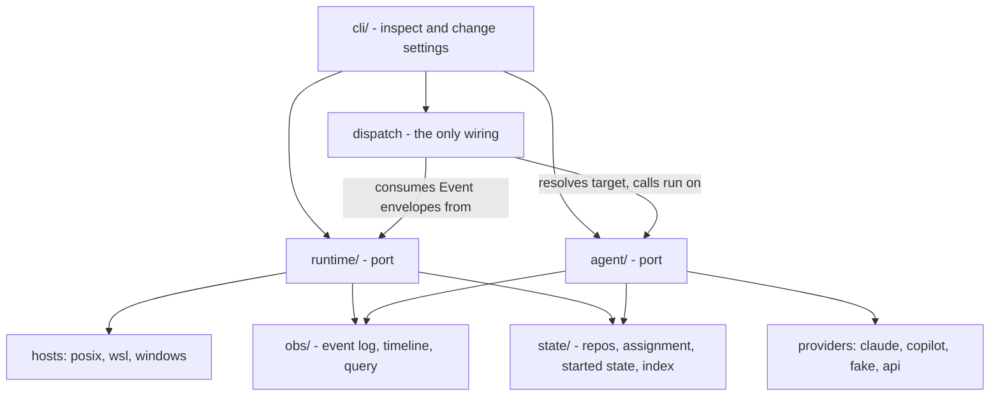

This is a proposal, not yet a decision record. No code has changed. It
states the problem, the target architecture, the open decisions that
need the developer's call, and the migration sequence. Once accepted it
should be rewritten in the past tense as a decision, per the
conventions in [README.md](README.md).

To resume this work later, start at
[Picking this up](#picking-this-up) at the end of the document. It
lists what is decided, what is not, and what can begin without waiting
for a decision.

## Problem

The package is about 19,000 lines of source against 8,750 lines of
test. (Every line count in this document is non-blank lines,
`grep -cve '^\s*$'`.)
The two seams that matter already exist, but neither is explicit:

- The **host seam** is a set of functions (`hostruntime`) plus two
  parallel trigger stores (`crontasks`, `wintasks`) plus two parallel
  event sources (`watchsource`, `winwatch`). It works, and
  [windows-support.md](windows-support.md) records why it is functions
  rather than a protocol object, but there is no single object that
  owns "the state of automation on this host".
- The **provider seam** is `agent_adapters`, a good abstraction that is
  only half applied: adapter quirks and generic execution are
  interleaved inside `headless.py`, which is 2,528 lines and holds
  frontmatter parsing, path discovery, MCP resolution, argv
  construction, subprocess execution, output normalization, safe-output
  enforcement, logging, and handler invocation.

The costs follow from that:

1. **Host state has no owner.** `activate` (833), `stop` (48),
   `health_check` (1,014), `doctor` (863), and `schedules` (194) each
   reimplement part of "what should be installed, what is installed,
   what is the difference". The backlog theme "Host changes that cannot
   half-finish" ([#226](https://github.com/johnshew/agents-live/issues/226),
   [#231](https://github.com/johnshew/agents-live/issues/231)) is a
   symptom of that missing owner, not of five separate bugs - though
   those two issues concern plugin and executable state rather than
   triggers: the same convergence gap on different artifacts.
2. **Liveness leaked into the command surface.** `heartbeat` is a public
   verb about a WSL implementation detail. Nothing outside a WSL host
   should know the word.
3. **Trigger syntax is spread across three fields and two shapes.**
   `schedule` is cron-ish, `watchPath`/`watchIgnore`/`debounce` are three
   YAML fields that must be re-joined by every consumer, and each store
   re-derives the semantics on its way to a crontab line or a Task
   Scheduler XML trigger.
4. **The CLI is a participant.** `cli.py` and `cli_spec.py` (1,169 lines
   together) plus `status`, `completions`, `dashboard` reach into
   execution and scheduling internals, so a change to either seam
   ripples into the command surface.
5. **The test suite cannot execute the paths that break.** Recorded in
   the backlog as [#184](https://github.com/johnshew/agents-live/issues/184)
   and [#180](https://github.com/johnshew/agents-live/issues/180). The
   structural cause is that neither seam has a fake on the other side, so
   coverage is bought with mocks.

## Goals

Ordered. Later goals must not be bought at the cost of earlier ones.

1. **Reduce concepts before reducing lines.** Measurable proxies:
   - Public types and callables imported across a seam: target under
     25 per port. Value-object fields do not count; the fitness
     function inspects the exported API and cross-boundary imports.
   - Frontmatter fields an agent author must know: 25 today; 21 after
     the collapses this document actually specifies (the three watch
     fields to one string, `model` into the selector, `handler`
     retired). A smaller surface is desirable but needs field
     decisions not yet made; an earlier target of 12 was aspiration
     without a plan and is withdrawn.
   - Public CLI verbs: target no growth, and `heartbeat` removed.
   - Internal mechanism words (`plan`, `apply`, `converge`, `diff`,
     `subscription`) appearing in CLI help, output, or error text:
     target zero, enforced by a test. The user's vocabulary is
     `start`, `stop`, and `run`.
   - Occurrences of `sys.platform`, `os.name`, or a WSL check outside
     `runtime/hosts/`: target zero, enforced by a test.
   - Modules that import both a host detail and an agent detail: target
     zero, enforced by a test.
2. **One owner per fact.** Desired automation state, actual automation
   state, and the difference between them are computed in one pure
   function, not in five commands.
3. **Only primitives cross a seam.** An event carries an agent
   identifier, never an agent object, because on every supported
   platform the process that registers a trigger is not the process
   that services it.
4. **Every platform and every provider is a plugin, including the
   built-ins.** No built-in may use a private path.
5. **Reduce line count.** Targets in [Expected size](#expected-size).
   This is an outcome of goals 1 through 4, not an independent goal.

Non-goals: changing what the tool does for a user, adding a scheduler
daemon, adopting asyncio, or shipping any backward-compatibility shim
(the repository rule stands; the frontmatter break is handled by a
version bump, see [Open decisions](#open-decisions)).

## Target architecture

Six top-level pieces, two of them ports in the ports-and-adapters
sense:

- **`runtime/`** - the port for "automation on this host": triggers,
  watches, processes, liveness, convergence. Implemented by host
  plugins: `posix`, `wsl`, `windows`.
- **`agent/`** - the port for "a runnable unit of work": definition,
  invocation, outcome. Implemented by provider plugins: `claude`,
  `copilot`, `fake`, later `api`.
- **`dispatch.py`** - the only module below the CLI that imports both
  ports. Turns an event envelope into an agent run.
- **`state/`** - repository registry, assignment, started state, and
  the durable subscription index. Sits above both ports.
- **`obs/`** - event log, timeline, query. Written by both ports,
  owned by neither.
- **`cli/`** - inspects and changes settings through the ports and
  hands execution to `dispatch`; no execution logic of its own.

The two ports never import each other, and only primitives cross a
seam. The change lands strangler-fig - each phase releases
independently over the live system, per the
[migration sequence](#migration-sequence) - not as a rewrite. Arrows
below point from depender to dependee.



### The runtime port

Intentionally small. It initializes the host, keeps itself honest,
converges a set of subscriptions, and emits events.

The user model it serves is three verbs and nothing else. An agent is
an Agent Skill whose frontmatter says how and when it should execute;
`start` means make that happen automatically here, `stop` means
stop making it happen, and `run` means do it once now. Convergence is
how those verbs are kept honest, never something the user is asked to
think about: no verb, flag, or message names a plan, a diff, a
subscription, or a convergence pass. What surfaces instead is `status`
and `doctor` in the same three-verb vocabulary - this agent is started
here, this one should be and is not, re-run `start`.

One word, one meaning: an agent is **started** or **stopped** on a
runtime, and a **run** is one execution of it. Nothing here calls an
agent active, activated, enabled, or running - those were four
spellings of one bit, and the concurrency rule in
[the firing contract](#the-firing-contract) needs "running" to keep
meaning a run in flight. The verbs need no rename: `cli_spec.py`
already publishes `start`, `stop`, and `run`, and only the words
behind them lag - the module is `activate.py`, `start`'s help says
"Activate cron and watcher triggers", and `stop`'s says "Deactivate
triggers". That is a module rename in phase 2 and a help-text pass in
phase 8, not a breaking change. One caution comes with the word.
In a service manager, `start` means run now and `enable` means run on
its triggers; here an agent is not a daemon, so `start` means the
second and `run` means once, now. The help text should say so in
those words.

That has one consequence worth stating, because today's code does not
satisfy it: **started is a recorded fact**, not something derivable
from frontmatter. A schedule in frontmatter says how an agent would
run if it were started, not that it is started on this runtime. Today
the only record is the installed trigger itself, which is why the
check-and-repair loop can prune an orphaned trigger
(`health_check.py`) but can never restore a missing one: converging
from frontmatter alone would undo every `stop`. The desired set is
therefore frontmatter *times* the started set that `start` writes
and `stop` clears, kept in `state/` beside assignment. Recording it is
what turns an externally deleted trigger into repairable drift instead
of a silent stop.

`Runtime` is a facade over three narrow, separately implementable
protocols. The segregation is not ceremony: the three have different
lifetimes (durable, process-scoped, per-child), different failure
modes, and different conformance tests.

The facade itself is adopted on evidence, not upfront:
[windows-support.md](windows-support.md) records building and
rejecting a `HostRuntime` object once already, because nearly every
member was a stateless function of the host. With one idempotent
`converge` and no plan held between calls, the validity window that
was the likely candidate for instance state no longer exists, so the
port most probably stays a module of functions plus the three
protocols. Phase 2 lands it that way and adopts the object form only
if the prototype produces real instance state; nothing else in this
document changes either way.

```python
class Runtime(Protocol):
    id: str  # 'posix' | 'wsl' | 'windows'
    triggers: TriggerStore
    changes: ChangeSourceFactory | None   # None = host cannot watch
    processes: ProcessHost

    def converge(self, desired: DesiredAutomation, *,
                 dry_run: bool = False) -> Converged:
        '''Goal-seek: make this runtime match desired, and report what
        it did. Host prerequisites and liveness first, then
        subscriptions. Idempotent - a second call reports nothing to
        do. dry_run reports the same operations without performing
        them, which is what `--dry-run` prints.'''

    def health(self) -> Health:
        '''Read-only. Liveness is a field here, not a command.'''


class TriggerStore(Protocol):
    '''Durable. Survives reboot. One OS artifact per subscription.
    Observes artifacts only: it cannot reconstruct a Subscription,
    because a watcher's artifact records just its respawn command.'''
    def install(self, rendered: RenderedSubscription) -> None: ...
    def remove(self, key: str) -> None: ...
    def list(self) -> list[InstalledTrigger]: ...


class ChangeSource(Protocol):
    '''Process-scoped. Raw paths only: no debounce, no policy.'''
    def start(self) -> None: ...
    def poll(self, timeout: float) -> list[str]: ...
    def stop(self) -> None: ...


class ProcessHost(Protocol):
    '''Process management. `run_child` is the slice agent execution
    receives by injection; the rest is runtime-internal.'''
    def spawn_detached(self, argv: Sequence[str], **io) -> ProcessRef: ...
    def run_child(self, argv: Sequence[str], **io) -> ChildResult: ...
    def alive(self, ref: ProcessRef) -> bool: ...
    def terminate(self, ref: ProcessRef) -> None: ...
    def owned(self, role: str | None = None) -> list[ProcessRef]: ...
```

`Event` is produced by a generic loop in `runtime/watchloop.py` that
consumes a `ChangeSource` and applies debounce, ignore rules, the
breaker, and duplicate suppression. No host plugin produces an `Event`.
See [Where events are produced](#where-events-are-produced).

Value types, primitives only:

```python
@dataclass(frozen=True)
class Subscription:
    key: str          # stable, derived from scope + target + trigger
    scope: str        # "runtime:<runtime-id>" (this installation)
                      # or "repo:<normalized-root>"
    target: str       # "agent:<id>", or "runtime" for the
                      # maintenance loop. Not an object, not a callable.
    kind: str         # "schedule" | "watch"
    trigger: str      # one expression string, per the grammars below

@dataclass(frozen=True)
class DesiredAutomation:
    covers: tuple[str, ...]     # scopes this call is authoritative for
    subscriptions: tuple[Subscription, ...]
    # Already filtered to the agents assigned to this runtime and
    # started here. The runtime never sees an owner; see Assignment
    # and started state.

@dataclass(frozen=True)
class InstalledTrigger:
    key: str          # matches a Subscription.key when it is ours
    kind: str
    rendered: str     # the OS artifact's own record, fingerprintable

@dataclass(frozen=True)
class WatcherRecord:
    key: str
    fingerprint: str  # canonical watch expression loaded at spawn
    process: ProcessRef

@dataclass(frozen=True)
class Operation:
    kind: str    # "install-trigger" | "remove-trigger"
                 # | "start-watcher" | "stop-watcher" | "repair-host"
    key: str
    detail: str  # printable, rendered in the user's vocabulary

@dataclass(frozen=True)
class Converged:
    dry_run: bool
    done: tuple[Operation, ...]              # "would do" when dry_run
    failed: tuple[tuple[Operation, str], ...]  # operation, error
    health: Health

@dataclass(frozen=True)
class Event:
    spec: str             # envelope schema version; see the firing contract
    id: str               # correlation id, unique per firing
    origin: str           # "clock" | "boot" | "watch" | "manual"
    key: str | None       # subscription key; None for a manual run
    repo: str
    target: str           # "agent:<id>"; runtime maintenance emits no Event
    at: datetime
    trigger: str | None   # the matched expression, for the dueness gate
    payload: Mapping[str, str | list[str]]
    # Small values travel inline; large ones (a changed-file batch) by
    # state-file reference, which the Windows command-line length
    # bound already requires (windows-support.md).
```

`Subscription` is desired state, computed from the frontmatter of the
agents started on this runtime; `InstalledTrigger` is observed
state, read back from the OS. They are
different types on purpose: a watcher's OS artifact records only its
respawn command, never the watch expression, so the store cannot
reconstruct a `Subscription` and is never asked to. The diff matches
the two by key and by a fingerprint of the rendered form.

`scope` names a runtime installation, not a machine: native Windows
and each WSL distribution on the same hardware are separate runtimes
that run agents independently (`hostruntime.py`), so the runtime scope
is spelled with the runtime identity the 2026-07-28 decision log
already defines, never a bare "host". That identity is a name for an
installation and has nothing to do with which agents are assigned to
it. `covers` makes a call authoritative only
where it says it is: pruning and orphan detection are confined to the
declared scopes, so starting one agent, or reconciling one
repository, can never remove another repository's subscriptions from
the host-global crontab.

A watch subscription has a second piece of observed state the store
cannot see: the running watcher process, which loaded its watch
expression at spawn. `actual` for a watch subscription is therefore a
pair - the installed respawn trigger and the running watcher - where
the watcher is found through `ProcessHost.owned()` and carries the
fingerprint of the expression it was started with, recorded in the
subscription index as `WatcherRecord`. A desired fingerprint that
differs produces a stop-watcher followed by a start-watcher; without
that, editing a watch expression would take effect only at the next
reboot.

Convergence deliberately spans the runtime protocols and `state/`.
Its operation vocabulary - install or remove a
trigger, start or stop a watcher, repair a host prerequisite - is
interpreted through `TriggerStore`, `ProcessHost`, and the
subscription index. That vocabulary is internal: it is what `converge`
reports and what `status` and `doctor` render into the user's words,
never something a caller assembles. The exact `Converged`, `Health`,
`RenderedSubscription`, and `ChildResult` fields are phase-2 design
work; which protocol owns each operation is fixed here.

One call rather than a plan handed back and applied later is
deliberate. A held plan needs a validity window, a staleness rule, and
a caller that knows to re-plan after a partial failure. A single
idempotent pass under the runtime lock needs none of those, and the
answer to a partial failure is to run the same command again.
`--dry-run` is the only thing the two-step surface bought, and
`converge(..., dry_run=True)` returns it without the artifact.

Watcher record ordering fails toward convergence. `converge` spawns
the watcher, receives its `ProcessRef`, then atomically writes the
`WatcherRecord`. If that write fails, it terminates the child and
reports the start as failed. A crash between spawn and record is found
on the next pass as an owned watcher-role process with no matching
record; the pass terminates it before starting the canonical watcher.
The cleanup consults `owned(role="watcher")` only - `ProcessRef`
carries a role precisely so this sweep can never terminate an
in-flight provider child. Stopping does the reverse: confirm
termination, then remove the record. No unrecorded watcher is ever
treated as current.

`Event.origin`
distinguishes the four ways a run begins - `clock` and `boot` split
what one "schedule" kind used to cover, because only `clock` events
pass through the dueness gate, and a `manual` run has no subscription
at all, which is why `key` and `trigger` are optional.

Two preconditions carry over from today's `activate`, but they belong
one layer up rather than in the runtime: see
[Assignment and started state](#assignment-and-started-state).

One mapping is worth stating, because today's store persists three
trigger kinds (`triggers.py`: schedule, watcher-respawn, maintenance).
A `watch` subscription's durable OS artifact is its `@reboot`
watcher-respawn entry, so `TriggerStore` still holds one artifact per
subscription of either kind. The host-scoped check-and-repair loop is
not a special case in the diff: it is exactly one subscription with
the runtime-instance scope and target `runtime`, added to that
runtime's own convergence rather than to every repository's. It is a
special case at firing time,
deliberately: `dispatch` resolves only `agent:` targets through the
agent port, and the runtime-targeted subscription renders the
scheduled invocation of `Runtime.converge()` over everything started
on this runtime (today's `internal maintain` entry
point), so a maintenance firing never enters event dispatch at all.

What lives in the **runtime core**, generic across hosts: the two
grammars, debounce, the fire-rate circuit breaker, duplicate
suppression, the "is this minute actually due" gate that today only
Windows needs, subscription-key derivation, the pure diff
(`diff(desired, actual) -> operations` - `converge` gathers `actual`
and delegates to it; the pure function is what Tier 1 tests exercise),
orphan detection, and the junk sweep.

What a **host plugin** supplies: the three protocols above, a
liveness report, and the host facts `hostruntime` answers today -
identity, state location, runtime identity, lock acquisition,
executable pinning, the child environment floor, shell availability,
and native-tool detection (`hostruntime.py`). That list is longer
than "three protocols plus liveness", so freezing the plugin contract
starts with a capability inventory of `hostruntime`'s exports, not
with this sketch. `wsl` is likewise more than `posix` plus liveness:
it is a separate environment with its own runtime identity and
interop-native tool checks; liveness is what absorbs `heartbeat.py`,
not the whole delta.

`ProcessHost` is the home for what is scattered today across
`hidden.py` (`CREATE_NO_WINDOW`), `spawn.py`, `hostruntime`'s pty and
child-output decoding, and the `wslg.exe` windowless launcher.
`ProcessRef` carries pid, creation time, and image name - the identity
triple [windows-support.md](windows-support.md) already requires
before a termination - plus a role (`watcher` | `provider-child` |
`maintenance`), so no seam ever passes a bare pid and no sweep ever
guesses what a process is. Agent
execution receives the child-execution slice as an injected parameter
(`dispatch` and the CLI pass it into `agent.run`) rather than
importing it, which is how a provider stays free of platform knowledge
and how `agent/` stays free of a `runtime/` import.

WSL liveness also owns a Windows-side Task Scheduler artifact, and
replacing it is not yet transactional: today's `heartbeat.install()`
registers the current task name with `Register-ScheduledTask -Force` -
overwriting the existing registration - *before* it verifies a fresh
beacon; only the legacy task enjoys verify-before-remove. Phase 3 must
close that gap rather than inherit it: stage the replacement under a
distinct task name (or capture the old action and restore it on
failure), verify a fresh beacon, and only then swap and remove the old
tasks and the public command. The migration belongs to WSL liveness
convergence, not to the generic `TriggerStore`.

### Assignment and started state

Two facts decide what a runtime should be running, and neither belongs
to the runtime. Both live in `state/`, above the port, and what they
hand down is a set of agent keys. Nothing below reads an `owner:`
field, consults the registry, or uses the word ownership: not
`Runtime`, not `dispatch`, not `cli/`, and not the agent seam, which
never did.

**Assignment: whose agent is this?** A pure function of the agent
inventory, the registry snapshot, and this runtime's identity,
answering one question per agent: is this one mine? Its key is
`AgentKey`, repository root plus agent id, because a fleet spans
repositories in which bare agent names collide. `*` means
every runtime may run it, a named owner means one runtime may, and
unclaimed means none may until someone claims it. Being pure and
whole-fleet, it is also the report that is awkward to get today: list
the agents, see which are wildcard and which are pinned to a single
machine, and see which machine.

**Started state: is it started here?** For the agents that are mine, a
per-runtime record of started or stopped that `start` writes and
`stop` clears. Getting a machine running is then exactly what it
sounds like: make the agents assigned to it match their started or
stopped state.

**What convergence is handed.** Collection is a loop with no decisions
left in it. Read the agent inventory, keep the ones assignment says
are mine, keep the ones marked started, expand each through
`Agent.triggers()`, and pass the result down. Three details keep that
from being naive.

*It is subscriptions, not agents.* A started agent with two schedules
and a watch expression is three subscriptions, and the expansion
happens here, which is how `converge` avoids ever parsing frontmatter.

*The absent are the stopped.* Anything inside the authority scope and
not in the list is removed, which is what "everything else is stopped"
has to mean to mean anything. Orphan pruning stops being a separate
mechanism: an agent whose file was deleted is simply not in the list.
Today that is `activate.prune_orphans` plus a sweep in the repair
loop; afterwards it is the absence of a line.

*A short list is dangerous, so a partial read abstains.* If a
repository could not be read or the registry was unavailable, the list
does not mean "fewer agents are started", it means "unknown".
Collection either narrows `covers` to exclude what it could not read
or declines to converge at all. This is assignment's abstain rule
again and the reason `covers` exists: without it, an unmounted drive
would quietly stop every agent in that repository.

The runtime adds one subscription of its own, its check-and-repair
loop, as a host prerequisite. Collection never sees it and no caller
assembles it.

Convergence therefore receives `subscriptions` already filtered by
both facts and has nothing left to decide, which is why
`DesiredAutomation` carries no owner map and no registry revision.

The preconditions that were drafted into the planner are this layer's
rules, which is where they belonged. Assignment never *invents* an
owner: an unregistered agent with no frontmatter `owner:` is reported
and excluded, and an unavailable registry means abstain rather than
guess. It may *materialize* an owner the frontmatter explicitly
declares, which is today's behavior at `activate.py`, preserved
deliberately - frontmatter `owner:` is a seed read the first time an
agent is started, never a second source of truth afterwards. Claiming
beyond
that stays an explicit, single-agent act, and it already has the right
home: `start --transfer-here` claims for this runtime and then starts,
which is the only reason anyone claims (`cli_spec.py`). Claiming is
assignment and starting is convergence, but the user wants both in one
breath, so the CLI composes them in that order; if the claim succeeds
and the start fails, the claim stands and re-running the command
finishes the job. The sibling flag is the one that does not fit:
`--transfer-to <identity>` assigns an agent to a *different* runtime
and deliberately starts nothing here (`activate.py` returns without
registering). A flag on `start` that never starts is a wart, and phase
4 should either give remote reassignment its own spelling or drop it,
since `stop` here plus `start --transfer-here` there already expresses
the move in the three verbs. The modes are stated once,
here: local (no registry, nothing assigned elsewhere), registry
unavailable (abstain), wildcard, unclaimed, explicitly declared, and
ephemeral `_`-prefixed definitions, which belong to the run that
created them and are exempt from assignment and from sweeps.
Assignment resolves and seeds before anything reaches the runtime, so
a failure there converges nothing rather than half of something.

One consequence deserves to be explicit, because it is the only place
the separation could leak. Assignment can change while a trigger is
installed: a transfer propagates by git pull, so the losing runtime's
triggers keep firing until its next convergence prunes them. The
barrier is at dispatch, and it is deliberately not an ownership check.
It is the same desired-state question asked for a single key - is this
subscription still one I should be running? - which assignment feeds
several layers up while `dispatch` never learns the word. It costs one
state read on the firing path and fails closed. The alternative,
letting the losing machine run until its next maintenance pass, is a
bounded window in which one agent runs on two machines, and for an
agent that writes files that is not a bounded cost.

### Firing events: what the state of the art actually is here

Callbacks are the wrong primitive for this system, and not because
callbacks are old. On every supported platform a scheduled trigger is
serviced by a **new process** created by the operating system minutes or
days after registration. No object graph survives that gap. The only
things that can cross it are bytes on disk and an argv.

The state of the art for that shape is a **durable subscription plus an
event envelope**, which is what cron, systemd timers, Task Scheduler,
EventBridge, and CloudEvents all converge on:

- Registration writes a **declarative, durable record** (the OS artifact
  plus an index entry). It is idempotent and reconcilable.
- Firing produces an **envelope of primitives** - id, origin, key,
  repo, target, timestamp, payload - which the watcher loop hands to
  the dispatcher in-process, and which a scheduler-launched process
  rebuilds through an ingress decoder from argv plus, for large
  payloads, a state-file reference (`agents-live run --name X
  --changed-files [...]` is that ingress today, in cruder form).
- The **dispatcher** resolves target to a runnable. It is the only code
  that knows both halves exist.

This confirms the leaning in the proposal: the seam carries an agent id,
not a live agent. It also gives a property worth stating as a rule -
**the in-process path and the cross-process path must produce the same
envelope**, so that a watcher dispatch and a cron dispatch differ only
in how the envelope traveled. Today they differ in more than that, which
is why `run.py` re-derives dueness and ownership per trigger kind.

Recommended against: asyncio. It buys nothing here (one blocking
iterator and one reader thread per source is sufficient) and would
propagate into the CLI and every provider. Also recommended against: an
in-process scheduler daemon. Delegating to cron and Task Scheduler is
the single best property this package has, because the host survives
reboots and the package does not have to.

### Where events are produced

Three options were considered for whether the port streams events.

| Option | Shape | Cost |
|---|---|---|
| A. `Runtime.events()` | Port yields fully-policied events | Every host plugin must be handed the policy engine or reimplement it. Registration and streaming are forced to share one lifetime they do not have. |
| B. Generic loop over a raw source | Host supplies `ChangeSource`; `runtime/watchloop.py` applies policy and yields `Event` | One more named module. |
| C. Two independent ports | `TriggerStore` and `ChangeSource` as peers, no facade | Every caller has to know which host capabilities exist before it can ask a question. |

**Decision: B, with C's segregation kept inside the facade.** The port
surface stays small, policy stays generic and testable with no host
present, and a host that cannot watch reports `changes is None` rather
than raising from a method it was obliged to declare. Registration is
durable and reconcilable; streaming is process-scoped and disposable.
Merging those two lifetimes into one interface is the mistake option A
makes, and it is the mistake the current code makes implicitly.

### The firing contract

Three rules the envelope needs and today's code leaves implicit. They
are fixed in the runtime core rather than exposed as frontmatter:
none is a decision an agent author has the information to make, and
the field count in [Goals](#goals) should not grow. If one ever needs
to vary per agent it becomes an option clause in the schedule
expression, which costs no new field.

**The envelope is versioned.** `Event.spec` carries the envelope
schema version, and the argv ingress carries it too. This is not
bookkeeping: the process that writes a durable trigger and the process
that services it are separated by an operating system and, across an
upgrade, by a release boundary. A cron line written by 5.5 fires into
a 6.0 binary. The decoder therefore accepts the current version and
the one before it, and refuses an unknown version with an admin-log
error rather than guessing at a payload. That is an upgrade path
rather than a compatibility shim - the two ends are separated by the
scheduler, not by a code path this package controls - and the window
is bounded, because the next convergence rewrites the artifact at the
current version.

**Concurrency policy: skip.** A firing that arrives while the same
subscription's previous run is still going does not start a second
run; it is recorded and dropped. This unifies a split that exists
today: Task Scheduler is configured `MultipleInstancesPolicy=IgnoreNew`
(`wintasks.py`, whose comment notes that overlapping runs share one
log and one lock), while cron on the same agent happily starts a
second run. Skip is the behavior worth keeping, and stating it is what
makes the two hosts agree. The two values a general scheduler would
also offer are declined: `allow` is the accidental POSIX behavior this
rule removes, and `replace` would let a watch storm kill an agent
mid-answer.

**Misfire policy: skip.** A `clock` firing that arrives outside a
minute its expression names does not run, and firings missed while the
machine was off or asleep are not replayed. That is cron's behavior by
construction and Windows's behavior today, where Task Scheduler is set
`StartWhenAvailable=true` and `claim_due_minute` filters what comes
back (`schedules.py`); the rule that file leaves to Task Scheduler is
now stated rather than inherited. Two firings inside one matching
minute still produce one run, which is what the claim in that function
already provides. `boot` firings are exempt, being due by definition,
and `watch` and `manual` firings never consult the gate. Catch-up
after downtime is the obvious future option and would change
user-visible behavior, so it stays out of scope here.

### Trigger grammars

One string per subscription, parsed once in the runtime core, rendered
by each host. Sketches, deliberately close to today's behavior:

Schedule expression:

```ebnf
schedules   = schedule , { ";" , schedule } ;
schedule    = special | cron ;
special     = "@reboot" ;
cron        = minute sp hour sp dom sp month sp dow ;
minute      = field ;   (* 0-59  *)
hour        = field ;   (* 0-23  *)
dom         = field ;   (* 1-31  *)
month       = field ;   (* 1-12  *)
dow         = field ;   (* 0-7, 7 folded onto 0 *)
field       = item , { "," , item } ;
item        = ( "*" | number | range ) , [ "/" , number ] ;
range       = number , "-" , number ;
number      = digit , { digit } ;
```

This is exactly today's language - five-field cron plus `@reboot`
(`triggers.py`) - with two additions that change no behavior: an agent
that declares several schedules (allowed today as a YAML list) carries
them in one string separated by `;`, each becoming its own
subscription; and the parsed form is re-rendered canonically, so
comparison and hashing never depend on the author's spelling. New `@`
specials (`@hourly` and kin) were considered and dropped: they would
change user-visible behavior, which is a non-goal.

Watch expression:

```ebnf
watch       = clause , { sp , clause } ;
clause      = include | exclude | option ;
include     = glob ;
exclude     = "!" , glob ;
option      = "debounce" , sp , duration ;
duration    = number , [ "ms" | "s" | "m" ] ;
glob        = ? repo-relative path or glob, quoted if it contains spaces ? ;
```

So `watch: "docs/**/*.md !**/node_modules/** debounce 2s"` replaces the
three fields used today. The gain is not brevity; it is that a
subscription is one comparable, hashable, renderable string, which is
what keeps the diff pure and the index a flat table.

A host watches directories, not globs: the core derives each
`ChangeSource` root as the longest literal prefix of an include
pattern (`docs/` above), and the patterns themselves are policy
applied in the generic watch loop. That replaces today's split, where
`watchPath` names the directories and `watchIgnore` filters what they
yield.

### The agent port

An agent builds on an Agent Skill: the definition file is a conforming
skill, and this package adds extension frontmatter and processes it.
Loaded, that file becomes a handle you can run.

```python
def load(agent_id: str, *, root: Path) -> Agent: ...

class Agent:
    id: str
    spec: AgentSpec
    def triggers(self) -> list[Subscription]:
        """What this agent wants registered. Value types only."""
    def run(self, request: Request) -> Outcome:
        """Normalized in, normalized out. Never raises for agent failure."""
```

`Request` carries input text, changed files, and environment overlay.
`Outcome` is a closed union: a success with structured output, usage,
and transcript reference, or a failure with a category drawn from a
closed taxonomy (the categories `headless.py` already emits: `timeout`,
`output_parse_error`, `agent_output_invalid`, `cli_crash`,
`handler_crash`, `pre_processor_crash`, `agent_invalid`, `empty_output`, and the hierarchy's base
`agent_error`, which stays as the explicit catch-all so the union is
closed rather than open through inheritance).
Exceptions stay internal to the port; the seam returns values.

`Agent.triggers()` is the answer to "ask the agent for its schedule
stream and filesystem stream". The agent produces `Subscription` value
objects; the CLI or the reconciler hands them to the runtime; the
runtime never learns what an agent is.

### The provider plugin

Providers stay as small as `agent_adapters` already proves they can be:

```python
class Provider(Protocol):
    name: str
    def prepare(self, spec: ResolvedSpec, request: Request) -> Launch: ...
    def parse(self, raw: RawOutput) -> Completion: ...
```

(`prepare`, not `plan`: the runtime port's internal diff owns that
word, per the naming discipline in
[Naming hazard](#naming-hazard-worth-fixing-now).)

Two lifecycle questions stay open until the fake CLI (see
[Testing approach](#testing-approach)) shows what generic invocation
actually needs from a provider: how streaming output is normalized
incrementally, and who cleans up what `prepare` created. The likely
answer is a `parse_stream` hook and a cleanup handle on `Launch`, not
a wider protocol; that call belongs to phase 5, made against evidence.

`Launch` is either a subprocess description (argv, env, temp config
files, whether a pty is required, whether TUI noise must be filtered) or
a direct call description for a future API-router provider. Everything
else - timeout, retry, streaming, size cap, JSON extraction and repair,
schema validation, path-root enforcement, provenance, logging, error
classification - is generic and lives once in `agent/invocation.py`.
That split is the single largest line reduction available in the
package, because it is the interleaving inside `headless.py` that makes
each of those concerns cost more than it should.

### The runtime selector grammar

The frontmatter field stays `runtime:` if that is what the field
standard says, but it parses into a selector, not a string compared
against a set:

```ebnf
selector    = provider , [ "/" , model ] , [ ":" , effort ] ;
provider    = "default" | "none" | "local" | name ;
model       = name | "default" ;
effort      = "low" | "medium" | "high" | "xhigh" | "max" ;
name        = alnum , { alnum | "-" | "_" | "." } ;
```

The effort levels are taken verbatim from Claude Code's `effort` field
rather than invented, so a selector maps onto an existing vocabulary
instead of needing a translation table.

Examples: `default:high`, `claude/opus:high`, `copilot`,
`local/llama3.1`, `api/router-gpt:medium`, `none`. A provider declares
which models and effort levels it can honor; the core rejects a
selector no installed provider can serve, with a message that lists
what is installed. This is where "low, medium, hard reasoning" and
"named clis, named models" land in one field instead of three.

### Naming hazard, worth fixing now

The word "runtime" would otherwise mean two things: the host automation
manager (`hostruntime.id()` today) and the agent model selector
(`runtime:` in frontmatter today). Proposal: in code, `Runtime` and
`runtime/` mean the host only. The frontmatter field's parsed form is
`ProviderSelector`, never called a runtime in code. Reviewers should
reject any use of the bare word for the agent side.

### The CLI

`cli/` is a separate directory whose only permitted imports are the two
ports, `dispatch`, `obs`, and `state`. It constructs a runtime, reads
health and what is started, and converges. `start`, `stop`, and
`run` keep exactly the meanings they have today under their present
names; `--dry-run` prints
what would change. No verb, flag, help string, or error text names a
plan, a diff, or a convergence pass.
A one-shot `run` builds an envelope with origin `manual` - no
subscription key, no trigger expression - and hands it to `dispatch`,
so a user-invoked run and a cron-invoked run travel the same path and
differ only in origin and how the envelope was produced. The CLI contains no event loop, no argv
construction for a provider, and no platform branch. The declarative
`cli_spec` approach is good and should survive intact.

### state/, obs/, and dispatch

`state/` and `obs/` exist today and will re-scatter across the ports
unless they are named:

- **`state/`** - the repository registry, assignment, started state,
  and the durable subscription index. `repos.py`, `ownership.py`, and
  `paths.py` are already close to this.
- **`obs/`** - the JSONL event schema, `qlog`, `timeline`. Both ports
  write to it; neither owns it. Keeping it separate is what lets a
  runtime test assert on emitted events without importing an agent.

And one that is genuinely new: **`dispatch.py`**, roughly 150 lines,
the only module below the CLI that imports both ports. Its surface is
`dispatch(event, context)`: the watch loop calls it in-process, and a
scheduler-launched process reaches it through an ingress decoder that
rebuilds the envelope from argv and the state-file payload reference,
refusing an envelope version it does not know.
The still-desired check, the not-due gate (`clock` events only;
`boot`, `watch`, and `manual` are never "not due"), the concurrency
skip, and envelope-to-request translation
live there. The still-desired check re-reads `state/` at firing time
and fails closed, which is what covers the window between an
assignment change and the losing runtime's next convergence -
eventual cleanup on that side, immediate refusal at the gate. It is
glue, but it is glue with a name and a test.

## Expected size

Targets, stated as hypotheses to be checked at each phase, not
promises.

| Area | Today | Target | Where the reduction comes from |
|---|---|---|---|
| Host automation (`hostruntime`, `crontasks`, `wintasks`, `winwatch`, `watchsource`, `watchpolicy`, `triggers`, `schedules`, `heartbeat`) | 3,544 | ~1,500 | Shared grammar and policy; hosts reduced to install, remove, list, watch, liveness. Task Scheduler XML is largely irreducible. |
| Lifecycle commands (`activate`, `stop`, `health_check`, `doctor`, `preflight`, `migrate`) | 3,266 | ~900 | One convergence path replaces five implementations; `--dry-run` and orphan pruning fall out of it. |
| Agent execution (`headless`, `run`, `agent_adapters`) | 3,181 | ~1,300 | Generic execution separated from provider quirks; one output path instead of layered retries. |
| MCP (`pipeline_mcp`, `pipeline_runtime`, bridge, loader) | 838 | ~700 | Mostly moves. |
| CLI (`cli`, `cli_spec`, `status`, `completions`, `dashboard`, `dashboards`) | 2,961 | ~2,200 | Dashboard is UI and stays; status and completions read the ports instead of re-deriving. |
| `smoketest` | 1,386 | ~450 | Conformance suites and a fake provider absorb most of it; what remains is the real-CLI release gate. |
| Test suite | 8,753 | ~5,000 | Table-driven grammar and diff tests plus two conformance suites replace the mock population. |

Source total: roughly 19,000 to roughly 11,500. The number is a
consequence; the concept counts in [Goals](#goals) are the target.

## Testing approach

The current suite is mock-heavy because neither seam has a fake on the
other side. Making the seams explicit is what fixes that, so the test
plan is part of the refactoring rather than a follow-up.

**Tier 1 - pure, table-driven, no I/O.** The two trigger grammars, the
selector grammar, debounce, the fire-rate breaker, dueness,
assignment, and the
convergence diff are all pure functions. `diff(desired, actual) ->
operations` being pure is the unlock: every convergence scenario that
today needs a mocked `crontab` or a mocked `Register-ScheduledTask`
becomes a table row. Property tests apply well here (round-trip a
rendered schedule). Idempotence - a second `converge` finds nothing to
do - runs one tier up against the fake host, since converging is I/O
by definition and does not belong in this tier.

**Tier 2 - host conformance suite, plus an in-tree `fake` host.** One
abstract test class, run against every registered host plugin, skipped
when the platform is not present. The fake host (in-memory trigger
store, scripted change source, recording process host) registers
through the same entry point as the real ones and is what runtime-core
and dispatcher tests run against. Install, list, remove, install twice, remove what is not
there, enumerate after an external edit. Shipped in the package so a
third-party host plugin runs the same suite. This replaces per-platform
duplicate tests and gives the Windows half a real signal, which the
backlog identifies as the platform receiving the most change and the
least CI attention.

**Tier 3 - provider conformance suite plus an in-tree `fake`
provider.** The fake provider is the highest-value single artifact in
this plan. With it, the entire agent pipeline - schema validation, size
caps, path roots, retries, timeout handling, error taxonomy, logging -
is testable end to end with no CLI installed, no network, and no
mocks. Today that path is only reachable through `smoketest` with real
credentials, which is why it is 1,386 lines. The fake provider is
in-process and deliberately skips the subprocess layer, so it is
paired with a **deterministic fake CLI executable** - a tiny program
the real invocation path launches - which is what exercises argv
quoting, output decoding, kill-on-timeout, and process-tree cleanup:
the paths [#184](https://github.com/johnshew/agents-live/issues/184)
says keep shipping defects. The fake host and fake provider register
through the same plugin entry points as the real implementations -
the payoff of goal 4, and what makes the plugin rule testable rather
than aspirational; the fake CLI is not a plugin itself but the
executable the provider's `Launch` points at.

**Tier 4 - seam contract tests.** The runtime emits envelopes into a
recorded corpus; the dispatcher is tested against that corpus. Neither
side is ever tested against a mock of the other. Down the road the
corpus grows into a log-driven simulator: `obs/` records every
envelope and outcome, so a field incident can be replayed against the
fakes and kept as a regression test.

**Tier 5 - architecture fitness functions.** Cheap, non-flaky,
whole-package invariants of exactly the kind the backlog says pay off:

- `runtime/` does not import `agent/` and vice versa.
- `cli/` does not import `hosts/` or `providers/`.
- `sys.platform`, `os.name`, and WSL detection appear only under
  `runtime/hosts/`.
- Every built-in host and provider is registered through the same entry
  point mechanism a third party would use.
- Every shipped template and smoke fixture passes `skills-ref
  validate`, so conformance to the Agent Skills specification cannot
  drift silently.

**Tier 6 - `smoketest` as the release gate only.** Real CLIs, real
host, one end-to-end path per platform. It stops being a coverage
mechanism.

## Migration sequence

Strangler-fig, not a rewrite. Each phase lands independently, keeps the
suite green, and can be released.

1. **Carve out `state/` and `obs/`.** Pure moves. No behavior change.
   Establishes the fitness-function tests early, when they are cheap to
   satisfy.
2. **Introduce the runtime port over today's stores.** Move
   `crontasks`, `wintasks`, `winwatch`, `watchsource` behind
   `hosts/posix.py` and `hosts/windows.py`. Add the pure diff and the
   single `converge`. Lift assignment and started state into `state/`
   as the two facts above the port, so that the runtime receives an
   already-filtered set and a trigger removed behind the tool's back
   is repairable drift rather than a silent stop. Put
   `start`, `stop`, and `doctor` on that
   one path and delete their bespoke convergence: the verbs keep
   exactly the meaning and wording they have today, and the module
   behind `start` stops being called `activate`. Nothing about
   convergence reaches the command surface, and `--prune-orphans`
   retires, because pruning is what convergence does with anything
   absent from the list.
   Add the host conformance suite. Treat assignment resolution,
    watcher record ordering, unrecorded-process cleanup,
    and restart-on-fingerprint-change as phase acceptance criteria,
    exercised over the shapes that actually break: same-named agents in
    different repositories, native Windows plus WSL on one machine,
    wildcard and unavailable registries, a transfer landing mid-pass,
    partial-scope reconciliation, and watcher-only
    cleanup with a provider child alive.
3. **Fold liveness into `hosts/wsl.py` and land `ProcessHost`.** Remove
   the `heartbeat` command. Absorb `hidden.py`, `spawn.py`, and
   `hostruntime`'s child execution into `ProcessHost`, and add the
   durable dispatch budget in the same phase, since the budget exists
    to bound what process spawning makes possible. Stage the replacement
    heartbeat task under a distinct name, verify a fresh beacon, then
    swap and remove the old invocation - never `-Force` over a working
    registration; removing `heartbeat` is the first visible
    simplification for a user.
4. **Land the grammars.** Schedule, watch, and selector,
   with a validator and a clear failure message. This is the breaking
   release; it needs its own migration note. `start --transfer-to`
   is settled here too: either a spelling of its own or dropped, since
   it is the one flag on `start` that starts nothing.
5. **Carve out the agent port.** Split `headless.py` into
   `definition`, `invocation`, and `result`; move quirks into
   `providers/claude.py` and `providers/copilot.py`; add `providers/
   fake.py`, the fake CLI executable, and the provider conformance
   suite; shrink `smoketest`. Extract `dispatch.py`.
6. **Move the CLI into `cli/`** and enforce its import boundary.
7. **Adopt the skill layout**, if the layout-level position in
   [Open decisions](#open-decisions) is chosen: `<skill>/SKILL.md`
   directories, handlers under `scripts/`, and the `skills-ref
   validate` gate. A migration of what a definition is, so it gets its
   own release and its own migration note.
8. **Simplify the repository's language and documentation.** Once the
    names, ports, and optional skill layout are stable, review every
    README, `AGENTS.md`, `.agents/` guide, design document, shipped skill
    document, template, example, CLI help string, and relevant code
    comment. Present one consistent model: an Agent Skill is the
    definition, Agents Live adds local automation, the runtime owns host
    subscriptions, and providers execute runs. Remove retired terms and
    duplicated architecture explanations, keep the root README and
    shipped overview synchronized, and validate links, frontmatter,
    templates, and examples. Each earlier phase still updates the docs it
    directly changes; this final pass is for cross-repository coherence,
    not deferred documentation.

Phases 1 and 2 are mechanical and low risk. Phase 3 changes process
management and liveness and is not; it sits early because everything
after it builds on `ProcessHost`. Phases 4 and 7 are the ones that
affect existing user agents. Phase 5 is the largest and should be
sliced by concern (output normalization first, then argv construction,
then MCP), each slice guarded by the fake provider and fake CLI added
at the start of the phase. Phase 8 follows the last terminology-changing
phase that is selected, whether or not phase 7 is chosen.

## The definition standard

The target is the **Agent Skills** open format, specified at
<https://agentskills.io/specification>. It was released by Anthropic as
an open standard and is now implemented by Claude Code, GitHub Copilot,
VS Code, Gemini CLI, OpenAI Codex, Cursor, Goose, OpenCode, and others.
There is a reference validator, `skills-ref validate`, and a spec
repository at `github.com/agentskills/agentskills`.

One boundary keeps this honest: Agent Skills is a definition standard,
not an execution standard. The specification defines an instruction
bundle a client loads; it says nothing about providers, triggers,
isolation, or invocation. The relationship is layered, and deliberate:
**this package builds on Agent Skills** - the file stays a conforming
skill any client can read, and this package adds extension frontmatter
and processes it. The skill spec governs the definition; this package
governs execution. That is the pattern the code already applies to
native agent directories (`headless.py`: a file in `.claude/agents/`
is a standard definition, and carrying `schedule:`/`watchPath:` makes
it *also* a scheduled agent). Adopting the skill layout is therefore a
migration of what a definition is, not a path rename, and the
migration sequence gives it its own phase.

The rationale for taking the ecosystem's word for it is already
recorded outside this repository, in the engineering leadership repo
plan of 2026-07-25: `SKILL.md` is an open standard and a private
synonym would cost more than it buys. That note also draws the line
this refactoring holds to - the definition is inert, and automating it
on a schedule or a trigger is a separate per-machine choice made with
additional tooling. That is precisely the `agent` / `runtime` split
proposed here.

### The normative frontmatter

Six fields, two required:

| Field | Required | Constraint |
|---|---|---|
| `name` | Yes | 1-64 chars, lowercase alphanumeric and hyphens, no leading, trailing, or doubled hyphen. **Must match the parent directory name.** |
| `description` | Yes | 1-1024 chars. What it does and when to use it. |
| `license` | No | License name or a bundled license file. |
| `compatibility` | No | Up to 500 chars. Environment requirements. |
| `metadata` | No | **Map of string keys to string values.** Explicitly for properties the spec does not define. Unique key names recommended. |
| `allowed-tools` | No | Space-separated string. Marked experimental. |

Everything else that looks standard is a client extension. Claude Code
adds `model`, `effort`, `context`, `agent`, `background`,
`disable-model-invocation`, `user-invocable`, `argument-hint`,
`arguments`, `disallowed-tools`, `paths`, `hooks`, `shell`, and
`when_to_use`. Other clients add their own. A field being widely
recognized is not the same as it being in the specification.

### What this settles

**The extension mechanism already exists: `metadata`.** Of the 25
fields parsed today, 24 are outside the Agent Skills specification
(`description` is native); retiring the `handler` alias leaves 23,
and the watch and selector collapses reduce that to 20 extension
keys. This count includes runtime fields, `owner`, and
`timeout`; the nineteen fields confined to the agent seam are not the
whole metadata surface. The extension keys belong under `metadata`
with the `agents-live.` prefix (`agents-live.schedule`,
`agents-live.allow-tools`, and so on - one prefix, stated once, used
everywhere), and a conforming reader that has never heard of this
package still reads the file correctly.

**`metadata` values are strings.** That constraint arrives from the
specification, independently of anything argued in this document, and
it is the strongest available argument for the single-string grammars
proposed above. A schedule, a watch expression, and a provider selector
can each be one string. A YAML list of `watchIgnore` patterns or a
nested `output-schema` object cannot live in `metadata` at all without
being encoded. Two of the three grammars were proposed here for a
different reason and turn out to be required for conformance.

The three grammars are not the whole mapping, though. The
metadata-level position is not implementable until every extension
field has a stated string encoding - `env`, `mcps`, `output-schema`,
`output-path-roots`, the processors, the booleans, and the numeric
settings (structured values are most likely JSON-in-string) - plus a
schema-version key so a reader can tell which encoding it is looking
at. That mapping is part of the open decision, not an afterthought.

**Two conflicts with today's definitions:**

- The package parses `allow-tools`; the specification defines
  `allowed-tools`. This is not a typo to fix by renaming: the
  package's field *narrows* constrained headless execution and can
  never grant a tool, while the spec's field tells any conforming
  client which tools are *pre-approved* during skill use. Renaming
  would merge two different security contracts and could broaden
  interactive authority in every other client that reads the file.
  The exact keys: at field level the spelling stays `allow-tools`; at
  metadata level it becomes `agents-live.allow-tools`. It never
  becomes `allowed-tools` unless the two contracts are proven
  identical.
- The specification requires `name` to match the parent directory
  name, which means `<skill>/SKILL.md`. The package uses flat
  `Agents/<name>.md` (alongside the native agent directories
  `.claude/agents/` and `.github/agents/` it already reads).
  Conforming means adopting the directory layout,
  which is also what makes bundled `scripts/`, `references/`, and
  `assets/` available - the natural home for the handlers that
  `pre-processor` and `post-processor` point at today.

**A free conformance test.** `skills-ref validate` becomes a tier-5
fitness function over the shipped templates and the smoke fixtures, so
the package cannot drift from the standard silently.

## Field inventory

Twenty-five frontmatter fields are parsed today, not counting `name`,
which is identity rather than configuration. Before deciding what to
collapse, here is which seam consumes each. Nothing is collapsed in this
table; it is the input to that decision.

**Consumed by the runtime and event system:**

| Field | Shape today | Role |
|---|---|---|
| `schedule` | string or list of cron expressions, `@reboot` | Becomes one or more schedule subscriptions. |
| `watchPath` | string or list of repo-relative paths | Directories to open a `ChangeSource` on. |
| `watchIgnore` | list of patterns | Policy input to the generic watch loop. |
| `debounce` | seconds | Policy input to the generic watch loop. |

**Consumed above both seams:**

| Field | Shape today | Role |
|---|---|---|
| `owner` | identity string or `*` | Seed for assignment in `state/`, read the first time an agent is started. Neither seam ever sees it. |
| `timeout` | seconds, default 120 | Enforced generically around provider execution. A provider that owns its own timeout cannot be held to a common contract. |

**Consumed by the agent seam only,** listed so the boundary is visible:
`runtime`, `model`, `mode`, `allow-tools`, `mcps`, `env`, `transcript`,
`pre-processor`, `post-processor`, `handler` (a compatibility alias
for `post-processor`; see [Defects](#defects-found-while-writing-this)),
`output-schema`, `output-max-bytes`, `output-path-roots`,
`output-provenance`, `description`, `tools`, `user-invocable`,
`disable-model-invocation`, `argument-hint`.

Observations that bear on the collapse decision:

- Only four fields cross into the runtime, and three of them -
  `watchPath`, `watchIgnore`, `debounce` - describe watch
  subscriptions. Those three are the entire case for a watch grammar,
  and it is weaker than it first looked: the gain is one comparable,
  hashable key per subscription, not fewer fields for the author.
- `schedule` needs no collapsing. It is already one string per
  subscription, which is why the scheduled path has never had the
  problems the watch path has.
- `owner` is not a definition concern at all: it seeds assignment in
  `state/` the first time an agent is started, and after that the
  registry answers. Neither seam reads it.
- Nineteen of twenty-five fields never leave the agent seam. Whatever
  the runtime refactoring does, it should not touch them.
- Of those nineteen, only `description` is an Agent Skills
  specification field outright. `allow-tools` resembles the spec's
  `allowed-tools` but deliberately does not map onto it - the two are
  different security contracts (see the conflicts under
  [What this settles](#what-this-settles)). `tools`, `user-invocable`,
  `disable-model-invocation`, and `argument-hint` are carried in the
  code as ecosystem-standard metadata; they are Claude Code
  extensions, not specification fields. The comment should be
  corrected whether or not the rest of this proposal proceeds.

## Process management

Two things are bundled today under `spawn.py` and the `_`-prefixed
ephemeral convention, and they belong in different places.

**Process lifecycle is a host capability** and belongs in the runtime
seam as `ProcessHost`: detached and windowless launch, child execution
with correct decoding, liveness, termination, and enumeration of the
processes this project owns. Agent execution consumes it for the
provider subprocess, which is what keeps `providers/claude.py` and
`providers/copilot.py` free of `CREATE_NO_WINDOW`, `setsid`, pty
selection, and `wslg.exe`. It is also what the `uninstall` precedent
already needs: know which processes are running before touching
anything.

**Definition lifetime is not process management.** An ephemeral
`_`-prefixed definition belongs to the run that created it and must not
be adopted by a maintenance sweep. That is a lifetime and collection
rule about a file, and it belongs in `state/` beside repository
registration and assignment. The backlog reached this conclusion
once already, when a hidden `smoketest --cleanup-only` mode was retired
in favor of naming the rule as `headless.is_ephemeral`; this
refactoring should give the rule a home rather than a helper.

Splitting the two is what keeps the runtime seam free of the concept
"agent": `ProcessHost` knows about argv and pids, never about
definitions.

## Circuit breakers

The fire-rate breaker generalizes, but not by putting durable state on
every dispatch. Two breakers with different substrates:

- **In-process, per-watcher.** As today. No durable state, no lock, no
  clock-skew handling. It stays exactly as it is.
- **Durable, one budget per project per host.** A single counter for
  all dispatches, not one per subscription. One small file, one
  read-modify-write per dispatch, and it catches a cascade regardless
  of which agent originated it.

Downsides, and how each is handled:

| Downside | Handling |
|---|---|
| A write on the firing path can fail or be contended, especially under a Windows file lock | Fail open. A breaker that cannot read its own state must not stop work. |
| Corrupt or stale state silently stops every agent | Fail open, auto-reset after the window, and expose the state as a `health()` field so it is readable without parsing logs. |
| Per-subscription counters multiply the write cost by the number of subscriptions | One global counter avoids this entirely. |
| A tripped breaker looks like agents stopping for no reason | Trip loudly: an admin-log error, a `health()` field, and a line in `status`. This is the same gap [#123](https://github.com/johnshew/agents-live/issues/123) records. |
| Clock skew or reboot corrupts a sliding window | Store absolute timestamps, discard any entry in the future, and let a reboot empty the window. Emptying is the safe direction. |

The scheduled case is worth naming precisely: cron and Task Scheduler
already limit a periodic trigger to once a minute, so a durable budget
is not protecting against a schedule. It protects against fan-out,
which is what `ProcessHost` makes possible. The budget and the process
seam should therefore land in the same phase.

## Open decisions

1. **How far to conform.** Building on Agent Skills is settled; what
   remains is where the extension frontmatter lives and whether to
   adopt the layout. Three positions, in increasing cost:
   - **Field-level.** Keep the flat `Agents/<name>.md` layout and the
     extension fields at the top level. `allow-tools` keeps its own
     name either way: renaming it onto the spec's `allowed-tools`
     would merge two different security contracts (see
     [Defects](#defects-found-while-writing-this)). Cheap, and still
     not conforming.
   - **Metadata-level.** Move the extension fields under `metadata`
     with the `agents-live.` prefix (20 after the documented collapses;
     the `handler` alias is retired rather than moved). Requires the
     string-valued grammars, which is the collapse this document
     proposes anyway.
   - **Layout-level.** Also adopt `<skill>/SKILL.md` with `name`
     matching the directory, which brings `scripts/` and `references/`
     as the home for handlers. Largest change, and the only position
     where `skills-ref validate` passes.

   The layout question is the real decision; the field questions follow
   from it.
2. **The break itself.** Any of the three positions breaks existing
   agent definitions, and the third breaks their file paths as well.
   The repository rule forbids compatibility shims, so this is a major
   version bump with a migration note and, at most, a one-release
   validator that explains the new form when it sees the old. Current
   version is 5.5.2. The verbs are not part of it: `start`, `stop`,
   and `run` are already the published names.

## Consequences

Accepted costs:

- One breaking release for agent authors.
- Task Scheduler XML generation stays large; the plan does not shrink
  it, and pretending otherwise would produce a worse abstraction.
- A new named module (`dispatch.py`) whose only job is wiring, which is
  a concept added in exchange for the several implicit couplings it
  replaces.

Gains beyond line count:

- Half-finished host changes shrink from a design gap to a bounded,
  visible failure: the whole diff is computed before the first write,
  and `converge` reports per-operation results, so what remains after
  a failure is printable and the remedy is to run the same command
  again. Convergence covers
  subscriptions; the plugin-convergence and executable-replacement
  halves of [#226](https://github.com/johnshew/agents-live/issues/226)
  and [#231](https://github.com/johnshew/agents-live/issues/231) need
  the same fingerprint-and-precondition pattern applied to their own
  artifacts - enabled here, not delivered.
- A third-party host or provider is a first-class citizen, with a
  conformance suite to prove it.
- A future direct-to-API provider is a plugin, not a fork of the
  execution path.

## Review feedback not acted on, and why

A design review on 2026-07-31 produced nine findings. The accepted
ones are already folded into the sections above: the Agent Skills
layering statement, `ProcessRef` identity and the injected
child-runner, the ingress decoder and the richer envelope, the
softened plan/apply claim, the fake CLI executable, and the
resequenced migration. What follows is the feedback that was not
acted on, or only partly, and the reasoning - recorded so the next
reader does not re-litigate it without new evidence.

**"`state/` and `obs/` are directories, not cohesive abstractions;
moving them first is churn without a behavioral seam."** Not acted
on. Phase 1's purpose is not a behavioral seam; it is landing the
import-boundary fitness functions while they are cheap to satisfy,
and pure moves are reversible. The fair kernel of the point - both
ports free-writing JSONL couples them to a concrete schema - is an
argument for naming `obs/` as the schema's owner, not against it.

**"Replace `prepare`/`parse` with a full provider lifecycle (start,
events, cancel, close)."** Partly acted on. Streaming normalization
and cleanup are now recorded as open questions on the provider seam,
but the wider protocol was declined: the small contract is the
package's largest line-count win, and the right surface will only be
visible once the fake CLI exercises real invocation. Deferred to
phase 5, decided on evidence.

**"The `Runtime` facade repeats an abstraction windows-support.md
already rejected."** Partly acted on. The history is real and is now
cited in the port section; the response is prototype-first - planner
as pure functions, the object form only if real instance state shows
up - rather than withdrawing the facade. The earlier rejection
predates the plan/apply lifecycle, which is the one candidate for
genuine state. Round six removed that candidate by withdrawing
plan/apply, so the module-of-functions outcome is now the expected
one.

**"Use versioned JSON or a sidecar automation file instead of a
whitespace-sensitive DSL."** Not acted on. If the extension fields
move under `metadata`, the specification forces string values
regardless, so some string encoding is unavoidable, and hashability
comes from canonical re-rendering, which the grammar section now
states. A sidecar file would reopen the one-file definition and
create a second artifact to keep consistent. Revisit only if the
metadata-level position is rejected.

**"Reorder the migration around contracts: event ingress, planner,
process services, provider lifecycle, then the format break."**
Mostly the existing order already. The one visible difference -
dispatch landing in phase 5 - stands, because dispatch needs both
ports, and extracting it before the agent port exists would wire it
to `headless.py` only to rewire it a phase later. The sequence did
gain phase 7, the layout migration, from this feedback.

A second review round (also 2026-07-31) produced seven findings and
two corrections. All were folded in above - the
`InstalledTrigger`/`Subscription` split, `Event.origin` with optional
key and trigger, the `allow-tools` defect reversal, planner ownership
preconditions, the host capability inventory, the metadata encoding
map, and the two testing corrections - except one:

**"The event arrow between runtime and dispatch is reversed."** Not
acted on as stated: the diagram draws dependencies, not dataflow, and
dispatch depends on the runtime. But two reviewers in a row misread
that edge, so the labels now name the action (`consumes ... from`,
`calls run on`) instead of the payload, which is what invited the
dataflow reading.

A third round (the developer's own review, 2026-07-31) added phase 8
- the repository-wide terminology and documentation pass - and five
concerns, all folded in with nothing declined: watch-subscription
convergence now includes the running watcher and its configuration
fingerprint, `Subscription.target` is discriminated (`agent:<id>` |
`runtime`) with maintenance kept outside event dispatch, the batch
rule was sharpened to "never invents an owner, but may materialize an
explicitly declared one" to match `activate.py` exactly, the
field-count target was replaced with the supported figure (21, with
12 withdrawn as unplanned aspiration), and the `allow-tools` keys are
now stated exactly for both conformance positions.

A fourth verification round separated contract defects from phase
detail. The host-scope subscription and metadata counts were corrected;
the pure planner now emits owner materialization rather than performing
I/O; watcher operations and crash ordering are explicit; maintenance is
the scheduled form of the runtime's own convergence (`ensure` at the
time, `converge` after round six); and heartbeat retirement has
a verify-before-remove migration. Two conclusions were declined:
watcher restart is expressible through `ProcessHost`, so spanning
protocols is the runtime plan's job, and the Windows heartbeat task is
a WSL liveness artifact rather than a second generic trigger store.

A fifth round hardened phase 2 for the real deployment shape -
several repositories, native Windows plus WSL runtimes on one
machine, and ownership transfers racing reconciliation. All ten
findings were folded in, none declined: ownership keyed by `AgentKey`
(repository plus agent id, since a runtime-scoped plan spans
repositories where bare names collide); `scope` respelled from the
ambiguous "host" to the runtime-instance form using the owner
identity; plans made authoritative only over their declared `covers`,
bounding pruning; versioned ownership snapshots that `apply` refuses
when the registry has moved past them; the six ownership modes stated
in the contract; `owned()` filtered by process role so watcher
cleanup can never terminate an in-flight provider child; a
transactional heartbeat replacement - correcting round four's
overstatement, since today's `-Force` registration overwrites the
current task before verification and only the legacy task was ever
verify-before-remove; fail-closed dispatch-time ownership rechecks
with eventual cleanup on the losing runtime; the metadata counts
restated as 24 non-spec today, 23 after `handler` retires, 20 after
the collapses; and phase-2 acceptance scenarios covering all of it.

A sixth round asked the question the previous five had not: is
plan/apply necessary at all, given how simple the user's model is. It
is not. The port now exposes one idempotent `converge` plus `health`;
the diff, the operation vocabulary, and the word convergence are
internal, and `--dry-run` is a flag on the pass rather than a plan
artifact with a validity window and a staleness rule. `activate`,
`stop`, and `run` keep the meanings they have today and are the only
vocabulary the user sees, enforced as a fitness function over CLI
text. The round also produced a finding that the simplification
forces: activation has to become a recorded fact in `state/`, because
a runtime that goal-seeks on frontmatter alone would undo every
`stop` - which is exactly why today's repair loop can prune an
orphaned trigger but never restore a missing one. The same round
closed the three firing-contract gaps: a versioned envelope with a
stated decoder rule across an upgrade, concurrency policy fixed at
skip (unifying `IgnoreNew` on Windows with cron's accidental overlap),
and misfire policy fixed at skip, matching both hosts today.

A seventh round pulled ownership out of the runtime entirely. It is
now assignment: a pure, fleet-wide answer to "whose agent is this?"
that sits in `state/` above both ports and hands down a set of agent
keys, paired with activation, the per-runtime started-or-stopped
record. `DesiredAutomation` lost its owner map and registry revision,
the operation vocabulary lost materialize-owner, and the six modes
plus the never-invent rule moved to the layer that was already making
those decisions. Getting a machine running reduces to making the
agents assigned to it match their started or stopped state. The one
place the separation could leak is named rather than hidden: the
firing-time barrier is a still-desired check on one subscription key,
not an ownership check, and `dispatch` never learns the word.

An eighth round settled the vocabulary and the collection contract.
The bit an agent carries has one name now, started or stopped;
active, activated, and enabled are gone, and "running" is reserved for
a run in flight, which the concurrency rule needs it to mean. Whether
the verb follows the state and becomes `start` is left as an open
decision, since renaming a shipped verb is user-visible. Collection
was written down rather than assumed: it expands started, assigned
agents into subscriptions, so orphan pruning stops being a separate
mechanism, and it abstains instead of shortening the list when a
repository or the registry cannot be read - otherwise an unmounted
drive would read as "nothing is started here" and stop everything in
it.

A ninth round corrected an error the eighth introduced and settled the
claim flag. The error: the document had `activate` becoming `start` in
the breaking release, but `cli_spec.py` already publishes `start`,
`stop`, and `run` - `activate` is only the module behind `start`. So
there is no verb rename and no user-visible break; there is a module
rename in phase 2 and a help-text pass in phase 8, since `start` still
advertises "Activate cron and watcher triggers" and `stop` still says
"Deactivate". The claim flag likewise needed no new home:
`start --transfer-here` already claims and then starts, which is the
order the CLI should compose because claiming is never an end in
itself. What remains is `--transfer-to`, which assigns to another
runtime and starts nothing, and `--prune-orphans`, which convergence
makes redundant. Both are phase decisions now rather than open
questions about vocabulary.

## Picking this up

Nothing here is committed work. Per the repository rule, a work item
becomes a GitHub issue before it is started; this section is the list
of candidates, not a substitute for them.

### Settled while writing this

These needed a call and got one. They do not need revisiting unless
something below them changes.

| Question | Answer | Section |
|---|---|---|
| What the user has to understand | Three verbs. An agent is a skill whose frontmatter says how and when it runs; `start` makes that happen automatically, `stop` stops it, `run` does it once. Everything else is mechanism and stays invisible. | [The runtime port](#the-runtime-port) |
| Does the port expose plan and apply | No. One idempotent `converge` plus `health`; the diff and the operation vocabulary are internal, and `--dry-run` is a flag on the pass. | [The runtime port](#the-runtime-port) |
| What says an agent runs here | A recorded started-or-stopped fact in `state/`, not frontmatter. Otherwise convergence would undo every `stop`. | [The runtime port](#the-runtime-port) |
| Where ownership lives | Above everything, as assignment in `state/`. It hands down a set of agent keys; the runtime, dispatch, the CLI, and the agent seam never read an owner. | [Assignment and started state](#assignment-and-started-state) |
| What convergence is handed | Subscriptions of the agents that are assigned here and started here, plus the scopes the call is authoritative for. A partial read abstains rather than shortening the list. | [Assignment and started state](#assignment-and-started-state) |
| Callbacks or something else for firing events | Neither: a durable subscription plus an envelope of primitives. The registering process is never the servicing process. | [Firing events](#firing-events-what-the-state-of-the-art-actually-is-here) |
| Does the port stream events | No. A host supplies a raw `ChangeSource`; a generic loop applies policy and yields `Event`. | [Where events are produced](#where-events-are-produced) |
| What the firing contract fixes | A versioned envelope the ingress decoder can refuse, concurrency policy skip, and misfire policy skip. All in the runtime core; none becomes a frontmatter field. | [The firing contract](#the-firing-contract) |
| Which skill standard | Agent Skills, <https://agentskills.io/specification>. | [The definition standard](#the-definition-standard) |
| How do package-specific fields fit the standard | Under `metadata`, which the specification provides for exactly this. | [What this settles](#what-this-settles) |
| Generalize the circuit breaker | Yes, as one durable budget per project per host, fail-open, not per subscription. | [Circuit breakers](#circuit-breakers) |
| Where do spawned and ephemeral agents belong | Split: process lifecycle to `ProcessHost` in the runtime seam, definition lifetime to `state/`. | [Process management](#process-management) |
| Asyncio | No. | [Firing events](#firing-events-what-the-state-of-the-art-actually-is-here) |
| Is an agent a different thing from a skill | No: an agent is a conforming Agent Skill plus extension frontmatter this package processes. The skill spec governs the definition; this package governs execution. | [The definition standard](#the-definition-standard) |
| How the pieces are tested | A fake per plugin seam - host, provider, and a fake provider CLI executable - each registered through the same entry points as the real implementations; later, a log-driven simulator replays recorded envelopes. | [Testing approach](#testing-approach) |

### Still needing a decision

1. **How far to conform to Agent Skills.** Field-level, metadata-level,
   or layout-level. The layout question gates the rest, and only the
   third position passes `skills-ref validate`. See
   [Open decisions](#open-decisions).
2. **The breaking release.** Every conformance position breaks existing
   agent definitions; the third breaks their paths. Needs a version
   plan and a migration note. Current version is 5.5.2.

### Defects found while writing this

Both are real today and independent of whether this refactoring
proceeds. They should be filed as issues rather than left in this
document.

- An earlier draft recorded `allow-tools` as a misspelling of the
  specification's `allowed-tools`. Review showed the opposite defect:
  the two are different security contracts (narrowing headless
  execution versus pre-approving tools for any client), and renaming
  would silently broaden interactive authority. The field keeps its
  own name - `allow-tools` at top level, `agents-live.allow-tools` if
  it moves under `metadata` - and the near-collision deserves a
  warning in the docs.
- `headless.py` describes `tools`, `user-invocable`,
  `disable-model-invocation`, and `argument-hint` as ecosystem-standard
  metadata. They are Claude Code extensions, not specification fields.
- `headless.py` parses `handler` as a compatibility alias for
  `post-processor` (`handler_path` resolves `post_processor or
  handler`). The repository rule forbids compatibility shims; the
  breaking release should retire the alias rather than carry it into
  `metadata`.

### What can start without any decision

Phase 1 of the [migration sequence](#migration-sequence): carve out
`state/` and `obs/` as pure moves, and land the tier-5 architecture
fitness functions while they are still cheap to satisfy. Neither
depends on a conformance position, a grammar, or a breaking release,
and the fitness functions are what keep the later phases honest.

Phase 2 can follow if the runtime port is wanted independently of the
frontmatter question: moving `crontasks`, `wintasks`, `winwatch`, and
`watchsource` behind `TriggerStore` and `ChangeSource`, and replacing
five convergence implementations with one convergence path, requires no
change to any agent definition.
