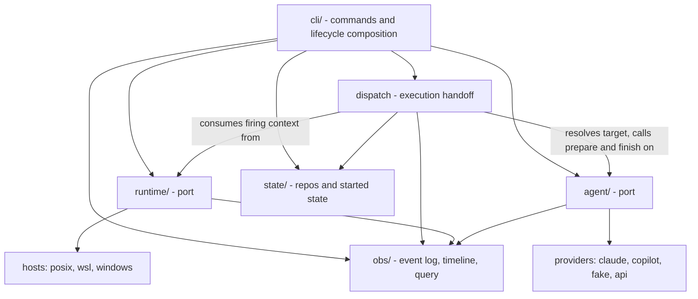

This is a proposal, not yet a decision record. No code has changed. It
states the problem, the target architecture, the open decisions that
need the developer's call, and the migration sequence. Once accepted it
should be rewritten in the past tense as a decision, per the
conventions in [README.md](README.md).

To resume this work later, start at
[Key learnings and next steps](#key-learnings-and-next-steps), then
[Picking this up](#picking-this-up) at the end of the document. The
first records what the review established; the second lists what is
decided, what is not, and what can begin without waiting for a decision.

## Problem

The package is 18,951 lines of source against 8,753 lines of
test. (Every line count in this document is non-blank lines,
`grep -cve '^\s*$'`.)
The two seams that matter already exist, but neither is explicit:

- The **host seam** is a set of functions (`hostruntime`) plus two
  parallel trigger stores (`crontasks`, `wintasks`) and one event-source
  seam (`watchsource`), whose POSIX implementation is inline and whose
  Windows implementation lives in `winwatch`. It works, and
  [windows-support.md](windows-support.md) records why it is functions
  rather than a protocol object, but there is no single path that
  owns "the state of automation on this host".
- The **provider seam** is `agent_adapters`, a good abstraction that is
  only half applied: adapter quirks and generic execution are
  interleaved inside `headless.py`, which is 2,528 lines and holds
  frontmatter parsing, path discovery, MCP resolution, argv
  construction, subprocess execution, output normalization, safe-output
  enforcement, logging, and handler invocation.

The costs follow from that:

1. **Host state has no owner.** `activate` (833), `stop` (48),
   `health_check` (1,014), `doctor` (863), and `schedules` (194) each
   reimplement part of "what should be installed, what is installed,
  what is the difference". The backlog theme "Host changes that cannot
  half-finish" (open [#226](https://github.com/johnshew/agents-live/issues/226),
  closed [#231](https://github.com/johnshew/agents-live/issues/231))
  illustrates the same failure shape, though those issues
  concern plugin and executable state rather than triggers. They are
  evidence for a reusable convergence pattern, not evidence that one
  host-state owner can make unlike artifacts transactional.
2. **Liveness leaked into the command surface.** `heartbeat` is a public
   verb about a WSL implementation detail. Nothing outside a WSL host
   should know the word.
3. **Trigger syntax is spread across three fields and two shapes.**
   `schedule` is cron-ish, `watchPath`/`watchIgnore`/`debounce` are three
   YAML fields that must be re-joined by every consumer, and each store
   re-derives the semantics on its way to a crontab line or a Task
   Scheduler XML trigger.
4. **The CLI is a participant.** `cli.py` and `cli_spec.py` (1,169 lines
   together) plus `status`, `completions`, `dashboard` reach into
   execution and scheduling internals, so a change to either seam
   ripples into the command surface.
5. **The test suite cannot execute the paths that break.** Recorded in
   the backlog as [#184](https://github.com/johnshew/agents-live/issues/184)
   and [#180](https://github.com/johnshew/agents-live/issues/180). The
   structural cause is that neither seam has a fake on the other side, so
   coverage is bought with mocks.

## Goals

Ordered. Later goals must not be bought at the cost of earlier ones.

1. **Reduce concepts before reducing lines.** Measurable proxies:
   - Public types and callables imported across a seam: target under
     25 per port. Value-object fields do not count; the fitness
     function inspects the exported API and cross-boundary imports.
   - Frontmatter fields an agent author must know: 25 today; 21 after
     the collapses this document actually specifies (the three watch
     fields to one string, `model` into the selector, `handler`
     retired). A smaller surface is desirable but needs field
     decisions not yet made; an earlier target of 12 was aspiration
     without a plan and is withdrawn.
   - Public CLI verbs: target no growth, and `heartbeat` removed.
   - Internal mechanism words (`plan`, `apply`, `converge`, `diff`,
     `subscription`) appearing in CLI help, output, or error text:
     target zero, enforced by a test. The user's vocabulary is
     `start`, `stop`, and `run`.
   - Occurrences of `sys.platform`, `os.name`, or a WSL check outside
     `runtime/hosts/`: target zero, enforced by a test.
   - Modules that import both a host detail and an agent detail: target
     zero, enforced by a test.
2. **One owner per fact.** Desired automation state, actual automation
   state, and the difference between them are computed in one pure
   function, not in five commands.
3. **Only immutable value records composed of primitives cross a seam.**
   A firing carries an agent identifier, never an agent object, because
   on every supported platform the process that registers a trigger is
   not the process that services it. Host service objects do not cross
   into the agent port.
4. **Built-ins use the same contract as their peers.** Provider
   built-ins register through the provider plugin path. Host built-ins
   satisfy one internal conformance contract; dynamic host-plugin loading
   is deferred until an external host implementation exists.
5. **Reduce line count.** Targets in [Expected size](#expected-size).
   This is an outcome of goals 1 through 4, not an independent goal.

Non-goals: changing what the tool does for a user, adding a scheduler
daemon, adopting asyncio, or shipping any backward-compatibility shim
(the repository rule stands; any frontmatter break is handled by a
version bump, see [Open decisions](#open-decisions)).

## Target architecture

Two seams, composed by the command and dispatch paths:

- **`runtime/`** - the port for "automation on this host": triggers,
  watches, processes, liveness, convergence. Implemented by host
  adapters: `posix`, `wsl`, `windows`.
- **`agent/`** - the port for "a runnable unit of work": definition,
  invocation, outcome. Implemented by provider plugins: `claude`,
  `copilot`, `fake`, later `api`.
- **`dispatch.py`** - the execution handoff between them. Lifecycle
  commands also compose the two seams when they turn definition metadata
  into runtime subscriptions; neither seam imports the other.
- **`state/`** - supporting persistence for the repository registry and
  started state. Optional assignment policy also lives here. Runtime
  artifact tracking stays inside `runtime/`.
- **`obs/`** - event log, timeline, query. Written by both ports,
  owned by neither.
- **`cli/`** - inspects and changes settings through the ports and
  hands execution to `dispatch`; no execution logic of its own.

The two ports never import each other, and only primitive value records
cross a seam. The change lands strangler-fig - each phase releases
independently over the live system, per the
[migration sequence](#migration-sequence) - not as a rewrite. Arrows
below point from depender to dependee.



### The runtime port

Intentionally small. It initializes the host, keeps itself honest,
converges a set of subscriptions, and reports firings as primitives.

The user model it serves is three verbs and nothing else. An agent
definition says how and when it should execute;
`start` means make that happen automatically here, `stop` means
stop making it happen, and `run` means do it once now. Convergence is
how those verbs are kept honest, never something the user is asked to
think about: no verb, flag, or message names a plan, a diff, a
subscription, or a convergence pass. What surfaces instead is `status`
and `doctor` in the same three-verb vocabulary - this agent is started
here, this one should be and is not, re-run `start`.

One word, one meaning: an agent is **started** or **stopped** on a
runtime, and a **run** is one execution of it. Nothing here calls an
agent active, activated, enabled, or running - those were four
spellings of one bit, and the concurrency rule in
[the firing contract](#the-firing-contract) needs "running" to keep
meaning a run in flight. The verbs need no rename: `cli_spec.py`
already publishes `start`, `stop`, and `run`, and only the words
behind them lag - the module is `activate.py`, `start`'s help says
"Activate cron and watcher triggers", and `stop`'s says "Deactivate
triggers". That is a module rename in phase 2 and a help-text pass in
phase 7, not a breaking change.

One caution comes with the word, and it is narrower than it looks.
Service managers do split the two ideas deliberately: systemd states
outright that "enabling and starting units is orthogonal", where
`enable` hooks a unit up to be started later and `start` spawns the
daemon now, and where `disable` stops nothing (`systemctl(1)`).
Windows Task Scheduler, the closer analogue, splits them too but
spells them the other way round: a task is Enabled or Disabled, and
`Start-ScheduledTask` runs it once, now. launchd uses load and
bootstrap for the same idea. So there is no universal convention to
appeal to, only a universal distinction.

That distinction exists because a daemon has a resident running state
separate from its registration. Most agents have none: between firings
nothing of theirs is running, so there is one bit here rather than two,
and naming it is a free choice. `start` earns it because watch agents
*do* leave a process resident - starting one literally starts a
watcher, which `enable` would describe poorly - and because `stop` is
already its opposite. The residual risk is somebody typing `start` and
expecting an immediate run; one line of output naming the next fire
time and pointing at `run` closes it.

That has one consequence worth stating, because today's code does not
satisfy it: **started is a recorded fact**, not something derivable
from frontmatter. A schedule in frontmatter says how an agent would
run if it were started, not that it is started on this runtime. Today
the only record is the installed trigger itself, which is why the
check-and-repair loop can prune an orphaned trigger
(`health_check.py`) but can never restore a missing one: converging
from frontmatter alone would undo every `stop`. The desired set is
therefore frontmatter *times* the started set that `start` writes
and `stop` clears, kept in `state/` beside optional assignment policy.
Recording it is
what turns an externally deleted trigger into repairable drift instead
of a silent stop.

The runtime port is a module-level API over four narrow, separately
implementable protocols, separated by lifetime: `TriggerStore` survives
a reboot, `Supervisor` survives the spawning process but not a reboot,
`ChangeSource` dies with its holder, and `ChildRunner` dies with the
call. The segregation is not ceremony: the four have different failure
modes and different conformance tests.

The ladder explains the watcher rather than merely classifying it. A
watcher is the only thing at the second rung, outliving its parent but
not a reboot, which is exactly why a watch subscription carries two
pieces of actual state - a durable respawn artifact and a live process -
where a schedule carries one. Splitting supervision from execution also
keeps the fakes apart: a dispatch test needs a recording `ChildRunner`
and has no business implementing `owned()`, and a convergence test needs
a scripted `Supervisor` and never runs a child. One protocol serving
both is how a fake drifts into a mock.

There is deliberately no `Runtime` facade object:
[windows-support.md](windows-support.md) records building and
rejecting a `HostRuntime` object once already, because nearly every
member was a stateless function of the host. With one idempotent
`converge` and no plan held between calls, the validity window that
was the likely candidate for instance state no longer exists. Phase 2
therefore keeps the proven module-of-functions shape and introduces an
object only if implementation evidence later finds instance state that
cannot live in one of the protocol implementations.

```python
def converge(subscriptions: Sequence[Subscription], *,
             dry_run: bool = False) -> Converged:
    '''Goal-seek: make this runtime match the complete desired set.
    Host prerequisites and liveness first, then subscriptions.
    Idempotent - a second call reports nothing to do. dry_run reports
    the same operations without performing them.'''


def health() -> Health:
    '''Read-only. Liveness is a field here, not a command.'''


def change_source() -> ChangeSource | None:
    '''None when this host cannot watch, so no adapter is obliged to
    declare a method it would only raise from.'''


class TriggerStore(Protocol):
    '''Durable. Survives reboot. One OS artifact per subscription.
    Observes artifacts only: it cannot reconstruct a Subscription,
    because a watcher's artifact records just its respawn command.'''
    def install(self, rendered: RenderedSubscription) -> None: ...
    def remove(self, key: str) -> None: ...
    def list(self) -> list[InstalledTrigger]: ...


class ChangeSource(Protocol):
    '''Process-scoped. Raw paths only: no debounce, no policy.'''
    def start(self) -> None: ...
    def poll(self, timeout: float) -> list[str]: ...
    def stop(self) -> None: ...


class Supervisor(Protocol):
    '''Detached. Outlives the spawning process, not a reboot. The
    watcher's rung: convergence uses this and never runs a child.'''
    def spawn_detached(self, argv: Sequence[str], **io) -> ProcessRef: ...
    def alive(self, ref: ProcessRef) -> bool: ...
    def terminate(self, ref: ProcessRef) -> None: ...
    def owned(self, role: str | None = None) -> list[ProcessRef]: ...


class ChildRunner(Protocol):
    '''Per-call. Dies with the call. Dispatch uses this and nothing
    else in the runtime port.'''
    def run_child(self, argv: Sequence[str], **io) -> ChildResult: ...
```

Primitive firing context is produced by a generic loop in
`runtime/watchloop.py` that consumes a `ChangeSource` and applies
debounce, ignore rules, the breaker, and duplicate suppression. No host
adapter produces dispatch input. Phase 5 first tests whether the current
argv ingress already carries everything dispatch requires.
See [Where events are produced](#where-events-are-produced).

Runtime value types:

```python
@dataclass(frozen=True)
class Subscription:
    key: str          # stable, derived from scope + target + trigger
    scope: str        # "runtime:<installation-uuid>" (this installation)
                      # or "repo:<normalized-root>"
    target: str       # "agent:<id>", or "runtime" for the
                      # maintenance loop. Not an object, not a callable.
    kind: str         # "schedule" | "watch"
    trigger: str      # one expression string, per the grammars below

@dataclass(frozen=True)
class InstalledTrigger:
    key: str          # matches a Subscription.key when it is ours
    kind: str
    rendered: str     # the OS artifact's own record, fingerprintable

@dataclass(frozen=True)
class WatcherRecord:
    key: str
    fingerprint: str  # canonical watch expression loaded at spawn
    process: ProcessRef

@dataclass(frozen=True)
class Operation:
    kind: str    # "install-trigger" | "remove-trigger"
                 # | "start-watcher" | "stop-watcher" | "repair-host"
    key: str
    detail: str  # printable, internal vocabulary; status and doctor
                 # translate it into the user's words

@dataclass(frozen=True)
class Converged:
    dry_run: bool
    done: tuple[Operation, ...]              # "would do" when dry_run
    failed: tuple[tuple[Operation, str], ...]  # operation, error
    health: Health
```

`Subscription` is desired state, computed from the frontmatter of the
agents started on this runtime; `InstalledTrigger` is observed
state, read back from the OS. They are
different types on purpose: a watcher's OS artifact records only its
respawn command, never the watch expression, so the store cannot
reconstruct a `Subscription` and is never asked to. The diff matches
the two by key and by a fingerprint of the rendered form.

The runtime scope names an installation, not a machine: native Windows
and each WSL distribution on the same hardware are separate runtimes
that run agents independently (`hostruntime.py`), so the runtime scope
uses the installation UUID that the 2026-07-28 identity decision already
defines, never a host name or the implementation label `posix`. It has
nothing to do with which agents are assigned to the installation.

Every lifecycle command collects the complete desired set for the
registered repositories before calling `converge`; if the repository
registry or optional assignment policy cannot be read, it does not call
`converge`. That makes the desired set authoritative without a second
scope parameter or an `ALL` sentinel. Safe global removal first requires
each persisted artifact to carry a structured Agents Live marker; until
that prerequisite lands, convergence removes only artifacts the current
stores can identify unambiguously.

A watch subscription has a second piece of observed state the store
cannot see: the running watcher process, which loaded its watch
expression at spawn. `actual` for a watch subscription is therefore a
pair - the installed respawn trigger and the running watcher - where
the watcher is found through `Supervisor.owned(role="watcher")` and
carries the fingerprint of the expression it was started with. A desired
fingerprint that differs produces a stop-watcher followed by a
start-watcher; without that, editing a watch expression would take
effect only at the next reboot.

**Where that fingerprint lives is the one design detail phase 2 settles
by measurement.** The target is that it lives on the artifact and
nowhere else: the structured marker that learning 13 already makes a
prerequisite for exhaustive pruning carries key, scope, and fingerprint,
and the running watcher carries the same canonical expression in its own
command line, so both halves of `actual` are self-describing and no side
index exists. That is the Kubernetes `pod-template-hash` shape, it makes
one mechanism serve two needs, and it closes the write-ordering window
between spawn and record by construction rather than by rule.

The fallback, if measurement defeats the target, is a runtime-owned
artifact index holding a `WatcherRecord` per watch subscription. Three
things decide it, and all three are cheap to test early: whether a watch
expression at the length bound still fits a Windows respawn
registration; whether reading another process's command line is
acceptable as a fourth host capability alongside pid, creation time, and
image name; and whether canonical rendering is exact enough that a
re-rendered expression always matches the one a live watcher was started
with. If all three pass, `WatcherRecord`, the index, and the ordering
rules below are deleted together.

Convergence deliberately spans the runtime protocols, but not `state/`.
Started state and optional assignment are inputs already resolved by the
caller. Its operation vocabulary - install or remove a
trigger, start or stop a watcher, repair a host prerequisite - is
interpreted through `TriggerStore`, `Supervisor`, and the
runtime's artifact index. That vocabulary is internal: it is what `converge`
reports and what `status` and `doctor` render into the user's words,
never something a caller assembles. The exact `Converged`, `Health`,
`RenderedSubscription`, and `ChildResult` fields are phase-2 design
work; which protocol owns each operation is fixed here.

One call rather than a plan handed back and applied later is
deliberate. A held plan needs a validity window, a staleness rule, and
a caller that knows to re-plan after a partial failure. A single
idempotent pass under the runtime lock needs none of those, and the
answer to a partial failure is to run the same command again.
`--dry-run` is the only thing the two-step surface bought, and
`converge(..., dry_run=True)` returns it without the artifact.

Watcher record ordering fails toward convergence. These rules belong to
the fallback design above; under the target the process and the artifact
are their own records and none of this is needed. `converge` spawns
the watcher, receives its `ProcessRef`, then atomically writes the
`WatcherRecord`. If that write fails, it terminates the child and
reports the start as failed. A crash between spawn and record is found
on the next pass as an owned watcher-role process with no matching
record; the pass terminates it before starting the canonical watcher.
The cleanup consults `owned(role="watcher")` only - `ProcessRef`
carries a role precisely so this sweep can never terminate an
in-flight provider child. Stopping does the reverse: confirm
termination, then remove the record. No unrecorded watcher is ever
treated as current.

Firing context distinguishes the four ways a run begins: `clock`,
`boot`, `watch`, and `manual`. Only `clock` passes through the dueness
gate. The current `--scheduled`, `--boot`, and changed-file inputs
already carry that distinction; a full envelope, if selected, must
preserve it.

Two preconditions carry over from today's `activate`, but they belong
one layer up rather than in the runtime: assignment never invents an
owner, and collection abstains when the registry or the assignment
policy cannot be read. See
[Started state and optional assignment](#started-state-and-optional-assignment).

One mapping is worth stating, because today's scheduling layer persists
three trigger kinds defined by `triggers.py`: schedule,
watcher-respawn, and maintenance.
A `watch` subscription's durable OS artifact is its `@reboot`
watcher-respawn entry, so `TriggerStore` still holds one artifact per
subscription of either kind. The host-scoped check-and-repair loop is
not a special case in the diff: it is exactly one subscription with
the runtime-instance scope and target `runtime`, added to that
runtime's own convergence rather than to every repository's. It is a
special case at firing time,
deliberately: `dispatch` resolves only `agent:` targets through the
agent port, and the runtime-targeted subscription renders the
scheduled invocation of `runtime.converge()` over everything started
on this runtime (today's `internal maintain` entry
point), so a maintenance firing never enters event dispatch at all.

What lives in the **runtime core**, generic across hosts: the two
grammars, debounce, the fire-rate circuit breaker, duplicate
suppression, the "is this minute actually due" gate that today only
Windows needs, subscription-key derivation, the pure diff
(`diff(desired, actual) -> operations` - `converge` gathers `actual`
and delegates to it; the pure function is what Tier 1 tests exercise),
orphan detection, and the junk sweep.

What a **host adapter** supplies: the four protocols above, a
liveness report, and the host facts `hostruntime` answers today -
identity, state location, runtime identity, lock acquisition,
executable pinning, the child environment floor, shell availability,
and native-tool detection (`hostruntime.py`). That list is longer
than "four protocols plus liveness", so freezing the adapter contract
starts with a capability inventory of `hostruntime`'s exports, not
with this sketch. `wsl` is likewise more than `posix` plus liveness:
it is a separate environment with its own runtime identity and
interop-native tool checks; liveness is what absorbs `heartbeat.py`,
not the whole delta.

`Supervisor` and `ChildRunner` are the home for what is scattered today across
`hidden.py` (`CREATE_NO_WINDOW`), `spawn.py`, `hostruntime`'s pty and
child-output decoding, and the `wslg.exe` windowless launcher.
`ProcessRef` carries pid, creation time, and image name - the identity
triple [windows-support.md](windows-support.md) already requires
before a termination - plus a role (`watcher` | `provider-child` |
`maintenance`), so no seam ever passes a bare pid and no sweep ever
guesses what a process is. `dispatch` turns the agent port's launch
description into a `ChildRunner.run_child` call and returns the raw value
record to the agent port for normalization. No provider imports the
runtime or receives a host service object.

WSL liveness also owns a Windows-side Task Scheduler artifact, and
replacing it is not yet transactional: today's `heartbeat.install()`
registers the current task name with `Register-ScheduledTask -Force` -
overwriting the existing registration - *before* it verifies a fresh
beacon; only the legacy task enjoys verify-before-remove. Phase 3 must
close that gap rather than inherit it: stage the replacement under a
distinct task name (or capture the old action and restore it on
failure), verify a fresh beacon, and only then swap and remove the old
tasks and the public command. The migration belongs to WSL liveness
convergence, not to the generic `TriggerStore`.

### Started state and optional assignment

One core fact decides what this installation should automate:
**started state**. It is a machine-local record keyed by repository and
agent. `start` writes it and `stop` clears it. Frontmatter says how an
agent would run; it does not say whether this installation should run it.

Assignment is not a second core fact in the default product.
`ownership.py` defines local mode as the absence of an ownership
declaration, and in local mode every local agent is mine without a
registry read. Only a project that opts into the `agents_live.ownership`
plugin adds an assignment decision. Registry-specific states such as
wildcard, unclaimed, and transferred belong to that plugin contract,
not to the runtime model. Assignment is therefore absent from the
public kernel's pure-function tests: in a default install there is no
decision to test, and the plugin brings its own conformance suite.

Collection applies one safety question to three inputs: would treating
this input as empty destroy working automation?

| Input | Meaning | Failure rule |
|---|---|---|
| Repository registry | Where to look | Abstain from convergence; the desired set cannot be bounded. |
| Optional assignment plugin | Permission to run here | Abstain rather than silently fall back to local mode. |
| Definitions in a registered repository | What could run | An unreadable repository contributes no subscriptions, so its unusable triggers are pruned and later rebuilt from started state. A malformed definition in a readable repository is an error and aborts convergence rather than masquerading as deletion. |
| Started state | What should run here | Adopt when never initialized; abstain when present but unreadable. |

Started state is written by `start` and `stop`, but convergence reads it
on every pass, which makes it an input subject to the same question as
the rest. Treating it as empty means "nothing runs here", and the
response to that is to prune every trigger on the machine, so the two
ways it can be missing have to be kept apart:

- **Never initialized** - no store, no marker. Convergence adopts:
  every artifact this installation can identify as its own becomes a
  started record, and the marker is written. On a fresh machine nothing
  is installed, so the adopted set is empty and this is
  indistinguishable from an ordinary first run.
- **Present but unreadable** - permission denied, corrupt, caught
  mid-write. Abstain, exactly as for the registry, because the
  condition is transient and guessing destroys working automation for a
  fact that could not be confirmed.

Adoption is an ordinary property of convergence rather than an upgrade
step. Started state can go missing at any point in a machine's life:
a cleared state directory, a restored home directory, a new user
profile, a failed disk. Keeping the recovery path and the fresh-install
path as one code path is what stops it rotting unnoticed, and it cannot
live only in `upgrade`, because new code arrives through package
upgrades with no interactive command and the maintenance trigger fires
regardless. Adoption claims only artifacts the installation can identify
as its own, so an unrecognized artifact survives as an orphan rather
than being deleted.

After those reads succeed, collection keeps started agents that the
optional assignment policy permits, expands their trigger declarations
into subscriptions, and calls `converge` once with the complete set.
A started agent with two schedules and a watch expression becomes three
subscriptions. Anything absent is stopped or deleted, so orphan pruning
is no longer a separate mechanism. The runtime adds its own maintenance
subscription as a prerequisite; callers never assemble it.

Pruning an unavailable repository is recoverable because started state
lives outside the repository. The accepted cost is that a fire due while
the repository is unavailable is lost under the skip misfire policy. A
repository move is different: `paths.repo_state_key` deliberately keys
state by resolved absolute path today, so phase 2 must define how the
existing `repos` operation carries started state to the new path before
started state relies on that location. This is a migration requirement,
not a current runtime-state corruption bug.

The optional assignment plugin never invents an owner during a sweep.
It may materialize a frontmatter `owner:` seed on the first targeted
start, preserving today's behavior. `start --transfer-here` composes a
claim followed by a start. `--transfer-to` can retire because it cannot
complete the receiving side; the operator must run `start
--transfer-here` there anyway. Ephemeral `_`-prefixed definitions remain
local to the run that created them and are excluded from persistence.

A transfer can propagate before the losing installation next converges.
The firing path therefore repeats the single desired-state check for the
subscription key and fails closed. In local mode that check is only
started state; in registry mode it also consults the optional assignment
policy. `dispatch` needs no ownership vocabulary.

### Firing events: what the state of the art actually is here

Callbacks are the wrong primitive for this system, and not because
callbacks are old. On every supported platform a scheduled trigger is
serviced by a **new process** created by the operating system minutes or
days after registration. No object graph survives that gap. The only
things that can cross it are bytes on disk and an argv.

The common shape is a **durable subscription plus a primitive firing
ingress**. Cron and Task Scheduler execute argv directly; systems such
as EventBridge and CloudEvents use richer envelopes. The shared rule is
durability plus primitive transport, not one mandatory envelope shape:

- Registration writes a **declarative, durable record** (the OS artifact
  plus an index entry). It is idempotent and reconcilable.
- Firing supplies the dispatcher with the primitives it needs. Today
  that is agent id, origin flags, and changed files through argv plus,
  for large payloads, a state-file reference. A richer envelope remains
  an option if the phase-5 prototype proves those inputs insufficient.
- The **dispatcher** resolves target to a runnable. It is the only code
  that knows both halves exist.

This confirms the core rule: the seam carries an agent id, not a live
agent. The in-process and cross-process paths must produce the same
dispatch inputs, so a watcher firing and a scheduled firing differ only
in transport and origin.

Recommended against: asyncio. It buys nothing here (one blocking
iterator and one reader thread per source is sufficient) and would
propagate into the CLI and every provider. Also recommended against: an
in-process scheduler daemon. Delegating to cron and Task Scheduler is
the single best property this package has, because the host survives
reboots and the package does not have to.

### Where events are produced

Three options were considered for whether the port streams events.

| Option | Shape | Cost |
|---|---|---|
| A. `Runtime.events()` | Port yields fully-policied events | Every host adapter must be handed the policy engine or reimplement it. Registration and streaming are forced to share one lifetime they do not have. |
| B. Generic loop over a raw source | Host supplies `ChangeSource`; `runtime/watchloop.py` applies policy and yields primitive firing context | One more named module. |
| C. Two independent ports | `TriggerStore` and `ChangeSource` exposed directly, with no module-level API over them | Every caller has to know which host capabilities exist before it can ask a question. |

**Decision: B, with C's lifetime segregation preserved.** Withdrawing
the facade object narrowed the gap between B and C, so the difference
worth naming is not whether an object exists but who asks: the runtime
module answers on the caller's behalf, and the four protocols keep
their separate lifetimes underneath. The port
surface stays small, policy stays generic and testable with no host
present, and a host that cannot watch returns `None` from
`change_source()` rather than raising from a method it was obliged to
declare. Registration is
durable and reconcilable; streaming is process-scoped and disposable.
Merging those two lifetimes into one interface is the mistake option A
makes, and it is the mistake the current code makes implicitly.

### The firing contract

Two behavior rules are fixed in the runtime core rather than exposed as
frontmatter: concurrency and misfire. A third transport rule applies
only if the full envelope is selected. None should grow the author-facing
field count in [Goals](#goals).

**If the full envelope is selected, it is versioned.** Its `spec` field
carries the envelope schema version, and the argv ingress carries it too. This is not
bookkeeping: the process that writes a durable trigger and the process
that services it are separated by an operating system and, across an
upgrade, by a release boundary. A cron line written by 5.5 fires into
a 6.0 binary. The decoder therefore accepts the current version and
the one before it, and refuses an unknown version with an admin-log
error rather than guessing at a payload. That is an upgrade path
rather than a compatibility shim - the two ends are separated by the
scheduler, not by a code path this package controls - and the window
is bounded, because the next convergence rewrites the artifact at the
current version.

**Concurrency policy: skip.** A firing that arrives while the same
subscription's previous run is still going does not start a second
run; it is recorded and dropped. This unifies a split that exists
today: Task Scheduler is configured `MultipleInstancesPolicy=IgnoreNew`
(`wintasks.py`, whose comment notes that overlapping runs share one
log and one lock), while cron on the same agent happily starts a
second run. Skip is the behavior worth keeping, and stating it is what
makes the two hosts agree. The two values a general scheduler would
also offer are declined: `allow` is the accidental POSIX behavior this
rule removes, and `replace` would let a watch storm kill an agent
mid-answer.

**Misfire policy: skip.** A `clock` firing that arrives outside a
minute its expression names does not run, and firings missed while the
machine was off or asleep are not replayed. That is cron's behavior by
construction and Windows's behavior today, where Task Scheduler is set
`StartWhenAvailable=true` and `claim_due_minute` filters what comes
back (`schedules.py`); the rule that file leaves to Task Scheduler is
now stated rather than inherited. Two firings inside one matching
minute still produce one run, which is what the claim in that function
already provides. `boot` firings are exempt, being due by definition,
and `watch` and `manual` firings never consult the gate. Catch-up
after downtime is the obvious future option and would change
user-visible behavior, so it stays out of scope here.

### Trigger grammars

One string per subscription, parsed once in the runtime core, rendered
by each host. Sketches, deliberately close to today's behavior:

Schedule expression:

```ebnf
schedule    = special | cron ;
special     = "@reboot" | "@yearly" | "@annually" | "@monthly"
            | "@weekly" | "@daily" | "@midnight" | "@hourly" ;
cron        = minute sp hour sp dom sp month sp dow ;
minute      = field ;   (* 0-59  *)
hour        = field ;   (* 0-23  *)
dom         = field ;   (* 1-31  *)
month       = field ;   (* 1-12 or JAN-DEC *)
dow         = field ;   (* 0-7 or SUN-SAT; 7 folded onto 0 *)
field       = item , { "," , item } ;
item        = ( "*" | value | range ) , [ "/" , number ] ;
range       = value , "-" , value ;
value       = number | name ;
name        = letter , { letter } ;
number      = digit , { digit } ;
```

This preserves the language accepted today: a `schedule` field is one
string or a YAML list of strings, and each string is five-field Vixie cron,
including month and weekday names, plus the eight `@` keywords validated
by `headless.py`. The shared parser currently handles only numeric fields
and `@reboot`, so the other accepted forms do not translate on Windows;
the grammar must close that existing portability gap rather than silently
remove accepted POSIX behavior. Each list item becomes its own
subscription and is re-rendered canonically, so comparison and hashing
never depend on the author's spelling. New `@` specials beyond the eight
already accepted remain out of scope.

Watch expression:

```ebnf
watch       = patterns , [ sp , debounce ] ;
patterns    = pattern , { sp , pattern } ;
pattern     = include | exclude ;
include     = glob ;
exclude     = "!" , glob ;
debounce    = "debounce" , sp , duration ;
duration    = number , unit ;
unit        = "ms" | "s" | "m" ;
glob        = ? repo-relative path or glob, quoted if it contains spaces ? ;
```

So `watch: "docs/**/*.md !node_modules/** debounce 2s"` replaces the
three fields used today. The gain is not brevity; it is that a
subscription is one comparable, hashable, renderable string, which is
what keeps the diff pure and the index a flat table.

`debounce` is deliberately not a pattern. There is one watch
subscription per agent holding one window (`watchpolicy.DebounceWindow`
already carries a single delay), so the term is one optional trailing
option on the whole expression rather than something that could appear
to attach to a preceding glob. Four rules travel with it: at least one
include, since an expression of only excludes watches nothing; at most
one `debounce`, a second being an error rather than last-wins;
precedence that is not positional, so a path fires when it matches an
include and no exclude, unlike gitignore's last-match-wins; and a
canonical form of sorted includes, sorted excludes, then the normalized
duration, so reordering does not restart a watcher.

The author's excludes sit on a built-in floor that stays implicit:
dotfiles, `__pycache__`, `_index_.md`, and the tool's own JSONL logs are
always ignored (`watchpolicy.should_ignore`).

The collapse is a capability gain rather than a rename. Today's
`watchIgnore` is not glob-matched at all: an entry matches an exact
basename, or a directory prefix when it ends in `/`. So the old form
maps into the new one mechanically (`secrets.env` to `!**/secrets.env`,
`node_modules/` to `!node_modules/**`) while the reverse does not, which
is what lets a migrator compute the replacement line from a file's own
values.

A host watches directories, not globs: the core derives each
`ChangeSource` root as the longest literal prefix of an include
pattern (`docs/` above), and the patterns themselves are policy
applied in the generic watch loop. That replaces today's split, where
`watchPath` names the directories and `watchIgnore` filters what they
yield.

### The agent port

The agent port owns definition loading and provider-specific preparation
and normalization, not trigger registration or process creation.
Lifecycle orchestration reads trigger declarations from the loaded spec
and produces runtime subscriptions above both ports.

A run is a short pipeline rather than a single call: up to three child
processes in a fixed order, each optional, plus one optional run-scoped
resource. `run.py` orchestrates that today. The port describes each
piece and runs none of them.

```python
class Step(StrEnum):
    PRE   = "pre"     # pre-processor script; may end the run with skip
    AGENT = "agent"   # provider CLI; absent when runtime is none
    POST  = "post"    # post-processor script


def load(agent_id: str, *, root: Path) -> AgentSpec: ...
def shape(spec: AgentSpec) -> RunShape: ...
def prepare(spec: AgentSpec, step: Step, ctx: StepContext) -> Launch: ...
def interpret(spec: AgentSpec, step: Step, launch: Launch,
              raw: RawOutput) -> StepResult: ...
def outcome(spec: AgentSpec,
            results: Mapping[Step, StepResult]) -> Outcome: ...
```

`RunShape` is four booleans - which steps exist, and whether the run
needs the pipeline MCP - so the six valid pipeline shapes are a table
test rather than a narrative. Only the `AGENT` step involves a provider;
`PRE` and `POST` launches are built from a file extension and an
environment dict (`_build_handler_command` today), which is why they are
uniform at the runtime seam and why a provider plugin never learns that
processors exist.

Dispatch runs the sequence as straight-line code with three
conditionals. A design that returned the whole pipeline as one data
structure, with declared bindings between steps and a rule vocabulary
for what to do after each, was considered and rejected: it invents a
general-purpose orchestrator for a fixed four-position sequence, and the
only thing it buys is avoiding a second call across the seam, paid for
with two closed languages and a state object threaded through the port.
Asking the port again is cheaper than a vocabulary that avoids asking.
The calls are named and made at fixed points, so nothing stateful
crosses the seam.

The `AGENT` step's launch cannot be built before `PRE` finishes, because
the pre-processor's stdout is interpolated into the prompt. That is the
concrete reason `prepare` is called per step at the moment it is needed.

`Request` carries input text, changed files, and environment overlay.
`Outcome` is a closed union: a success with structured output, usage,
and transcript reference, or a failure with a category drawn from a
closed taxonomy (the categories `headless.py` already emits: `timeout`,
`output_parse_error`, `agent_output_invalid`, `cli_crash`,
`post_processor_crash`, `pre_processor_crash`, `agent_invalid`, `empty_output`, and the hierarchy's base
`agent_error`, which stays as the explicit catch-all so the union is
closed rather than open through inheritance).
Today's category for a failing post-processor is `handler_crash`, an
artifact of the field's old name. 6.0 renames it to
`post_processor_crash` so the taxonomy is symmetric with `Step`, riding
the same break that retires `handler`.
Exceptions stay internal to the port; the seam returns values. `dispatch`
is the only caller that composes `prepare`, `ChildRunner.run_child`, and
`interpret`, and it owns the retry loop, because whether an output is
empty is a judgement `interpret` makes while re-running is an action only
dispatch can take.

Trigger expansion deliberately is not an `Agent` method. Otherwise the
agent execution port must import the runtime's `Subscription` type,
contradicting the port boundary. Lifecycle orchestration reads the
definition's primitive schedule and watch declarations and constructs
subscriptions; the runtime never learns what an agent is.

### The provider plugin

Providers stay as small as `agent_adapters` already proves they can be:

```python
class Provider(Protocol):
    name: str
    def prepare(self, spec: ResolvedSpec, request: Request) -> Launch: ...
    def parse(self, raw: RawOutput) -> Completion: ...
```

(`prepare`, not `plan`: the runtime port's internal diff owns that
word, per the naming discipline in
[Naming hazard](#naming-hazard-worth-fixing-now).)

The two `prepare` functions are one level apart, and the type names say
so. The agent port's `prepare` resolves the `runtime:` selector to a
concrete provider, model, and effort, narrows `AgentSpec` to
`ResolvedSpec`, and delegates to the selected provider.
**`ResolvedSpec` is that narrowed projection**: what a provider needs to
build a launch, which is the prompt, mode, allow-tools, mcps, the
environment overlay, and the resolved model and effort. It deliberately
excludes the trigger fields, `owner`, the output contract, and the
processors. The narrowing is what keeps a published plugin boundary from
becoming a contract over the whole definition, and it costs nothing by
goal 1's count: `AgentSpec` crosses the port's public surface and
`ResolvedSpec` crosses the provider seam, one named type each. It is
also what today's adapters already do, receiving `mode`, `allow_tools`,
`system_prompt`, and `env` rather than an `AgentConfig`. The exact fields
are phase-5 work; the rule is fixed here.

`Completion` is likewise narrower than `Outcome` and not a second
spelling of it. A provider returns what it could read out of its own
output: the text or structured payload, usage, and a transcript
reference. `interpret` calls `parse` for the `AGENT` step and `outcome`
turns the collected results into an `Outcome` by applying the
provider-independent validation and classification listed
below. A provider never classifies an error, which is
what keeps the taxonomy closed.

One lifecycle question stays open until the fake CLI (see
[Testing approach](#testing-approach)) shows what generic invocation
actually needs from a provider: how streaming output is normalized
incrementally. The likely answer is a `parse_stream` hook rather than a
wider protocol; that call belongs to phase 5, made against evidence.

The question of who cleans up what `prepare` created is no longer open.
Anything scoped to the whole run, the pipeline MCP server most of all,
belongs to `dispatch`, which owns the run's lifetime and releases it on
exit; anything scoped to one step, such as a temp config file, is
released when that step's launch is done with. The port allocates
nothing it has to remember.

`Launch` is either a subprocess description (argv, env, temp config
files, the resolved timeout, whether a pty is required, whether TUI
noise must be filtered) or a direct call description for a future
API-router provider. `dispatch` owns retry, streaming, process cleanup,
and conversion from `ChildResult` to the primitive `RawOutput` record,
and it enforces the timeout `Launch` carries rather than owning it: the
value is a per-agent fact `prepare` resolves from the definition and its
default, and `dispatch` is the only side holding the child it applies
to. `RawOutput` records whether the child timed out, so the `timeout`
category is still classified in the agent port. The agent port owns
provider-independent size caps, JSON extraction and repair, schema and
path-root validation, provenance, and error classification. Logging is
through `obs/`. That split is the single largest line reduction available
in the package, because it removes the interleaving inside `headless.py`
without passing a process service into the agent seam.

### The runtime selector grammar

The frontmatter field stays `runtime:` if that is what the field
standard says, but it parses into a selector, not a string compared
against a set:

```ebnf
selector    = provider , [ "/" , model ] , [ ":" , effort ] ;
provider    = "default" | "none" | "local" | name ;
model       = name | "default" ;
effort      = "low" | "medium" | "high" | "xhigh" | "max" ;
name        = alnum , { alnum | "-" | "_" | "." } ;
```

The effort levels are taken verbatim from Claude Code's `effort` field
rather than invented, so a selector maps onto an existing vocabulary
instead of needing a translation table.

Examples: `default:high`, `claude/opus:high`, `copilot`,
`local/llama3.1`, `api/router-gpt:medium`, `none`. A provider declares
which models and effort levels it can honor; the core rejects a
selector no installed provider can serve, with a message that lists
what is installed. This is where "low, medium, hard reasoning" and
"named clis, named models" land in one field instead of three.

### Naming hazard, worth fixing now

The word "runtime" would otherwise mean two things: the host automation
manager (`hostruntime.id()` today) and the agent model selector
(`runtime:` in frontmatter today). Proposal: in code, `Runtime` and
`runtime/` mean the host only. The frontmatter field's parsed form is
`ProviderSelector`, never called a runtime in code. Reviewers should
reject any use of the bare word for the agent side.

### The CLI

`cli/` is a separate directory whose only permitted imports are the two
ports, `dispatch`, `obs`, and `state`. It calls the runtime module, reads
health and what is started, and converges. `start`, `stop`, and
`run` keep exactly the meanings they have today under their present
names; `--dry-run` prints
what would change. No verb, flag, help string, or error text names a
plan, a diff, or a convergence pass.
A one-shot `run` hands `dispatch` primitive context with origin
`manual`, so a user-invoked run and a scheduled run travel the same path
and differ only in origin and transport. The CLI contains no event loop, no argv
construction for a provider, and no platform branch. The declarative
`cli_spec` approach is good and should survive intact.

### state/, obs/, and dispatch

The `state/` and `obs/` responsibilities exist today and will re-scatter
across the ports unless they are named:

- **`state/`** - the repository registry, started state, and optional
  assignment policy. `repos.py`, `ownership.py`, and `paths.py` are
  already close to this. Runtime artifact records do not live here.
- **`obs/`** - the JSONL event schema, `qlog`, `timeline`. Both ports
  write to it; neither owns it. Keeping it separate is what lets a
  runtime test assert on emitted events without importing an agent.

And one that is genuinely new: **`dispatch.py`**, roughly 150 lines,
the execution handoff between the ports. Phase 5 chooses its smallest
sufficient surface. The watch loop calls it in-process, and a
scheduler-launched process reaches it through the argv ingress and any
state-file payload reference. If the full envelope is selected, this is
also where its decoder refuses an unknown version.
The still-desired check, the not-due gate (`clock` events only;
`boot`, `watch`, and `manual` are never "not due"), the concurrency
skip, and firing-context-to-request translation
live there. The still-desired check re-reads `state/` at firing time
and fails closed, which is what covers the window between an
assignment change and the losing runtime's next convergence -
eventual cleanup on that side, immediate refusal at the gate. It is
glue, but it is glue with a name and a test.

## Expected size

Targets, stated as hypotheses to be checked at each phase, not
promises.

| Area | Today | Target | Where the reduction comes from |
|---|---|---|---|
| Host automation (`hostruntime`, `crontasks`, `wintasks`, `winwatch`, `watchsource`, `watchpolicy`, `triggers`, `schedules`, `heartbeat`) | 3,544 | ~1,500 | Shared grammar and policy; hosts reduced to install, remove, list, watch, liveness. Task Scheduler XML is largely irreducible. |
| Lifecycle commands (`activate`, `stop`, `health_check`, `doctor`, `preflight`, `migrate`) | 3,266 | ~900 | One convergence path replaces five implementations; `--dry-run` and orphan pruning fall out of it. |
| Agent execution (`headless`, `run`, `agent_adapters`) | 3,181 | ~1,300 | Generic execution separated from provider quirks; one output path instead of layered retries. |
| MCP (`pipeline_mcp`, `pipeline_runtime`, bridge, loader) | 838 | ~700 | Mostly moves. |
| CLI (`cli`, `cli_spec`, `status`, `completions`, `dashboard`, `dashboards`) | 2,961 | ~2,200 | Dashboard is UI and stays; status and completions read the ports instead of re-deriving. |
| `smoketest` | 1,386 | ~450 | Conformance suites and a fake provider absorb most of it; what remains is the real-CLI release gate. |
| Test suite | 8,753 | ~5,000 | Table-driven grammar and diff tests plus two conformance suites replace the mock population. |

Source total: roughly 19,000 to roughly 10,800, holding the 3,775 lines
outside these rows constant. The number is a
consequence; the concept counts in [Goals](#goals) are the target.

## Testing approach

The current suite is mock-heavy because neither seam has a fake on the
other side. Making the seams explicit is what fixes that, so the test
plan is part of the refactoring rather than a follow-up.

**Tier 1 - pure, table-driven, no I/O.** The two trigger grammars, the
selector grammar, debounce, the fire-rate breaker, dueness, and the
convergence diff are all pure functions. `diff(desired, actual) ->
operations` being pure is the unlock: every convergence scenario that
today needs a mocked `crontab` or a mocked `Register-ScheduledTask`
becomes a table row. Property tests apply well here (round-trip a
rendered schedule). Idempotence - a second `converge` finds nothing to
do - runs one tier up against the fake host, since converging is I/O
by definition and does not belong in this tier.

**Tier 2 - host conformance suite, plus an in-tree `fake` host.** One
abstract test class, run against every host adapter, skipped
when the platform is not present. The fake host (in-memory trigger
store, scripted change source, recording supervisor and child runner) is selected by
tests through the same internal contract and is what runtime-core
and dispatcher tests run against. Install, list, remove, install twice, remove what is not
there, enumerate after an external edit. The conformance suite can be
published if an external host adapter appears. This replaces per-platform
duplicate tests and gives the Windows half a real signal, which the
backlog identifies as the platform receiving the most change and the
least CI attention.

**Tier 3 - provider conformance suite plus an in-tree `fake`
provider.** The fake provider is the highest-value single artifact in
this plan. With it, the entire agent pipeline - schema validation, size
caps, path roots, retries, timeout handling, error taxonomy, logging -
is testable end to end with no CLI installed, no network, and no
mocks. Today that path is only reachable through `smoketest` with real
credentials, which is why it is 1,386 lines. The fake provider is
in-process and deliberately skips the subprocess layer, so it is
paired with a **deterministic fake CLI executable** - a tiny program
the real invocation path launches - which is what exercises argv
quoting, output decoding, kill-on-timeout, and process-tree cleanup:
the paths [#184](https://github.com/johnshew/agents-live/issues/184)
says keep shipping defects. The fake provider registers through the
same plugin entry point as the real providers; the fake host uses the
internal host contract. The fake CLI is not a plugin itself but the
executable the provider's `Launch` points at.

**Tier 4 - seam contract tests.** The runtime emits firing contexts into
a recorded corpus; the dispatcher is tested against that corpus. Neither
side is ever tested against a mock of the other. Down the road the
corpus grows into a log-driven simulator: `obs/` records every
firing and outcome, so a field incident can be replayed against the
fakes and kept as a regression test.

**Tier 5 - architecture fitness functions.** Cheap, non-flaky,
whole-package invariants of exactly the kind the backlog says pay off:

- `runtime/` does not import `agent/` and vice versa.
- `cli/` does not import `hosts/` or `providers/`.
- `sys.platform`, `os.name`, and WSL detection appear only under
  `runtime/hosts/`.
- Every built-in host satisfies the host conformance suite, and every
  built-in provider uses the provider registration path.

**Tier 6 - `smoketest` as the release gate only.** Real CLIs, real
host, one end-to-end path per platform. It stops being a coverage
mechanism.

## Migration sequence

Strangler-fig, not a rewrite. Each phase lands independently, keeps the
suite green, and can be released.

1. **Land architecture fitness functions around the existing modules.**
  Move files only when a later extraction gives the move a behavioral
  boundary; directory churn is not a prerequisite for testing imports.
2. **Introduce the runtime port over today's stores.** Move
   `crontasks`, `wintasks`, `winwatch`, `watchsource` behind
  `hosts/posix.py` and `hosts/windows.py`. Add the pure diff and the
  single `converge`. Add machine-local started state above the port and
  treat assignment as an optional policy, so that the runtime receives
  an already-filtered complete set and a trigger removed behind the
  tool's back
   is repairable drift rather than a silent stop. Put
   `start`, `stop`, and `doctor` on that
   one path and delete their bespoke convergence: the verbs keep
   exactly the meaning and wording they have today, and the module
   behind `start` stops being called `activate`. Nothing about
   convergence reaches the command surface, and `--prune-orphans`
   retires, because pruning is what convergence does with anything
   absent from the list.
   Add the structured artifact marker before global pruning and add the
   host conformance suite. Settle where the watcher fingerprint lives
   before writing either design down in code: recover a watcher's
   subscription key and fingerprint without a side index, on POSIX and
   on Windows, with a watch expression at the command-line length bound.
   If that passes, `WatcherRecord` and the artifact index never ship.
   Treat optional assignment resolution, watcher
   record ordering, unrecorded-process cleanup, and
   restart-on-fingerprint-change as phase acceptance criteria, exercised
   over the shapes that actually break: same-named agents in different
   repositories, native Windows plus WSL on one machine, wildcard and
   unavailable registries, a transfer landing mid-pass, an unavailable
   repository, and watcher-only cleanup with a provider child alive.
3. **Fold liveness into `hosts/wsl.py`.** Remove
   the `heartbeat` command. Absorb `hidden.py`, `spawn.py`, and
   `hostruntime`'s child execution into `Supervisor` and `ChildRunner`,
   noting that `Supervisor` is a convergence dependency and so cannot
   trail the phase that lands convergence. Add the
  durable dispatch budget in the same phase, since the budget exists
  to bound what process spawning makes possible. Stage the replacement
  heartbeat task under a distinct name, verify a fresh beacon, then
  swap and remove the old invocation - never `-Force` over a working
  registration; removing `heartbeat` is the first visible
  simplification for a user.
4. **Resolve the author-facing grammars.** Independently unify schedule
  validation and translation around today's accepted language. Land the
  watch and selector grammars only if the open decision finds that they
  simplify both authoring and implementation; that choice is the
  breaking release and needs a migration note. `start --transfer-to`
  can retire in phase 2 once started state makes the receiving-side gap
  explicit.
5. **Carve out the agent port.** Split `headless.py` into
   `definition`, `invocation`, and `result`; move quirks into
   `providers/claude.py` and `providers/copilot.py`; add `providers/
   fake.py`, the fake CLI executable, and the provider conformance
   suite; shrink `smoketest`. Extract `dispatch.py`, moving the pipeline
   sequencing out of `run.py` and taking the pipeline MCP with it as a
   run-scoped resource. The six pipeline shapes are the phase's
   conformance table, and they include the two that have no model at
   all, since `runtime: none` is a shipped template rather than an edge
   case.
6. **Move the CLI into `cli/`** and enforce its import boundary.
7. **Simplify the repository's language and documentation.** Once the
   names and ports are stable, review every README, `AGENTS.md`,
   `.agents/` guide, design document, shipped skill document, template,
   example, CLI help string, and relevant code comment. Present one
   consistent model: an agent definition describes work, Agents Live
   adds local automation, the runtime owns host subscriptions, and
   providers execute runs. Remove retired terms and duplicated
   architecture explanations, keep the root README and shipped overview
   synchronized, and validate links, frontmatter, templates, and
   examples. Each earlier phase still updates the docs it directly
   changes; this final pass is for cross-repository coherence, not
   deferred documentation.

Phase 1 is low risk; phase 2 changes lifecycle behavior and is not
mechanical. Phase 3 changes process
management and liveness and is not; it sits early because everything
after it builds on process management, and `Supervisor` in particular is
what convergence needs to see a watcher at all. Phase 4 affects existing
user agents.
Phase 5 is the largest and should be
sliced by concern (output normalization first, then argv construction,
then MCP), each slice guarded by the fake provider and fake CLI added
at the start of the phase. Phase 7 follows the last terminology-changing
phase.

## Agent Skills is separate work

The **Agent Skills** open format is specified at
<https://agentskills.io/specification>, with the `skills-ref` reference
validator. Its field and layout facts below were verified on 2026-08-07.

The specification defines an instruction bundle that a client loads. It
does not define an independently runnable agent, provider invocation,
triggers, isolation, or lifecycle. The current files under
`.claude/agents/` and `.github/agents/` are client agent definitions, not
conforming Agent Skills, and changing them to `<skill>/SKILL.md` would be
a product-format migration rather than an implementation detail of the
runtime seams.

This proposal therefore makes no agent-equals-skill claim and does not
use Agent Skills metadata constraints to justify runtime grammars. A
separate proposal may evaluate whether a skill bundle should become an
additional definition source or replace current agent definitions. That
decision is not required for any migration phase in this document.

### The normative frontmatter

Six fields, two required:

| Field | Required | Constraint |
|---|---|---|
| `name` | Yes | 1-64 chars, lowercase alphanumeric and hyphens, no leading, trailing, or doubled hyphen. **Must match the parent directory name.** |
| `description` | Yes | 1-1024 chars. What it does and when to use it. |
| `license` | No | License name or a bundled license file. |
| `compatibility` | No | Up to 500 chars. Environment requirements. |
| `metadata` | No | **Map of string keys to string values.** Explicitly for properties the spec does not define. Unique key names recommended. |
| `allowed-tools` | No | Space-separated string. Marked experimental. |

Everything else that looks standard is a client extension. Claude Code
adds `model`, `effort`, `context`, `agent`, `background`,
`disable-model-invocation`, `user-invocable`, `argument-hint`,
`arguments`, `disallowed-tools`, `paths`, `hooks`, `shell`, and
`when_to_use`. Other clients add their own. A field being widely
recognized is not the same as it being in the specification.

### What a separate packaging proposal must address

**The extension mechanism exists, but has a cost.** Of the 25
fields parsed today, 24 are outside the Agent Skills specification
(`description` is native); retiring the `handler` alias leaves 23,
and the watch and selector collapses reduce that to 20 extension
keys. This count includes runtime fields, `owner`, and `timeout`. If a
future format adopts Agent Skills conformance, those extension keys
would need to live under `metadata` with a unique prefix.

**`metadata` values are strings.** A schedule, a watch expression, and a
provider selector could each be one string. A YAML list of
`watchIgnore` patterns or a nested `output-schema` object would require
encoding. That is a cost of a possible packaging choice, not a reason
for the runtime refactor to choose a string grammar.

The three grammars are not the whole mapping, though. The
metadata-level position is not implementable until every extension
field has a stated string encoding - `env`, `mcps`, `output-schema`,
`output-path-roots`, the processors, the booleans, and the numeric
settings (structured values are most likely JSON-in-string) - plus a
schema-version key so a reader can tell which encoding it is looking
at. That mapping is part of the open decision, not an afterthought.

**Two conflicts with today's definitions:**

- The package parses `allow-tools`; the specification defines
  `allowed-tools`. This is not a typo to fix by renaming: the
  package's field *narrows* constrained headless execution and can
  never grant a tool, while the spec's field tells any conforming
  client which tools are *pre-approved* during skill use. Renaming
  would merge two different security contracts and could broaden
  interactive authority in every other client that reads the file.
  The exact keys: at field level the spelling stays `allow-tools`; at
  metadata level it becomes `agents-live.allow-tools`. It never
  becomes `allowed-tools` unless the two contracts are proven
  identical.
- The specification requires `name` to match the parent directory
  name, which means `<skill>/SKILL.md`. The package uses flat
  `Agents/<name>.md` (alongside the native agent directories
  `.claude/agents/` and `.github/agents/` it already reads).
  Conforming means adopting the directory layout,
  which is also what makes bundled `scripts/`, `references/`, and
  `assets/` available - the natural home for the handlers that
  `pre-processor` and `post-processor` point at today.

**A conformance test is available.** If a separate migration adopts the
skill layout, `skills-ref validate` should gate its templates and smoke
fixtures.

## Field inventory

Twenty-five frontmatter fields are parsed today, not counting `name`,
which is identity rather than configuration. Before deciding what to
collapse, here is which seam consumes each. Nothing is collapsed in this
table; it is the input to that decision.

**Consumed by the runtime and event system:**

| Field | Shape today | Role |
|---|---|---|
| `schedule` | string or list of cron expressions or accepted `@` keywords | Becomes one or more schedule subscriptions. |
| `watchPath` | string or list of repo-relative paths | Directories to open a `ChangeSource` on. |
| `watchIgnore` | list of patterns | Policy input to the generic watch loop. |
| `debounce` | seconds | Policy input to the generic watch loop. |

**Consumed by optional assignment policy:**

| Field | Shape today | Role |
|---|---|---|
| `owner` | identity string or `*` | Seed for assignment in `state/`, read the first time an agent is started. Neither seam ever sees it. |

**Consumed by the agent seam only,** listed so the boundary is visible:
`runtime`, `model`, `mode`, `allow-tools`, `mcps`, `env`, `transcript`,
`timeout`,
`pre-processor`, `post-processor`, `handler` (a compatibility alias
for `post-processor`; see [Defects](#defects-found-while-writing-this)),
`output-schema`, `output-max-bytes`, `output-path-roots`,
`output-provenance`, `description`, `tools`, `user-invocable`,
`disable-model-invocation`, `argument-hint`.

Observations that bear on the collapse decision:

- Only four fields cross into the runtime, and three of them -
  `watchPath`, `watchIgnore`, `debounce` - describe watch
  subscriptions. Those three are the entire case for a watch grammar,
  and it is weaker than it first looked: the gain is one comparable,
  hashable key per subscription, not fewer fields for the author.
- `schedule` needs no collapsing. It is already one string per
  subscription, which is why the scheduled path has never had the
  problems the watch path has.
- `owner` is not a definition concern at all: it seeds assignment in
  `state/` the first time an agent is started, and after that the
  registry answers. Neither seam reads it.
- Twenty of twenty-five fields never leave the agent seam. Whatever
  the runtime refactoring does, it should not touch them.
- Of those twenty, only `description` is an Agent Skills
  specification field outright. `allow-tools` resembles the spec's
  `allowed-tools` but deliberately does not map onto it - the two are
  different security contracts (see the conflicts under
  [What a separate packaging proposal must address](#what-a-separate-packaging-proposal-must-address)). `tools`, `user-invocable`,
  `disable-model-invocation`, and `argument-hint` are carried in the
  code as ecosystem-standard metadata; they are Claude Code
  extensions, not specification fields. The comment should be
  corrected whether or not the rest of this proposal proceeds.

## Process management

Two things are bundled today under `spawn.py` and the `_`-prefixed
ephemeral convention, and they belong in different places.

**Process lifecycle is a host capability** and belongs in the runtime
seam, split by lifetime: `Supervisor` for detached and windowless
launch, liveness, termination, and enumeration of the processes this
project owns, and `ChildRunner` for child execution
with correct decoding, liveness, termination, and enumeration of the
processes this project owns. Agent execution consumes it for the
provider subprocess, which is what keeps `providers/claude.py` and
`providers/copilot.py` free of `CREATE_NO_WINDOW`, `setsid`, pty
selection, and `wslg.exe`. It is also what the `uninstall` precedent
already needs: know which processes are running before touching
anything.

**Definition lifetime is not process management.** An ephemeral
`_`-prefixed definition belongs to the run that created it and must not
be adopted by a maintenance sweep. That is a lifetime and collection
rule about a file, and it belongs in `state/` beside repository
registration and assignment. The backlog reached this conclusion
once already, when a hidden `smoketest --cleanup-only` mode was retired
in favor of naming the rule as `headless.is_ephemeral`; this
refactoring should give the rule a home rather than a helper.

Splitting the two is what keeps the runtime seam free of the concept
"agent": process management knows about argv and pids, never about
definitions.

## Circuit breakers

The fire-rate breaker generalizes, but not by putting durable state on
every dispatch. Two breakers with different substrates:

- **In-process, per-watcher.** As today. No durable state, no lock, no
  clock-skew handling. It stays exactly as it is.
- **Durable, one budget per project per host.** A single counter for
  all dispatches, not one per subscription. One small file, one
  read-modify-write per dispatch, and it catches a cascade regardless
  of which agent originated it.

Downsides, and how each is handled:

| Downside | Handling |
|---|---|
| A write on the firing path can fail or be contended, especially under a Windows file lock | Fail open. A breaker that cannot read its own state must not stop work. |
| Corrupt or stale state silently stops every agent | Fail open, auto-reset after the window, and expose the state as a `health()` field so it is readable without parsing logs. |
| Per-subscription counters multiply the write cost by the number of subscriptions | One global counter avoids this entirely. |
| A tripped breaker looks like agents stopping for no reason | Trip loudly: an admin-log error, a `health()` field, and a line in `status`. |
| Clock skew or reboot corrupts a sliding window | Store absolute timestamps, discard any entry in the future, and let a reboot empty the window. Emptying is the safe direction. |

The scheduled case is worth naming precisely: cron and Task Scheduler
already limit a periodic trigger to once a minute, so a durable budget
is not protecting against a schedule. It protects against fan-out,
which is what `ChildRunner` makes possible. The budget and the process
seam should therefore land in the same phase.

## Open decisions

Two of the three were settled on 2026-08-08. The third is deliberately
left to implementation.

1. **Do the grammars earn a breaking release? Yes, as a clean break.**
  The watch and selector collapses ship with the `handler` retirement in
  one major version bump from 5.5.2, since there is no reason to spend
  two breaks where one will do. No compatibility period and no dual-form
  parsing: 6.0 refuses the retired names by name, with the replacement
  computed from the file's own values, and a one-shot migrator rewrites
  definitions as an explicit operator action. Coexistence was considered
  and declined - it buys a delay at the price of two accepted spellings,
  a mixing rule, and a removal condition somebody has to enforce later,
  which is the arrangement `handler` already demonstrates nobody
  enforces. The failure behavior is specified in
  [target-architecture.md](target-architecture.md#retiring-the-old-fields);
  the case that makes it more than a message is that a durable trigger
  written by 5.x survives the upgrade and keeps firing into the 6.0
  binary, so an agent can be started and unloadable at once.
2. **What does a repository move do to started state? Nothing, by
  design.** A move is `stop`, `mv`, register, `repos remove`, `start`.
  Forgetting is safe rather than silent: the repository becomes
  unreadable, so its triggers are pruned by the ordinary rule, and what
  survives is an orphaned registry entry and an orphaned state
  directory. Those are reported by `doctor` rather than removed, because
  unreadable is ambiguous between moved, deleted, and briefly unmounted,
  and auto-deregistering would break the unmount case this document
  already commits to keeping recoverable. Carrying state across the move
  automatically was declined: it requires guessing intent from a
  basename.
3. **Does the full event envelope earn its fields? Decided in phase 5,
  against the prototype.** A stable scheduler ingress already carries
  agent id, origin flags, and changed files. Rather than settling schema
  version, subscription key, target, timestamp, and a decoder on paper,
  phase 5 shows which required behavior cannot be derived inside the
  launched process.

Agent Skills packaging is separate work and gates none of these decisions.

## Consequences

Accepted costs:

- One breaking release for agent authors only if the grammars are selected.
- Task Scheduler XML generation stays large; the plan does not shrink
  it, and pretending otherwise would produce a worse abstraction.
- A new named module (`dispatch.py`) whose only job is wiring, which is
  a concept added in exchange for the several implicit couplings it
  replaces.

Gains beyond line count:

- Half-finished host changes shrink from a design gap to a bounded,
  visible failure: the whole diff is computed before the first write,
  and `converge` reports per-operation results, so what remains after
  a failure is printable and the remedy is to run the same command
  again. Convergence covers
  subscriptions. Open issue
  [#226](https://github.com/johnshew/agents-live/issues/226) still needs
  that pattern for plugin convergence; closed issue
  [#231](https://github.com/johnshew/agents-live/issues/231) is evidence
  that executable replacement needs its own transactional mechanism.
- Every built-in host adapter satisfies one conformance suite; providers
  remain extensible through their existing plugin path.
- A future direct-to-API provider is a plugin, not a fork of the
  execution path.

## Review feedback not acted on, and why

This section is a historical review log, not part of the target contract.
It records how earlier drafts changed and therefore mentions concepts
removed by the current body. Where it differs from the body, the body is
authoritative.

A design review on 2026-07-31 produced nine findings. The accepted
ones are already folded into the sections above: the Agent Skills
layering statement, `ProcessRef` identity and the injected
child-runner, the ingress decoder and the richer envelope, the
softened plan/apply claim, the fake CLI executable, and the
resequenced migration. What follows is the feedback that was not
acted on, or only partly, and the reasoning - recorded so the next
reader does not re-litigate it without new evidence.

**"`state/` and `obs/` are directories, not cohesive abstractions;
moving them first is churn without a behavioral seam."** Acted on in
the 2026-08-07 review. Phase 1 now lands fitness functions around the
existing modules; files move only with the behavior they come to own.

**"Replace `prepare`/`parse` with a full provider lifecycle (start,
events, cancel, close)."** Partly acted on. Streaming normalization
and cleanup are now recorded as open questions on the provider seam,
but the wider protocol was declined: the small contract is the
package's largest line-count win, and the right surface will only be
visible once the fake CLI exercises real invocation. Deferred to
phase 5, decided on evidence.

**"The `Runtime` facade repeats an abstraction windows-support.md
already rejected."** Acted on in the 2026-08-07 review. The port keeps
the proven module-of-functions shape; its three stateful capabilities
retain their narrow interfaces.

**"Use versioned JSON or a sidecar automation file instead of a
whitespace-sensitive DSL."** Reopened in the 2026-08-07 review. Agent
Skills metadata no longer forces this refactor to use strings, so each
grammar must justify itself against the existing YAML shapes without
appealing to a separate packaging decision.

**"Reorder the migration around contracts: event ingress, planner,
process services, provider lifecycle, then the format break."**
Mostly the existing order already. The one visible difference -
dispatch landing in phase 5 - stands, because dispatch needs both
ports, and extracting it before the agent port exists would wire it
to `headless.py` only to rewire it a phase later. The unrelated layout
migration was later removed from this proposal.

A second review round (also 2026-07-31) produced seven findings and
two corrections. All were folded in above - the
`InstalledTrigger`/`Subscription` split, `Event.origin` with optional
key and trigger, the `allow-tools` defect reversal, planner ownership
preconditions, the host capability inventory, the metadata encoding
map, and the two testing corrections - except one:

**"The event arrow between runtime and dispatch is reversed."** Not
acted on as stated: the diagram draws dependencies, not dataflow, and
dispatch depends on the runtime. But two reviewers in a row misread
that edge, so the labels now name the action (`consumes ... from`,
`calls run on`) instead of the payload, which is what invited the
dataflow reading.

A third round (the developer's own review, 2026-07-31) added the
repository-wide terminology and documentation pass - the final phase of
the migration sequence - and five
concerns, all folded in with nothing declined: watch-subscription
convergence now includes the running watcher and its configuration
fingerprint, `Subscription.target` is discriminated (`agent:<id>` |
`runtime`) with maintenance kept outside event dispatch, the batch
rule was sharpened to "never invents an owner, but may materialize an
explicitly declared one" to match `activate.py` exactly, the
field-count target was replaced with the supported figure (21, with
12 withdrawn as unplanned aspiration), and the `allow-tools` keys are
now stated exactly for both conformance positions.

A fourth verification round separated contract defects from phase
detail. The host-scope subscription and metadata counts were corrected;
the pure planner now emits owner materialization rather than performing
I/O; watcher operations and crash ordering are explicit; maintenance is
the scheduled form of the runtime's own convergence (`ensure` at the
time, `converge` after round six); and heartbeat retirement has
a verify-before-remove migration. Two conclusions were declined:
watcher restart is expressible through `ProcessHost`, so spanning
protocols is the runtime plan's job, and the Windows heartbeat task is
a WSL liveness artifact rather than a second generic trigger store.

A fifth round hardened phase 2 for the real deployment shape -
several repositories, native Windows plus WSL runtimes on one
machine, and ownership transfers racing reconciliation. All ten
findings were folded in, none declined: ownership keyed by `AgentKey`
(repository plus agent id, since a runtime-scoped plan spans
repositories where bare names collide); `scope` respelled from the
ambiguous "host" to the runtime-instance form using the owner
identity; plans made authoritative only over their declared `covers`,
bounding pruning; versioned ownership snapshots that `apply` refuses
when the registry has moved past them; the six ownership modes stated
in the contract; `owned()` filtered by process role so watcher
cleanup can never terminate an in-flight provider child; a
transactional heartbeat replacement - correcting round four's
overstatement, since today's `-Force` registration overwrites the
current task before verification and only the legacy task was ever
verify-before-remove; fail-closed dispatch-time ownership rechecks
with eventual cleanup on the losing runtime; the metadata counts
restated as 24 non-spec today, 23 after `handler` retires, 20 after
the collapses; and phase-2 acceptance scenarios covering all of it.

A sixth round asked the question the previous five had not: is
plan/apply necessary at all, given how simple the user's model is. It
is not. The port now exposes one idempotent `converge` plus `health`;
the diff, the operation vocabulary, and the word convergence are
internal, and `--dry-run` is a flag on the pass rather than a plan
artifact with a validity window and a staleness rule. `activate`,
`stop`, and `run` keep the meanings they have today and are the only
vocabulary the user sees, enforced as a fitness function over CLI
text. The round also produced a finding that the simplification
forces: activation has to become a recorded fact in `state/`, because
a runtime that goal-seeks on frontmatter alone would undo every
`stop` - which is exactly why today's repair loop can prune an
orphaned trigger but never restore a missing one. The same round
closed the three firing-contract gaps: a versioned envelope with a
stated decoder rule across an upgrade, concurrency policy fixed at
skip (unifying `IgnoreNew` on Windows with cron's accidental overlap),
and misfire policy fixed at skip, matching both hosts today.

A seventh round pulled ownership out of the runtime entirely. It is
now assignment: a pure, fleet-wide answer to "whose agent is this?"
that sits in `state/` above both ports and hands down a set of agent
keys, paired with activation, the per-runtime started-or-stopped
record. `DesiredAutomation` lost its owner map and registry revision,
the operation vocabulary lost materialize-owner, and the six modes
plus the never-invent rule moved to the layer that was already making
those decisions. Getting a machine running reduces to making the
agents assigned to it match their started or stopped state. The one
place the separation could leak is named rather than hidden: the
firing-time barrier is a still-desired check on one subscription key,
not an ownership check, and `dispatch` never learns the word.

An eighth round settled the vocabulary and the collection contract.
The bit an agent carries has one name now, started or stopped;
active, activated, and enabled are gone, and "running" is reserved for
a run in flight, which the concurrency rule needs it to mean. Whether
the verb follows the state and becomes `start` is left as an open
decision, since renaming a shipped verb is user-visible. Collection
was written down rather than assumed: it expands started, assigned
agents into subscriptions, so orphan pruning stops being a separate
mechanism, and it abstains instead of shortening the list when a
repository or the registry cannot be read - otherwise an unmounted
drive would read as "nothing is started here" and stop everything in
it.

A ninth round corrected an error the eighth introduced and settled the
claim flag. The error: the document had `activate` becoming `start` in
the breaking release, but `cli_spec.py` already publishes `start`,
`stop`, and `run` - `activate` is only the module behind `start`. So
there is no verb rename and no user-visible break; there is a module
rename in phase 2 and a help-text pass in the documentation phase,
since `start` still
advertises "Activate cron and watcher triggers" and `stop` still says
"Deactivate". The claim flag likewise needed no new home:
`start --transfer-here` already claims and then starts, which is the
order the CLI should compose because claiming is never an end in
itself. What remains is `--transfer-to`, which assigns to another
runtime and starts nothing, and `--prune-orphans`, which convergence
makes redundant. Both retire. `--transfer-to` in particular saves no
work: the receiving runtime has no started record either way, so
somebody has to go there regardless, and one
`start --transfer-here` on that machine does the whole move - the
losing runtime drops the agent from its desired set on its own and
prunes the trigger at its next convergence.

A tenth round killed `DesiredAutomation`. Once assignment took the
owner map and the registry revision, the type was two fields with one
call site, and "automation" was a noun that distinguished nothing from
"the subscriptions". `converge` now takes the subscriptions and the
scopes that list is complete for as two parameters, which is one fewer
type across the seam by goal 1's own count. The pair is worth keeping
visible rather than bundled: what should exist and where this call is
allowed to act are different kinds of fact, and hiding them behind one
name is what let the ownership fields accumulate there in the first
place. The scope argument was also respelled from `covers` to
`complete_for`, because what it asserts is completeness - pruning is
the consequence, and a caller that cannot assert completeness for a
scope must leave it out rather than shorten its list. An eleventh pass
removed the argument altogether once every lifecycle command
enumerated everything; see learning 4.

## Key learnings and next steps

Ten review rounds are summarized above as they were folded in. This
section records what the rounds taught, separately from what they
changed. The 2026-08-07 verification folded the actionable conclusions
into the body; the body is authoritative.

### Learnings already reflected in the body

1. **Borrowed shapes carry costs the borrower does not need.**
   `plan`/`apply` came from Terraform, which needs it because a human
   reviews a plan before it touches shared infrastructure. Nobody
   reviews a crontab edit. Withdrawing it deleted three concepts at
   once: the plan's validity window, the staleness rule, and the
   caller that had to know to re-plan after a partial failure. The
   remedy for a partial failure is now "run the same command again",
   which is what a user would try anyway. It also settled an open
   question in the document's favour, since the validity window was
   the one candidate for real instance state in the facade.

2. **Convergence needs a recorded intent, or `stop` is not
   expressible.** Frontmatter says how an agent *would* run, never
   that it *is* started on this runtime. That is why today's
   check-and-repair loop can prune an orphaned trigger
   (`health_check.py`) but can never restore a missing one: converging
   from frontmatter alone would undo every `stop`. Recording started
   state is what turns an externally deleted trigger into repairable
   drift instead of a silent stop.

3. **A wrapper type is where fields accumulate unnoticed.**
   `DesiredAutomation` began as four fields and a plausible name. It
   is how ownership ended up inside the runtime port without anyone
   deciding it belonged there. Once ownership moved out it was two
   fields and one call site, and deleting it was better than renaming
   it. Watch for the same shape elsewhere.

4. **Delete a parameter when its ordinary value is constant.** Scoped
  completeness became an `ALL` sentinel once every lifecycle command
  enumerated every registered repository. Making collection a
  precondition of one global convergence call deletes both the scope
  parameter and the sentinel.

5. **One word, one meaning.** Active, activated, enabled, and started
   were four spellings of one bit. The state is now started or
   stopped, and "running" is reserved for a run in flight, which the
   concurrency rule needs it to mean.

6. **The firing contract had three silent questions.** Concurrency and
  misfire are fixed at skip in the runtime core. Envelope versioning is
  required only if phase 5 selects the full envelope. The concurrency
  rule unifies a real split: Windows sets
  `MultipleInstancesPolicy=IgnoreNew` while cron happily overlaps the
  same agent.

### Learnings folded in the 2026-08-07 review

7. **Ownership is an optional plugin, not a core concept.**
   [ownership.py](../src/agents_live/ownership.py) makes registry mode
   opt-in per project: `mode()` returns `"local"` unless the project
   config declares `ownership = "registry"`, and registry mode
   additionally requires a backend the public kernel does not ship
   ("multi-host ownership is a private plugin... the public kernel is
   local-only"). In a default install, assignment answers "yes, mine"
  for everything in a registered repository, so it is a constant.
  Local mode is the definition of "mine"; registry-specific states
  stay in the optional plugin contract.

8. **Three inputs, one rule, three answers.** The rule is: *does
   removing this destroy working automation?*

   | Input | Kind | Where it lives | Unreadable means |
   |---|---|---|---|
   | The list of places (`repos.py`) | Where to look | `~/.config/agents-live/config.toml` | Nothing can be derived. Abstain. |
    | Assignment | Permission | Absent by default; plugin when declared | Abstain rather than fall back to local mode. |
   | Definitions in a place | Content | Inside each repository | Nothing to derive. Prune its triggers. |
   | Started state | What should run here | Machine-local, under `paths.state_home()` | Adopt when never initialized; abstain when unreadable. |

   Started state was described in an earlier round as "an output of
   `start` and `stop` rather than an input to be read from elsewhere".
   That was wrong, and the error mattered: convergence reads it on every
   pass, so it is an input, and treating it as empty prunes every
   trigger on the machine. It is now the fourth row above.

9. **An unreadable repository should have its triggers pruned.** A crontab line is
   `cd /src/C && agents-live run --name foo`; if C is unreadable that
   run fails anyway, so leaving the trigger installed preserves
   nothing but a failing run every interval, log noise, and a `status`
   that claims the agent is fine. Abstaining there protects broken
   automation, not working automation. The registry case is genuinely
   different and keeps its abstain: there the agents would run
   correctly, and their triggers would be deleted for a fact that
   merely could not be confirmed.

10. **Pruning is recoverable because the intent is not in the repository.**
    Started state is keyed by (repo, agent) and lives under
    `paths.state_home()`; `repo_state_dir` is already machine-local
    and outside the project tree ("runtime state never lives inside a
    project tree"). So pruning C's triggers loses nothing: when C
    comes back, the next convergence rebuilds the subscription from
    frontmatter times started state. Prune and restore is automatic.
    The real fragility is elsewhere and worth checking before relying
    on this: `repo_state_key` hashes the *resolved absolute path*, so
    a repository that is **moved** receives a new state directory. Phase
    2 must define that move before
    started state relies on the path-keyed directory.

11. **Enumerate every registered repository before every convergence.** A
    handful of repositories and tens of local definition files is
    milliseconds. `start`, `stop`, and the maintenance pass all
    converge everything and differ only in what they write first. That
    collapses several questions at once - orphan sweeping happens on
    every command rather than only in the background pass, and stale
    renderings written by an older version are replaced rather than
    accumulating. If collection cannot bound the desired set, it does
    not call `converge`.

12. **Global convergence can sweep an unregistered repository's
    leftovers only after collection succeeds and artifacts identify
    themselves structurally.** Without both conditions, the sweep
    abstains.

13. **Exhaustive pruning requires a structured marker first.** Today
    the crontab store identifies its own lines by token-matching the
    command (`belongs_to_root` and `is_maintenance_line` in
    [triggers.py](../src/agents_live/triggers.py)). Under scoped
    pruning, a heuristic that *misses* leaves one orphan. Under
    exhaustive pruning, a heuristic that *over-matches* deletes a line
    the user wrote themselves. So the Ansible-style marker comment
    carrying key, scope, and fingerprint is a prerequisite for turning
    exhaustive pruning on, not a later refinement.

14. **The accepted cost, stated so it is a decision.** If a volume is
    briefly unavailable - locked at boot, unmounted for a minute - its
    triggers are pruned and reinstated at the next convergence, and
    any run due inside that window is lost under misfire policy skip.
    A grace period was considered and rejected: it is a third state
    and a timer to get wrong. The mitigation is that convergence is
    frequent, which learning 11 makes true.

### Prior art worth keeping in view

A survey of comparable systems confirmed the core choices - durable
subscription plus primitive ingress, primitives across the seam, a pure
diff, delegating scheduling to the OS, no asyncio. Watchman is the
strongest confirmation: its `trigger` is durable and survives daemon
restart while its `subscribe` dies with the client, which is
`TriggerStore` and `ChangeSource` arrived at independently. One finding
was adopted as the target design on 2026-08-08; two remain unadopted and
should be weighed in phase 2 and 3:

- **Put the fingerprint on the artifact, not in a side index.**
  *Adopted as the target, pending phase-2 measurement.* Kubernetes
  stores `pod-template-hash` as a label on the object it manages. Doing
  the same makes learning 13's marker and the watcher fingerprint one
  mechanism, and removes the write-ordering window between spawn and
  record. It is the strongest of the three findings because it is the
  only one that deletes a mechanism instead of adding one. See
  [The runtime port](#the-runtime-port) for the target, the fallback,
  and what phase 2 measures.
- **Delegate process supervision where the host has it.** The
  `WatcherRecord` plus `owned(role=)` plus crash-ordering design is a
  small process supervisor. A Win32 **job object** makes membership
  definitional rather than enumerated (`TerminateJobObject`,
  `JOB_OBJECT_LIMIT_KILL_ON_JOB_CLOSE`), and a systemd user unit gives
  restart and cleanup for free. Enumerate-and-match is racy by
  construction; a handle is not. Deliberately not taken in the same
  phase as the finding above: it changes process ownership on both
  platforms at once and belongs after `Supervisor` has settled.
- **Scope the artifact store, not the plan.** Terraform documents
  `-target` as a hazard because partial scope causes undetected drift.
  Ansible's answer is a `cron_file` per unit of management. One
  `cron.d` file per repository would make authority structural rather
  than a rule the caller must honour.

### Meta-learnings about the review itself

- **Check the code before asserting.** Two corrections came from
  grepping rather than reasoning: `start` is *already* the published
  verb (`activate` is only the module behind it), and ownership is
  optional. A third, the claim that service managers universally
  "enable rather than start", was half wrong - systemd separates
  enable and start, but Task Scheduler spells the same split the other
  way round, so there is a distinction to reason about but no
  convention to appeal to.
- **A reader asking "what is this for?" means the name is wrong.**
  That produced learning 4 and, one step later, the discovery that the
  argument should usually be a constant.
- **Beware stale editor tabs.** Several turns were spent explaining
  edits that appeared absent because the file was open through a
  pinned `git:` URI several commits behind `HEAD`. Confirm against the
  working tree, not a pinned blob.

### Next steps

1. **File the verified current defects** under
  [Defects](#defects-found-while-writing-this) before implementing
  them, per the repository rule.
2. **Land phase 1 fitness functions** without moving modules.
3. **Resolve repository-move semantics and land the structured artifact
  marker** before global convergence in phase 2.
4. **Prototype the minimum dispatch ingress** before committing to the
  full event envelope in phase 5.
5. **Decide the watch and selector grammars on their own merits** before
  scheduling the breaking phase 4 release.

## Picking this up

Nothing here is committed work. Per the repository rule, a work item
becomes a GitHub issue before it is started; this section is the list
of candidates, not a substitute for them.

### Settled while writing this

These needed a call and got one. They do not need revisiting unless
something below them changes.

| Question | Answer | Section |
|---|---|---|
| What the user has to understand | Three verbs. An agent definition says how and when it runs; `start` makes that happen automatically, `stop` stops it, `run` does it once. Everything else is mechanism and stays invisible. | [The runtime port](#the-runtime-port) |
| Does the port expose plan and apply | No. One idempotent `converge` plus `health`; the diff and the operation vocabulary are internal, and `--dry-run` is a flag on the pass. | [The runtime port](#the-runtime-port) |
| What says an agent runs here | A recorded started-or-stopped fact in `state/`, not frontmatter. Otherwise convergence would undo every `stop`. | [The runtime port](#the-runtime-port) |
| Where ownership lives | Outside the runtime as an optional assignment policy. Local mode has no assignment decision; registry mode can veto a run. | [Started state and optional assignment](#started-state-and-optional-assignment) |
| What convergence is handed | The complete subscription set after repository collection, started-state filtering, and optional assignment. Failed collection means no convergence call. | [Started state and optional assignment](#started-state-and-optional-assignment) |
| What crosses a scheduled firing | A stable argv ingress of primitives. Whether it needs the full proposed envelope remains open. | [Open decisions](#open-decisions) |
| Does the port stream events | No. A host supplies a raw `ChangeSource`; a generic loop applies policy and yields primitive firing context. | [Where events are produced](#where-events-are-produced) |
| What the firing contract fixes | Concurrency policy skip and misfire policy skip. Envelope versioning applies only if the full envelope is selected. | [The firing contract](#the-firing-contract) |
| How Agent Skills relates | It is a separate packaging question, not an agent execution standard or a phase of this refactor. | [Agent Skills is separate work](#agent-skills-is-separate-work) |
| Generalize the circuit breaker | Yes, as one durable budget per project per host, fail-open, not per subscription. | [Circuit breakers](#circuit-breakers) |
| Where do spawned and ephemeral agents belong | Split: process lifecycle to `Supervisor` and `ChildRunner` in the runtime seam, definition lifetime to `state/`. | [Process management](#process-management) |
| Asyncio | No. | [Firing events](#firing-events-what-the-state-of-the-art-actually-is-here) |
| Is an agent a different thing from a skill | Yes. Current agent definitions and Agent Skills are distinct client concepts; a separate proposal may define a relationship. | [Agent Skills is separate work](#agent-skills-is-separate-work) |
| How the pieces are tested | A fake host through the internal host contract, a fake provider through the provider plugin path, and a deterministic fake CLI for subprocess behavior. | [Testing approach](#testing-approach) |

### Still needing a decision

1. **Whether the watch and selector grammars justify a breaking
  release.**
2. **How repository moves carry machine-local started state.**
3. **Whether dispatch needs the full proposed event envelope.**

### Defects found while writing this

These are real today and independent of whether this refactoring
proceeds. They should be filed as issues rather than left in this
document.

- An earlier draft recorded `allow-tools` as a misspelling of the
  specification's `allowed-tools`. Review showed the opposite defect:
  the two are different security contracts (narrowing headless
  execution versus pre-approving tools for any client), and renaming
  would silently broaden interactive authority. The field keeps its
  own name - `allow-tools` at top level, `agents-live.allow-tools` if
  it moves under `metadata` - and the near-collision deserves a
  warning in the docs.
- `headless.py` describes `tools`, `user-invocable`,
  `disable-model-invocation`, and `argument-hint` as ecosystem-standard
  metadata. They are Claude Code extensions, not specification fields.
- `headless.py` parses `handler` as a compatibility alias for
  `post-processor` (`handler_path` resolves `post_processor or
  handler`). The repository rule forbids compatibility shims; the
  next breaking release should retire the alias.
- Schedule validation accepts seven aliases beyond `@reboot` and Vixie
  month or weekday names, while the shared parser used by Windows
  handles only numeric fields and `@reboot`. A definition can therefore
  validate and run on POSIX but fail during native Windows registration.

### What can start without any decision

Phase 1 of the [migration sequence](#migration-sequence): land the
tier-5 architecture fitness functions around the current modules. It
depends on none of the open decisions.

Phase 2 can follow after repository-move semantics and the structured
artifact marker are settled. It requires no agent-definition format
change.
