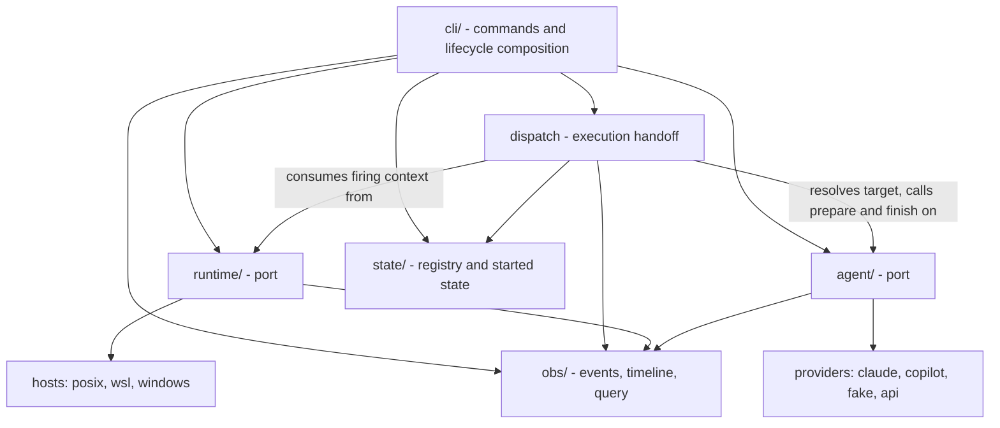
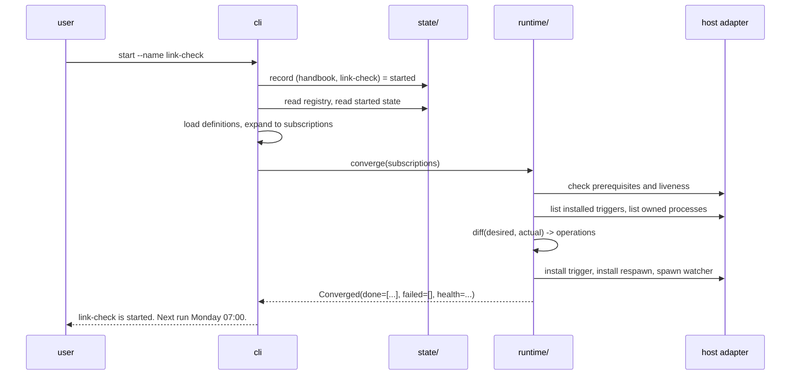
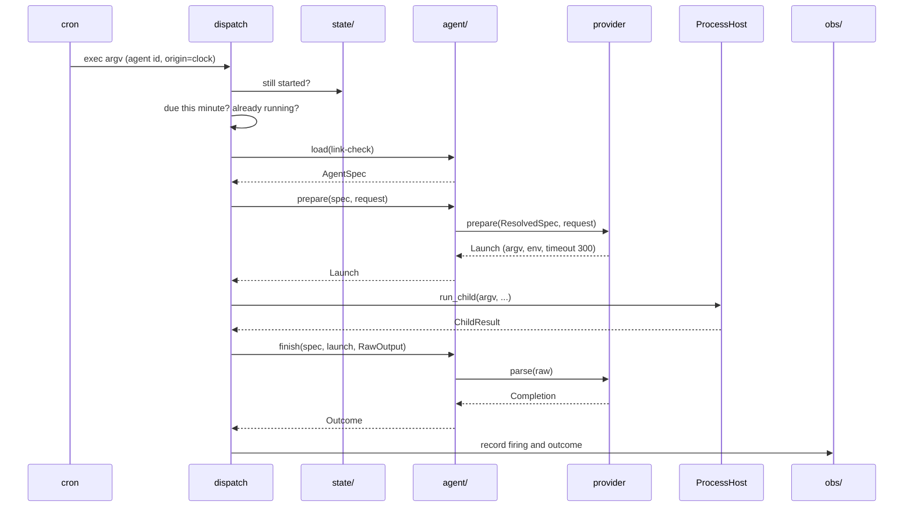
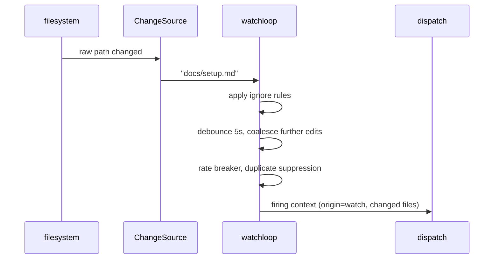

This document describes the proposed system as if it were finished. It
is the companion to
[refactoring-runtime-and-agent-seams.md](refactoring-runtime-and-agent-seams.md),
which carries the argument: why each choice was made, what was rejected,
what is still undecided, and how to get there phase by phase. Read that
one to challenge a decision. Read this one to understand what is being
built.

Two cautions. The end state is **not yet decided**, so nothing here is a
commitment. And one question inside it is deliberately left to
implementation; it is named under
[What is settled, and what is not](#what-is-settled-and-what-is-not)
rather than papered over.

## The system in one paragraph

An **agent definition** is a markdown file in a repository whose
frontmatter says what work to do, how to run it, and when it should run.
Agents Live turns that last part into real automation on one machine: it
registers a trigger with the operating system's own scheduler, and when
that trigger fires it runs the agent through a provider CLI and records
what happened. The whole system is two ports with a handoff between
them. One port knows about hosts and never learns what an agent is. The
other knows about agents and never touches a process or a trigger.

## What changes in the frontmatter

Twenty-five fields are parsed today, not counting `name`. Almost all of
them are untouched, because this refactor is about who reads a field,
not about what an author writes.

| Today | End state | What changes |
|---|---|---|
| `handler` | Retired | An alias for `post-processor`, which the no-shims rule does not allow to persist. The only unconditional removal. |
| `watchPath`, `watchIgnore`, `debounce` | `watch`, one string | Three fields that every consumer has to re-join become one comparable, hashable key: `watch: "docs/** !node_modules/** debounce 5s"`. |
| `runtime`, `model` | `runtime`, one selector | `runtime: claude/sonnet:low` replaces two fields and adds a reasoning-effort level without needing a third. |
| `schedule` | Same field, same language | One grammar parses it and each host renders it, closing the gap where `@daily` and `JAN-DEC` validate on POSIX and then fail during Windows registration. |
| `owner` | Same field | Still a seed read the first time an agent is started, but now by an optional plugin that a default install never loads. |
| `timeout` | Same field | Still the agent's own value. `prepare` resolves it onto `Launch` and `dispatch` enforces it, so neither side owns both halves. |
| The other 16 | Unchanged | `mode`, `allow-tools`, `mcps`, `env`, `transcript`, both processors, the four `output-*` fields, `description`, `tools`, `user-invocable`, `disable-model-invocation`, `argument-hint`. None of them ever leaves the agent seam. |

So the count goes 25 today to 21 in 6.0. `handler` retires and both
collapses land in the same breaking release, because there is no reason
to spend two breaks where one will do.

**No new fields are added.** The two behaviors this design pins down,
concurrency policy and misfire policy, are both fixed in the runtime core
rather than exposed to authors, because neither is a decision an author
has the information to make.

What the fields *mean* changes more than how they are spelled, and that
is covered in the [worked example](#a-worked-example).

### The watch grammar

```ebnf
watch       = patterns , [ sp , debounce ] ;

patterns    = pattern , { sp , pattern } ;
pattern     = include | exclude ;
include     = glob ;
exclude     = "!" , glob ;

debounce    = "debounce" , sp , duration ;
duration    = number , unit ;
unit        = "ms" | "s" | "m" ;

number      = digit , { digit } ;
glob        = ? repo-relative path or glob; quoted if it contains spaces ? ;
sp          = " " , { " " } ;
```

`debounce` is deliberately not a pattern. It is a single optional
trailing term on the whole expression, so there is no position where it
could appear to attach to a preceding glob and no way to write two of
them. That matches the implementation, where one watcher per agent holds
one `DebounceWindow` with one delay.

Six rules travel with the grammar because EBNF cannot carry them:

1. **One `watch` expression per agent, producing one watch
   subscription.** Several includes give the watcher several roots, the
   way `watchPath` takes a list today, but they feed one loop with one
   window. This is what makes debounce global by construction rather
   than by rule.
2. **At least one include.** An expression of only excludes watches
   nothing, which is an error rather than a silent no-op.
3. **At most one `debounce`, trailing.** A second occurrence is an
   error, not last-wins. Omitted means the current default.
4. **Precedence is not positional.** A path fires when it matches at
   least one include and no exclude. This is worth stating because
   readers will assume gitignore's last-match-wins, where a later
   pattern can re-include.
5. **Canonical form is sorted includes, then sorted excludes, then the
   normalized duration.** The fingerprint then depends on meaning rather
   than spelling, so reordering an expression does not restart a
   watcher. Rule 4 is what makes sorting safe.
6. **Author excludes sit on a built-in floor.** Dotfiles, `__pycache__`,
   `_index_.md`, and the tool's own JSONL logs are always ignored
   regardless of the expression, which is existing behavior and stays
   implicit.

```yaml
watch: "docs/**"
watch: "docs/** src/**/*.py debounce 2s"
watch: "docs/** !node_modules/** !**/*.tmp debounce 500ms"
```

One thing this collapse is not: a rename. Today's `watchIgnore` is not
glob-matched at all. An entry matches an exact basename, or a directory
prefix when it ends in `/`. Globs are strictly more capable, so the old
form maps into the new one mechanically while the reverse does not.

### The selector grammar

```ebnf
selector    = provider , [ "/" , model ] , [ ":" , effort ] ;
provider    = "default" | "none" | "local" | name ;
model       = name | "default" ;
effort      = "low" | "medium" | "high" | "xhigh" | "max" ;
name        = alnum , { alnum | "-" | "_" | "." } ;
```

Provider is required; model and effort are optional and independent, so
`claude`, `claude/opus`, `claude:high`, and `claude/opus:high` are all
valid. A provider declares which models and effort levels it honors, and
the core rejects a selector no installed provider can serve with a
message listing what is installed. The effort levels are taken verbatim
from Claude Code's `effort` field rather than invented. Canonical form is
the parsed selector re-rendered, so `claude` and `claude/default` hash
identically.

Examples: `default:high`, `claude/opus:high`, `copilot`,
`local/llama3.1`, `none`.

### Retiring the old fields

The break is clean. 6.0 does not understand `watchPath`, `watchIgnore`,
`debounce`, `model`, or `handler`, and no dual-form parsing period is
offered. Coexistence was considered and declined: it buys a delay at the
cost of two accepted spellings, a mixing rule, and a removal condition
somebody has to enforce later, which is exactly the arrangement `handler`
already demonstrates nobody enforces.

A clean break still has to fail well, and the failure has a specific
shape here because **a durable trigger written by 5.x survives the
upgrade and keeps firing into the 6.0 binary.** The stale definition is
the thing that stops working, not the trigger.

**Refuse the retired names specifically; keep tolerating unknown ones.**
The format is deliberately open to other clients' extension fields, so
erroring on every unrecognized key is not available. 6.0 therefore
carries a short list of *retired* names and refuses those by name. This
is a diagnostic, not a shim: a shim makes the old input produce the old
behavior, while this makes the old input produce a legible failure.
Silently ignoring them is the one unacceptable option, because the agent
would load, look healthy, and quietly never watch anything.

**Compute the replacement from the file's own values.** The translation
is mechanical, so the error can show the exact line to paste rather than
a generic template:

```
Agents/link-check.md: 'watchPath', 'watchIgnore', and 'debounce' were
replaced in 6.0 by a single 'watch' expression.

  Replace:  watchPath: docs
            watchIgnore: ["node_modules/"]
            debounce: 5
  With:     watch: "docs/** !node_modules/** debounce 5s"
```

**Report every offending file at once.** A malformed definition aborts
convergence for its repository rather than masquerading as a deletion,
so one stale file blocks that repository until it is fixed. Listing them
all turns migration into one pass instead of a whack-a-mole loop.

**Surface it in four places**, because each catches a different person:

| Where | What it does |
|---|---|
| `upgrade` | Scans registered repositories and prints the migration list while the operator is still at the terminal |
| `doctor` | Lists every offending file with its computed replacement |
| `start` | Refuses, naming the file and the fix |
| `status` | Renders the agent as started but not loadable |

That last row is the one worth designing for. After an upgrade the old
trigger is still installed and still firing, so an agent can be started
and broken at the same time. `status` has to say so rather than reporting
it as healthy. It is not a third recorded state: started state still says
started, and the definition simply cannot be read.

**A migrator is the escape hatch, and it is not a shim.** Since the
translation is mechanical, a one-shot command can rewrite definitions in
place as an explicit operator action. The loader never accepts the old
form; a separate tool converts files. `migrate.py` already establishes
that shape for persisted trigger entries.

**The retired-name list has its own expiry.** It ships for one major
cycle and is deleted in 7.0. Without that, the diagnostic becomes its own
museum, which is the failure it exists to prevent.

## The pieces

| Piece | Owns | Must never |
|---|---|---|
| `runtime/` | Triggers, watches, processes, liveness, convergence | Know what an agent is |
| `agent/` | Definition loading, provider preparation, output normalization | Register a trigger or create a process |
| `dispatch` | The handoff: one firing becomes one run | Contain host or provider specifics |
| `state/` | The repository registry and started state | Hold runtime artifacts |
| `obs/` | The event schema, query, and timeline | Belong to either port |
| `cli/` | Commands and lifecycle composition | Contain execution logic |



Arrows point from depender to dependee. The two ports never import each
other, and only immutable value records built from primitives cross
between them.

### `runtime/` - automation on this host

The runtime port answers one question: what automation exists on this
machine, and does it match what should exist. It exposes two functions
and three protocols.

`converge(subscriptions)` is the whole write surface. It is handed the
complete set of things that should be running, compares that against
what it finds, and makes reality match. It is idempotent, so calling it
twice reports nothing to do the second time, and the remedy for a
partial failure is to call it again. `health()` is the read surface, and
liveness is a field on it rather than a command.

Three protocols sit behind those, separated because they have genuinely
different lifetimes:

- **`TriggerStore`** is durable. It survives reboot, because it is the
  operating system's own scheduler: a crontab on POSIX, Task Scheduler
  on Windows. One OS artifact per subscription.
- **`ChangeSource`** is process-scoped. It reports raw filesystem paths
  and dies with the process holding it. No policy, no debounce.
- **`ProcessHost`** is per-child. Detached launch, child execution,
  liveness, termination, and enumeration of the processes this project
  owns.

A host adapter (`posix`, `wsl`, `windows`) supplies those three plus a
liveness report and a set of host facts: identity, state location, lock
acquisition, executable pinning, the child environment floor. Everything
generic lives above them in the runtime core: both trigger grammars,
debounce, the fire-rate breaker, duplicate suppression, the dueness gate,
subscription-key derivation, and the pure diff that turns desired plus
actual into a list of operations.

The single most important property: **the runtime never sees an agent.**
A subscription carries a target string like `agent:link-check`, never an
object and never a callable. This is not fastidiousness. On every
supported platform, the process that registers a trigger is dead by the
time that trigger fires, sometimes days later. Nothing but bytes and an
argv can cross that gap, so the seam is built for what actually survives.

**What changes.** Today this is nine modules totalling 3,544 lines, and
the job of "make the host match what should be installed" is
reimplemented in four more: `activate`, `stop`, `health_check`, and
`doctor`. One `converge` replaces all four partial implementations,
POSIX and Windows go behind one adapter contract instead of two parallel
stores, and `heartbeat` stops being a public command by folding into WSL
liveness.

### `agent/` - a runnable unit of work

Three functions:

```python
def load(agent_id: str, *, root: Path) -> AgentSpec: ...
def prepare(spec: AgentSpec, request: Request) -> Launch: ...
def finish(spec: AgentSpec, launch: Launch, raw: RawOutput) -> Outcome: ...
```

`load` parses the definition. `prepare` resolves the provider selector,
narrows the spec to what a provider needs, and asks the selected
provider to describe how to launch. `finish` takes the raw output back
and turns it into a classified result.

A **provider plugin** is small, and is meant to stay that way:

```python
class Provider(Protocol):
    name: str
    def prepare(self, spec: ResolvedSpec, request: Request) -> Launch: ...
    def parse(self, raw: RawOutput) -> Completion: ...
```

`Launch` describes a subprocess (argv, env, temp config files, the
resolved timeout, whether a pty is needed) or, for a future
direct-to-API provider, a call. `Completion` is what a provider could
read out of its own output. Everything provider-independent lives once
in the port: size caps, JSON extraction and repair, schema validation,
path-root enforcement, provenance, and a closed error taxonomy. A
provider never classifies an error, which is what keeps that taxonomy
closed.

The agent port never creates a process. It describes one, and hands the
description back.

**What changes.** Today `headless.py` is 2,528 lines holding frontmatter
parsing, path discovery, MCP resolution, argv construction, subprocess
execution, output normalization, safe-output enforcement, logging, and
handler invocation in one place. That splits three ways: definition and
result handling stay in the port, provider quirks move into plugins, and
process execution leaves the port entirely. `agent_adapters` is already
the shape the provider plugins take.

### Why `prepare` and `finish` are separate calls

They run back to back with one subprocess between them, which invites the
question: why not one `run(spec, request) -> Outcome`?

**Because a process has to happen in between, and the agent port is not
allowed to own one.** Combining them means the port either creates the
child itself, putting platform code back into the agent seam, or
receives a `ProcessHost` by injection, which invariant 3 forbids. The
split is what keeps `providers/claude.py` free of `CREATE_NO_WINDOW`,
pty selection, and `setsid`.

**Because both halves are pure, and that is what makes them testable.**
`prepare` is a function of the spec and the request. `finish` is a
function of the spec, the launch, and the raw output. Neither performs
I/O, so both are table-testable with no CLI installed and no subprocess
running. A combined `run` would necessarily perform I/O, which is exactly
why today's equivalent path is only reachable through `smoketest` with
real credentials.

**And because the sequence is not prepare, run, finish once.** It is
prepare once, then run and finish repeatedly.

### Is `Launch` reusable?

Within one dispatch, yes, and it has to be. Today's code already works
this way: `command` and `env` are built once, before the retry loop, and
every attempt re-runs the same command.

There are two retry budgets today, and the second one settles the
question. A timeout is detected by the runner, so a timeout retry could
in principle live below `finish`. An **empty output** is detected only
after the output has been parsed, and then the same command is run
again. So the decision to retry depends on the classification that
`finish` produces:

```python
# illustrative, not a proposed signature
launch = prepare(spec, request)
while True:
    raw = run_child(launch)
    outcome = finish(spec, launch, raw)
    if outcome.ok or not retryable(outcome):
        return outcome
```

`Launch` is therefore an immutable description that outlives several
attempts, and `finish` must neither consume nor invalidate it. Folding
the two calls together would hide that loop inside the agent port, which
would put retry, and therefore timing and inter-attempt process cleanup,
back on the wrong side of the seam.

Across dispatches, no. A `Launch` is built from one specific `Request`,
and a watch firing's changed-file list differs every time. It may also
own temp config files, which is why "who cleans up what `prepare`
created" is one of the two provider-lifecycle questions the proposal
leaves to phase 5.

**Why `finish` takes `launch` at all:** raw output cannot be interpreted
without knowing how it was produced. Whether a pty was used, whether TUI
noise was filtered, which provider was selected, and where the transcript
was written all change how the bytes should be read. Passing the launch
back is what lets `finish` stay a pure function instead of re-deriving
any of it.

### `dispatch` - the handoff

The only module that knows both halves exist. It is small on purpose,
roughly one page, and it is where the four questions that must be asked
at firing time live:

1. **Is this still wanted?** Re-read started state for this subscription
   key and fail closed. This is what covers the window between a change
   and the next convergence.
2. **Is it actually due?** Clock firings only. Boot, watch, and manual
   firings are due by definition.
3. **Is one already running?** If so, record the firing and drop it.
4. **What does the agent need?** Translate the firing context into a
   `Request`.

Then it composes: `prepare`, `ProcessHost.run_child`, `finish`. It owns
retry, streaming, and process cleanup, and it enforces the timeout that
`Launch` carries.

**What changes.** New as a module, but not as behavior. `run.py` already
runs an ownership gate, a dueness claim, an origin derivation from
`--scheduled`, `--boot`, and changed files, and a legacy-task repair,
all as a prologue to execution. Those move into one named place with one
test surface.

### `state/` - what should happen here

Two facts, both machine-local, both outside every repository:

- **The repository registry.** Which repositories this installation
  looks in. Answering "where do I look" is the precondition for
  everything else.
- **Started state.** For each `(repository, agent)` pair, started or
  stopped. `start` writes it, `stop` clears it.

Started state is the fact that makes the whole design work, and it does
not exist today. Frontmatter says how an agent *would* run; it never
says that it *is* started here. Without a recorded intent, a system that
goal-seeks on frontmatter alone would reinstall every trigger the user
had deliberately stopped. With it, a trigger someone deleted behind the
tool's back becomes repairable drift instead of a silent stop.

An **optional assignment policy** also lives here, for installations that
opt into multi-machine ownership. In a default install it is absent and
every local agent is simply yours.

**What changes.** `repos.py`, `ownership.py`, and `paths.py` are already
close to this. The addition is started state, which does not exist
today. The subtraction is that ownership becomes explicitly optional
rather than a concept the dispatch and lifecycle paths each consult.

### `obs/` - what happened

The JSONL event schema, the query interface, and the timeline. Both
ports write to it and neither owns it. Keeping it separate is what lets
a runtime test assert on emitted events without importing an agent, and
what lets a field incident be replayed later against fakes.

**What changes.** Least of any piece. `qlog`, `timeline`, and `adminlog`
already do this work. Naming them as one owner is what stops both ports
from free-writing their own JSONL shapes.

### `cli/` - the three verbs

The user's whole vocabulary is `start`, `stop`, and `run`.

- `start` means make this happen automatically here.
- `stop` means stop making it happen.
- `run` means do it once, now.

`status` and `doctor` report in those same words. Nothing the user sees
says plan, diff, subscription, or convergence. Those are mechanism, and
mechanism stays invisible.

**What changes.** The command surface barely moves: `start`, `stop`, and
`run` are already the published verbs, and `cli_spec`'s declarative
approach survives intact. What changes is that `status`, `completions`,
and `dashboard` stop reaching into scheduling and execution internals,
`activate.py` is renamed to match the verb it serves, help text stops
saying "Activate" and "Deactivate", and two flags retire:
`--prune-orphans`, because convergence removes anything absent from the
desired set, and `--transfer-to`, because it cannot finish the move it
names.

## Where state lives

Nothing machine-local is ever written inside a repository. Repositories
sync between machines and export to archives; machine state must not
travel with them.

| Fact | Location | Survives reboot | Survives a repo move |
|---|---|---|---|
| Which repositories to look in | `$XDG_CONFIG_HOME/agents-live/config.toml` | Yes | Yes |
| Started or stopped, per (repo, agent) | `$XDG_STATE_HOME/agents-live/repos/<name>-<hash8>/` | Yes | No, and deliberately: see [stage 9](#stage-9-moving-the-repository) |
| The definition itself | `<repo>/Agents/<name>.md` | Yes | Yes, it travels with the repo |
| The OS trigger | crontab or Task Scheduler | Yes | n/a |
| A running watcher process | The process table | No, the `@reboot` trigger restores it | n/a |
| Run logs and outcomes | `$XDG_STATE_HOME/agents-live/repos/<name>-<hash8>/logs/` | Yes | No, old logs are abandoned |
| Host health beacon | `$XDG_STATE_HOME/agents-live/health.ok` | Yes | n/a |
| Dispatch rate budget | One file per project per host | Emptied, which is the safe direction | n/a |

The per-repo directory name is the repository's basename plus a hash of
its resolved absolute path, which is what keeps two repositories with
the same name distinct. It is also why moving a repository is an
explicit act rather than something the tool infers.

## A worked example

A repository at `/src/handbook` contains one agent,
`Agents/link-check.md`:

```markdown
---
name: link-check
description: Verify that documentation links resolve.
runtime: claude/sonnet
mode: write
schedule: "0 7 * * 1"
watch: "docs/** !node_modules/** debounce 5s"
timeout: 300
---

Check every relative link under docs/. For each one that does not
resolve, open a GitHub issue naming the file and the line.
```

It should run every Monday at 07:00, and again whenever anything under
`docs/` changes and then settles for five seconds.

> In 5.x this was five fields rather than two: `runtime: claude` with
> `model: sonnet`, and `watchPath: docs` with
> `watchIgnore: ["node_modules/"]` and `debounce: 5`. Collapsing them is
> the breaking change in 6.0. The lifecycle below is identical either
> way.

**What changes for the author.** Two lines of this file, and the
field-level differences are tabled under
[What changes in the frontmatter](#what-changes-in-the-frontmatter). What
changes underneath them matters more:

- **Who reads it.** Today `headless.py` parses the definition and also
  runs it, so frontmatter knowledge leaks into everything that calls it.
  In the end state only the agent port loads the file, and lifecycle
  orchestration reads nothing from it but the trigger fields.
- **What it means.** Today an installed trigger is the only record that
  an agent is automated here, which is why the repair loop can delete an
  orphan but never restore one. Frontmatter now says how an agent *would*
  run; started state says whether it *does*.
- **Where it is authoritative.** The definition is inert. Copying this
  repository to a second machine automates nothing there until somebody
  runs `start` on that machine, which is the point stage 1 makes.

### Stage 1: the machine learns where to look

```
$ cd /src/handbook
$ agents-live init
```

This writes `/src/handbook` into the registry and creates the per-repo
state directory. That is all it does.

**Nothing is automated yet.** No trigger exists, because no agent has
been started. Registration answers "where do I look", which is a
different question from "what should run here". Keeping those separate
is what lets you register a repository on ten machines and run its
agents on one.

### Stage 2: starting the agent

```
$ agents-live start --name link-check
```

Five things happen, in this order:



**1. Record the intent.** Started state gets `(handbook, link-check) =
started`. This is written first, so that even if everything after it
fails, running the command again finishes the job.

**2. Collect the complete desired set.** Not just this agent. The CLI
reads the registry, walks every registered repository, loads every
definition, keeps the ones marked started, and expands each one's
trigger declarations. If the registry cannot be read, it stops here and
converges nothing, because a desired set that cannot be bounded is not a
desired set.

**3. Expand to subscriptions.** `link-check` is one agent but two
subscriptions, because it declares two triggers:

| Key | Scope | Target | Kind | Trigger |
|---|---|---|---|---|
| (derived) | `repo:/src/handbook` | `agent:link-check` | `schedule` | `0 7 * * 1` |
| (derived) | `repo:/src/handbook` | `agent:link-check` | `watch` | `docs`, ignore, debounce 5 |

The runtime adds a third of its own, scoped to this installation rather
than to any repository, targeting `runtime` instead of an agent. That is
the check-and-repair loop, and it is an ordinary subscription rather than
a special case.

**4. Converge.** The runtime checks host prerequisites first, then reads
what is actually installed, computes a pure diff, and executes the
resulting operations. Schematically, the crontab now holds three lines:
the Monday schedule, an `@reboot` line that respawns the watcher, and the
maintenance line.

**5. Spawn the watcher.** A watch subscription has a second piece of
state the trigger store cannot see: a live process. The `@reboot` line
carries a structured marker holding the subscription key and a
fingerprint of the watch expression, and the watcher is spawned with that
same canonical expression in its own command line. Both halves of
"actual" therefore describe themselves, and convergence recovers them by
reading the artifact and matching `owned(role="watcher")` against it.

Nothing is written to a side index, which is the point. A separate record
would have to be written after the spawn, opening a window where a
process exists and its record does not, and that window is what forces a
crash-recovery rule. Making the process its own record closes it by
construction. Whether the command-line length bound on Windows permits
this is the one thing phase 2 measures before committing; if it does not,
the fallback is a runtime-owned index and the crash-ordering rule that
comes with it.

### Stage 3: what exists now

```
Registry        ~/.config/agents-live/config.toml   -> /src/handbook
Started state   ~/.local/state/agents-live/repos/handbook-a1b2c3d4/
                  link-check = started
Definition      /src/handbook/Agents/link-check.md   (unchanged, in git)
crontab         0 7 * * 1   cd /src/handbook && agents-live run ...
                @reboot     cd /src/handbook && agents-live watch ...
                */N * * * * agents-live internal maintain
Process table   one watcher process, watching /src/handbook/docs
```

Note what is *not* in the repository: nothing. The definition is the only
file in `/src/handbook` that Agents Live cares about, and it was written
by the author, not by the tool.

### Stage 4: a scheduled firing

Monday, 07:00. The process that installed the trigger exited days ago.
Cron creates a brand new process.



Three checks happen before any work: still started, actually due, not
already running. All three are cheap, and all three fail closed. Only
then does the run begin.

Notice where the timeout comes from. `300` is a fact in the definition,
so the agent port resolves it and puts it on `Launch`. Dispatch enforces
it, because dispatch is the only side holding the child. Neither one owns
both halves.

### Stage 5: a watch firing

Someone saves `docs/setup.md`.



From `dispatch` onward this is the **same path** as stage 4, minus the
dueness gate. That is the point of the design: a watch firing and a
scheduled firing differ only in how they traveled and what origin they
carry. One runs in-process inside the watcher; the other arrives through
an argv in a fresh process.

The host adapter's job here is small and dumb: report raw paths. Ignore
rules, debounce, the breaker, and duplicate suppression are all generic,
which means they are testable with no host present at all.

### Stage 6: drift, and why it is repairable

Someone edits the crontab by hand and deletes the Monday line.

Nothing notices immediately. Then the maintenance subscription fires,
which runs a convergence over everything started on this installation.
Desired contains the schedule; actual does not; the diff produces one
install operation; the line comes back.

This is only possible because started state exists. A system converging
from frontmatter alone could not tell the difference between "someone
deleted this trigger" and "someone ran `stop`", so repairing the first
would silently undo the second. That is exactly why the current
check-and-repair loop can remove an orphaned trigger but can never
restore a missing one.

The same mechanism handles a subtler case. If the author edits
`watchPath`, the running watcher is still watching the old directory,
because it read its configuration at spawn. Convergence compares a
fingerprint of the desired watch expression against the one the running
watcher carries, and on a mismatch stops it and starts a new one.
Without that, editing a watch expression would take effect only at the
next reboot.

### Stage 7: stopping

```
$ agents-live stop --name link-check
```

Started state is cleared, then the same convergence runs. `link-check`
now contributes no subscriptions, so both of its artifacts are absent
from the desired set, and absence is what removal means: the crontab
lines go, the watcher is terminated.

Orphan pruning is not a separate feature here. An agent whose file was
deleted, an agent that was stopped, and an agent that was never started
all look identical to the diff, because all three are simply not in the
list. The definition file itself is never touched.

### Stage 8: the repository goes away

The volume holding `/src/handbook` is unmounted.

The next convergence reads the registry fine, but cannot read the
repository, so that repository contributes no subscriptions and its
triggers are pruned. This is deliberate, and it is the opposite of the
rule applied to the registry. A trigger for an unreachable repository
does not preserve working automation; it preserves a run that fails every
Monday, plus log noise, plus a `status` that claims the agent is fine.

Pruning is safe because the intent is not in the repository. Started
state is machine-local, so when the volume comes back the next
convergence rebuilds both subscriptions from frontmatter times started
state. The accepted cost is stated plainly: a firing due inside that
window is lost, because misfire policy is skip.

The registry is different and keeps the opposite rule. If the registry
itself cannot be read, convergence does not run at all, because there the
agents would run correctly and their triggers would be deleted for a fact
that merely could not be confirmed.

### Stage 9: moving the repository

Moving a directory does nothing on its own, and it should not.
Registration says where to look, started state says what runs here, and
neither is derivable from a path. So a move is an explicit sequence:

```
agents-live stop --name link-check      # in the old location
mv /src/handbook /work/handbook
cd /work/handbook && agents-live init   # register the new path
agents-live repos remove /src/handbook
agents-live start --name link-check
```

**If you forget and simply move it**, the half that misbehaves cleans
itself up and the half that is merely stale does not:

| Left behind | What happens to it |
|---|---|
| Crontab lines for the old path | Pruned at the next convergence |
| The running watcher | Terminated in the same pass |
| Registry entry for the old path | Survives, nothing removes it |
| Started state under the old path's hash | Survives, nothing removes it |

That is stage 8's rule doing its job. The repository is unreadable, so it
contributes no subscriptions, so its triggers go. What remains costs disk
and confusion, nothing else.

The leftovers are reported rather than removed, because "unreadable" is
ambiguous between moved, deleted, and temporarily unmounted, and stage 8
commits to the unmount case being recoverable. Auto-deregistering would
break exactly that: a drive unmounted at boot would deregister its
repository, and nothing would bring it back. So `doctor` reports it in
the user's vocabulary:

> Repository `/src/handbook` is registered but cannot be read. One agent
> is recorded as started there (`link-check`), and its triggers have been
> removed. If you moved the repository, register the new location and
> start it there. If you deleted it, run `repos remove /src/handbook`.

That message does three jobs: it says what already happened
automatically, it distinguishes the two causes, and it names the exact
command. Nothing new is needed to act on it, since `repos remove` exists.

One hazard worth knowing, because it behaves differently on the two
paths: on Linux, inotify watches follow the inode. A same-filesystem move
leaves the watcher running against a directory that no longer matches its
recorded root, so it can fire runs whose `cd` fails. A cross-filesystem
move is a copy and a delete, so the watch simply dies. Convergence
terminates it either way, but the window before that pass is not the
same.

## Rules that hold everywhere

These are the invariants worth checking any change against. Most are
enforceable as tests.

1. **`runtime/` does not import `agent/`, and `agent/` does not import
   `runtime/`.** Only `dispatch` and the lifecycle commands touch both.
2. **Only immutable value records built from primitives cross a seam.** A
   firing carries an agent id, never an agent. A launch description
   carries argv, never a process.
3. **No host service object enters the agent port.** The agent port
   describes a process; it never holds one.
4. **`sys.platform`, `os.name`, and WSL detection appear only under
   `runtime/hosts/`.** Everywhere else is host-agnostic.
5. **One word, one meaning.** An agent is started or stopped. "Running"
   is reserved for a run in flight, which the concurrency rule needs it
   to mean.
6. **The user's vocabulary is three verbs.** No CLI output, help text, or
   error message names a plan, a diff, a subscription, or a convergence
   pass.
7. **Convergence is idempotent and total.** It is always handed the
   complete desired set. If the set cannot be bounded, it is not called.
8. **Both firing paths produce the same dispatch inputs.** In-process and
   cross-process differ only in transport and origin.
9. **Concurrency policy is skip, and misfire policy is skip.** A firing
   arriving on top of a live run is dropped. A missed firing is not
   replayed.
10. **Machine state never lives in a repository.**

## What is settled, and what is not

Two of the three questions this document originally opened were settled
on 2026-08-08. The argument for each is in
[the proposal](refactoring-runtime-and-agent-seams.md#open-decisions).

**Settled: the grammars land as a clean break.** The watch and selector
collapses ship with the `handler` retirement in one major version bump
from 5.5.2. No compatibility period and no dual-form parsing. The retired
names are refused by name with the replacement computed from the file's
own values, per
[Retiring the old fields](#retiring-the-old-fields). Coexistence was
considered and declined: it buys a delay at the price of two accepted
spellings, a mixing rule, and a removal condition somebody has to
enforce later.

**Settled: moving a repository does nothing on its own.** A move is
`stop`, `mv`, register, `repos remove`, `start`, and forgetting is safe
but leaves two inert records that `doctor` reports rather than deletes.
See [stage 9](#stage-9-moving-the-repository).

**Open, deliberately: does a scheduled firing need a full event
envelope?** Today's argv already carries agent id, origin, and changed
files. Whether it needs a versioned envelope with a subscription key and
timestamp is a question the prototype answers better than a document can,
so it is settled during phase 5 rather than before it.

One design detail inside the picture is settled as a target rather than
as a fact: the watcher fingerprint lives on the durable artifact and in
the watcher's own command line, not in a runtime-owned index. That makes
it the same mechanism as the marker exhaustive pruning already needs, and
it removes the write-ordering window in stage 2 instead of writing a rule
to survive it. Phase 2 confirms it by measurement, since a watch
expression at the Windows command-line length bound is what could defeat
it, and keeps an index as the named fallback.
